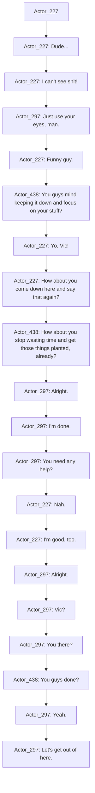

# Trachi/West/Laurel Bridge/Clint

```mermaid
graph TD
    728_0["Actor_227"]
    728_1["Actor_227: Dude..."]
    728_2["Actor_227: I can't see shit!"]
    728_3["Actor_297: Just use your eyes, man."]
    728_4["Actor_227: Funny guy."]
    728_5["Actor_438: You guys mind keeping it down and focus on your stuff?"]
    728_6["Actor_227: Yo, Vic!"]
    728_7["Actor_227: How about you come down here and say that again?"]
    728_8["Actor_438: How about you stop wasting time and get those things planted, already?"]
    728_9["Actor_297: Alright."]
    728_10["Actor_297: I'm done."]
    728_11["Actor_297: You need any help?"]
    728_12["Actor_227: Nah."]
    728_13["Actor_227: I'm good, too."]
    728_14["Actor_297: Alright."]
    728_15["Actor_297: Vic?"]
    728_16["Actor_297: You there?"]
    728_17["Actor_438: You guys done?"]
    728_18["Actor_297: Yeah."]
    728_19["Actor_297: Let's get out of here."]
    728_0 --> 728_1
    728_1 --> 728_2
    728_2 --> 728_3
    728_3 --> 728_4
    728_4 --> 728_5
    728_5 --> 728_6
    728_6 --> 728_7
    728_7 --> 728_8
    728_8 --> 728_9
    728_9 --> 728_10
    728_10 --> 728_11
    728_11 --> 728_12
    728_12 --> 728_13
    728_13 --> 728_14
    728_14 --> 728_15
    728_15 --> 728_16
    728_16 --> 728_17
    728_17 --> 728_18
    728_18 --> 728_19
```