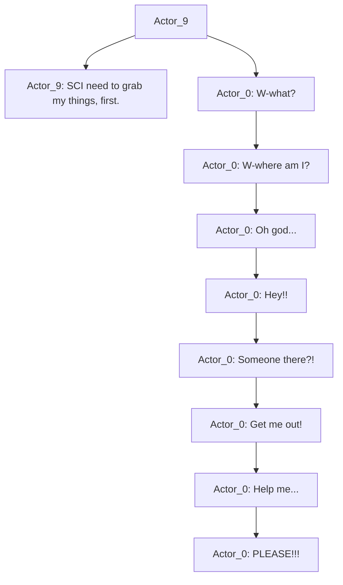

# Trachi/West/Sigmund Plaza/Prefecture/EV011

```mermaid
graph TD
    730_0["Actor_9"]
    730_1["Actor_9: SCI need to grab my things, first."]
    730_2["Actor_0: W-what?"]
    730_3["Actor_0: W-where am I?"]
    730_4["Actor_0: Oh god..."]
    730_5["Actor_0: Hey!!"]
    730_6["Actor_0: Someone there?!"]
    730_7["Actor_0: Get me out!"]
    730_8["Actor_0: Help me..."]
    730_9["Actor_0: PLEASE!!!"]
    730_0 --> 730_1
    730_0 --> 730_2
    730_2 --> 730_3
    730_3 --> 730_4
    730_4 --> 730_5
    730_5 --> 730_6
    730_6 --> 730_7
    730_7 --> 730_8
    730_8 --> 730_9
```