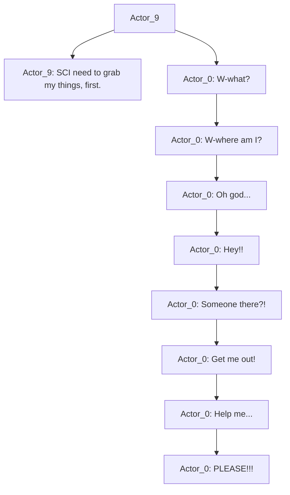

# Trachi/West/Sigmund Plaza/Prefecture/EV014

```mermaid
graph TD
    733_0["Actor_9"]
    733_1["Actor_9: SCI need to grab my things, first."]
    733_2["Actor_0: W-what?"]
    733_3["Actor_0: W-where am I?"]
    733_4["Actor_0: Oh god..."]
    733_5["Actor_0: Hey!!"]
    733_6["Actor_0: Someone there?!"]
    733_7["Actor_0: Get me out!"]
    733_8["Actor_0: Help me..."]
    733_9["Actor_0: PLEASE!!!"]
    733_0 --> 733_1
    733_0 --> 733_2
    733_2 --> 733_3
    733_3 --> 733_4
    733_4 --> 733_5
    733_5 --> 733_6
    733_6 --> 733_7
    733_7 --> 733_8
    733_8 --> 733_9
```