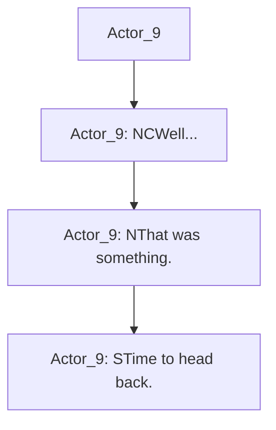

# Trachi/West/Sigmund Plaza/Prefecture/Hallway/Downstairs/Cell (Trachi)/EV003

```mermaid
graph TD
    736_0["Actor_9"]
    736_1["Actor_9: NCWell..."]
    736_2["Actor_9: NThat was something."]
    736_3["Actor_9: STime to head back."]
    736_0 --> 736_1
    736_1 --> 736_2
    736_2 --> 736_3
```