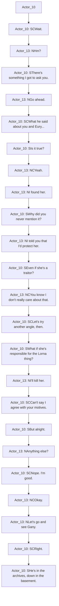

# Trachi/West/Sigmund Plaza/Prefecture/Hallway/EV004

```mermaid
graph TD
    738_0["Actor_10"]
    738_1["Actor_10: SCWait."]
    738_2["Actor_13: NHm?"]
    738_3["Actor_10: SThere's something I got to ask you."]
    738_4["Actor_13: NGo ahead."]
    738_5["Actor_10: SCWhat he said about you and Eury..."]
    738_6["Actor_10: SIs it true?"]
    738_7["Actor_13: NCYeah."]
    738_8["Actor_13: NI found her."]
    738_9["Actor_10: SWhy did you never mention it?"]
    738_10["Actor_13: NI told you that I'd protect her."]
    738_11["Actor_10: SEven if she's a traitor?"]
    738_12["Actor_13: NCYou know I don't really care about that."]
    738_13["Actor_10: SCLet's try another angle, then."]
    738_14["Actor_10: SWhat if she's responsible for the Lorna thing?"]
    738_15["Actor_13: NI'll kill her."]
    738_16["Actor_10: SCCan't say I agree with your motives."]
    738_17["Actor_10: SBut alright."]
    738_18["Actor_13: NAnything else?"]
    738_19["Actor_10: SCNope. I'm good."]
    738_20["Actor_13: NCOkay."]
    738_21["Actor_13: NLet's go and see Gany."]
    738_22["Actor_10: SCRight."]
    738_23["Actor_10: SHe's in the archives, down in the basement."]
    738_0 --> 738_1
    738_1 --> 738_2
    738_2 --> 738_3
    738_3 --> 738_4
    738_4 --> 738_5
    738_5 --> 738_6
    738_6 --> 738_7
    738_7 --> 738_8
    738_8 --> 738_9
    738_9 --> 738_10
    738_10 --> 738_11
    738_11 --> 738_12
    738_12 --> 738_13
    738_13 --> 738_14
    738_14 --> 738_15
    738_15 --> 738_16
    738_16 --> 738_17
    738_17 --> 738_18
    738_18 --> 738_19
    738_19 --> 738_20
    738_20 --> 738_21
    738_21 --> 738_22
    738_22 --> 738_23
```