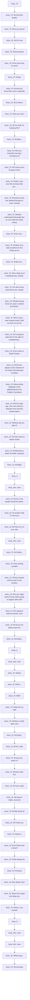

# Trachi/West/Sigmund Plaza/Prefecture/Second Level/EV003

```mermaid
graph TD
    741_0["Actor_70"]
    741_1["Actor_70: NCOf all the people."]
    741_2["Actor_70: NAre you alone?"]
    741_3["Actor_13: NCFor now."]
    741_4["Actor_70: SCConvenient."]
    741_5["Actor_13: NYou know why I'm here?"]
    741_6["Actor_70: NYeah."]
    741_7["Actor_70: NCAnd you know that I won't cooperate."]
    741_8["Actor_13: NCA shame."]
    741_9["Actor_70: NAre you sure?"]
    741_10["Actor_13: SCYou think I'm enjoying this?"]
    741_11["Actor_70: RCAtlas..."]
    741_12["Actor_70: NDo you remember the day I recruited you?"]
    741_13["Actor_70: NCI knew you'd be good at this."]
    741_14["Actor_70: RCBut I was sure that someone like you..."]
    741_15["Actor_70: RSomeone who has suffered through so much, himself."]
    741_16["Actor_70: SWould understand that people like us can't help but create misery."]
    741_17["Actor_70: SCIt's true..."]
    741_18["Actor_70: SCMost of us hate ourselves for the things we do."]
    741_19["Actor_70: SCBut you..."]
    741_20["Actor_70: SAre made up of something else, entirely."]
    741_21["Actor_70: SCI don't know what drives you, exactly."]
    741_22["Actor_70: SECBut during those ten years I worked for EnKAD..."]
    741_23["Actor_70: SEI've never seen anyone enjoy it half as much as you do."]
    741_24["Actor_13: SCI'm going to state this for the sake of completeness..."]
    741_25["Actor_13: SYour name is Daniil Preston."]
    741_26["Actor_13: NCFormer deputy to the chairman of the Ionian Revolutionary Comittee."]
    741_27["Actor_13: NNow acting ringleader of the selfproclaimed Free People's Syndicate."]
    741_28["Actor_13: NCFour days ago, your men seized a shipment from Kenović central station."]
    741_29["Actor_13: NWhere did you take it?"]
    741_30["Actor_13: SCI don't want to repeat myself."]
    741_31["Actor_70: SCWould be a waste of breath, anyways."]
    741_32["Actor_13: NCRight."]
    741_33["Actor_0"]
    741_34["Actor_461: none"]
    741_35["Actor_70: NCYou of all people should be aware -"]
    741_36["Actor_13: NI wouldn't stall if I were you."]
    741_37["Actor_13: NCTime isn't on your side."]
    741_38["Actor_461: none"]
    741_39["Actor_70: SCCecilia..."]
    741_40["Actor_70: SYou fucking monster!"]
    741_41["Actor_13: NThirty minutes until we start on the thumbs."]
    741_42["Actor_13: SDo you really want to know what's going to happen after that?"]
    741_43["Actor_13: NI'm going to need an answer, soon."]
    741_44["Actor_70: NCYou're not going to get one."]
    741_45["Actor_13: NCAlright..."]
    741_46["Actor_0"]
    741_47["Actor_461: none"]
    741_48["Actor_70: SWhat-"]
    741_49["Actor_70: RCNo..."]
    741_50["Actor_70: RNO!"]
    741_51["Actor_70: SANot her as well!"]
    741_52["Actor_70: SAShe's a child, damn you!"]
    741_53["Actor_13: NCDaniil..."]
    741_54["Actor_13: NCAs I said-"]
    741_55["Actor_70: SIt was you, wasn't it?"]
    741_56["Actor_13: NCDon't start this."]
    741_57["Actor_70: NCYou're right."]
    741_58["Actor_70: NIt doesn't matter, anymore."]
    741_59["Actor_70: RCSilk Street 32."]
    741_60["Actor_13: NCThank you."]
    741_61["Actor_70: SSave it."]
    741_62["Actor_70: NYou'll take care of them?"]
    741_63["Actor_13: NCWe always do."]
    741_64["Actor_70: NCGood."]
    741_65["Actor_70: NGo ahead, then."]
    741_66["Actor_70: SDon't let a dead man keep you."]
    741_67["Actor_70: SADo it, you coward!"]
    741_68["Actor_0"]
    741_69["Actor_461: none"]
    741_70["Actor_461: none"]
    741_71["Actor_13: NRest easy..."]
    741_72["Actor_13: NCComrade."]
    741_0 --> 741_1
    741_1 --> 741_2
    741_2 --> 741_3
    741_3 --> 741_4
    741_4 --> 741_5
    741_5 --> 741_6
    741_6 --> 741_7
    741_7 --> 741_8
    741_8 --> 741_9
    741_9 --> 741_10
    741_10 --> 741_11
    741_11 --> 741_12
    741_12 --> 741_13
    741_13 --> 741_14
    741_14 --> 741_15
    741_15 --> 741_16
    741_16 --> 741_17
    741_17 --> 741_18
    741_18 --> 741_19
    741_19 --> 741_20
    741_20 --> 741_21
    741_21 --> 741_22
    741_22 --> 741_23
    741_23 --> 741_24
    741_24 --> 741_25
    741_25 --> 741_26
    741_26 --> 741_27
    741_27 --> 741_28
    741_28 --> 741_29
    741_29 --> 741_30
    741_30 --> 741_31
    741_31 --> 741_32
    741_32 --> 741_33
    741_33 --> 741_34
    741_34 --> 741_35
    741_35 --> 741_36
    741_36 --> 741_37
    741_37 --> 741_38
    741_38 --> 741_39
    741_39 --> 741_40
    741_40 --> 741_41
    741_41 --> 741_42
    741_42 --> 741_43
    741_43 --> 741_44
    741_44 --> 741_45
    741_45 --> 741_46
    741_46 --> 741_47
    741_47 --> 741_48
    741_48 --> 741_49
    741_49 --> 741_50
    741_50 --> 741_51
    741_51 --> 741_52
    741_52 --> 741_53
    741_53 --> 741_54
    741_54 --> 741_55
    741_55 --> 741_56
    741_56 --> 741_57
    741_57 --> 741_58
    741_58 --> 741_59
    741_59 --> 741_60
    741_60 --> 741_61
    741_61 --> 741_62
    741_62 --> 741_63
    741_63 --> 741_64
    741_64 --> 741_65
    741_65 --> 741_66
    741_66 --> 741_67
    741_67 --> 741_68
    741_68 --> 741_69
    741_69 --> 741_70
    741_70 --> 741_71
    741_71 --> 741_72
```