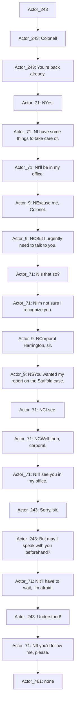

# Trachi/West/Sigmund Plaza/Prefecture/Second Level/EV010

```mermaid
graph TD
    742_0["Actor_243"]
    742_1["Actor_243: Colonel!"]
    742_2["Actor_243: You're back already."]
    742_3["Actor_71: NYes."]
    742_4["Actor_71: NI have some things to take care of."]
    742_5["Actor_71: NI'll be in my office."]
    742_6["Actor_9: NExcuse me, Colonel."]
    742_7["Actor_9: NCBut I urgently need to talk to you."]
    742_8["Actor_71: NIs that so?"]
    742_9["Actor_71: NI'm not sure I recognize you."]
    742_10["Actor_9: NCorporal Harrington, sir."]
    742_11["Actor_9: NSYou wanted my report on the Staffold case."]
    742_12["Actor_71: NCI see."]
    742_13["Actor_71: NCWell then, corporal."]
    742_14["Actor_71: NI'll see you in my office."]
    742_15["Actor_243: Sorry, sir."]
    742_16["Actor_243: But may I speak with you beforehand?"]
    742_17["Actor_71: NIt'll have to wait, I'm afraid."]
    742_18["Actor_243: Understood!"]
    742_19["Actor_71: NIf you'd follow me, please."]
    742_20["Actor_461: none"]
    742_0 --> 742_1
    742_1 --> 742_2
    742_2 --> 742_3
    742_3 --> 742_4
    742_4 --> 742_5
    742_5 --> 742_6
    742_6 --> 742_7
    742_7 --> 742_8
    742_8 --> 742_9
    742_9 --> 742_10
    742_10 --> 742_11
    742_11 --> 742_12
    742_12 --> 742_13
    742_13 --> 742_14
    742_14 --> 742_15
    742_15 --> 742_16
    742_16 --> 742_17
    742_17 --> 742_18
    742_18 --> 742_19
    742_19 --> 742_20
```