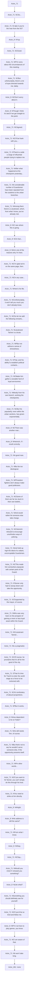

# Trachi/West/Sigmund Plaza/Prefecture/Second Level/Solka Office/Lieutenant Solka

```mermaid
graph TD
    744_0["Actor_71"]
    744_1["Actor_71: SCSo..."]
    744_2["Actor_71: SI take it you're the man from the IIS?"]
    744_3["Actor_9: NYup."]
    744_4["Actor_71: SCGood."]
    744_5["Actor_71: NPI'm sorry about the circumstances of this meeting."]
    744_6["Actor_71: SCBut unfortunately, there's a lot of eyes directed towards me, lately."]
    744_7["Actor_9: NCDon't worry about it."]
    744_8["Actor_9: NThough I think it's best if we get straight to the point."]
    744_9["Actor_71: NCAgreed."]
    744_10["Actor_71: NCI'll be frank with you..."]
    744_11["Actor_71: NThere's a wide a range of influential people trying to replace me."]
    744_12["Actor_71: NAfter what happened at the checkpoint yesterday..."]
    744_13["Actor_71: NA considerable number of Guardsmen have been reposted from the outskirts to the urban branches."]
    744_14["Actor_71: NAmong them there's a Lieutenant, which, from what I know, you've already met."]
    744_15["Actor_9: NCI see where this is going."]
    744_16["Actor_9: NCIn fact..."]
    744_17["Actor_9: NHe's one of the reasons why I'm here."]
    744_18["Actor_71: NCI'm glad we're on the same page, then."]
    744_19["Actor_71: NCIn any case..."]
    744_20["Actor_71: NHere's his file."]
    744_21["Actor_71: NCUnfortunately, it won't tell you much you don't already know."]
    744_22["Actor_71: NCSo let me add the following remarks..."]
    744_23["Actor_71: NLieutenant Tanner is a brute."]
    744_24["Actor_71: NPBut not without a sense of shrewdness."]
    744_25["Actor_71: NThat, and his ability to establish political contacts..."]
    744_26["Actor_71: NCMade him gather a sizeable herd of loyal servicemen."]
    744_27["Actor_71: NMostly from his own branch, working the checkpoints."]
    744_28["Actor_71: NCBut his popularity, even within the urban sections, has grown exponentially."]
    744_29["Actor_9: NCThere was another man..."]
    744_30["Actor_9: NHeinrich, if I recall correctly."]
    744_31["Actor_71: NA good man."]
    744_32["Actor_71: NBut far too ideological."]
    744_33["Actor_71: NPFreedom fighters don't always make good politicians."]
    744_34["Actor_71: NCSome of them are far too stuck in their own beliefs..."]
    744_35["Actor_71: NAnd would rather let someone else take charge."]
    744_36["Actor_71: NCHeinrich refused to encourage unorthodox ways of policing."]
    744_37["Actor_71: NAnd held up high the ideal of a valiant, uncorruptable Guardsman."]
    744_38["Actor_71: NCThis made him somewhat unpopular with certain parts of the Guard."]
    744_39["Actor_71: NTanner only had to swoop down and take the opportunity."]
    744_40["Actor_71: SCSupported by the mayor, of course."]
    744_41["Actor_71: SWho was very keen on the prospect of gaining a more or less loyal asset within the Guard."]
    744_42["Actor_71: NCLieutenant Tanner..."]
    744_43["Actor_71: NIs a pragmatist."]
    744_44["Actor_71: SCOf course, he proclaims that it's all for the good of the city."]
    744_45["Actor_71: SThat it's time for Trachi to enter the world stage as a force to be reckoned with."]
    744_46["Actor_71: SCIt's tomfoolery of absurd proportions."]
    744_47["Actor_71: SPBut it works."]
    744_48["Actor_9: NHow dependent is he on Faber?"]
    744_49["Actor_71: NHe still needs him, of course."]
    744_50["Actor_71: NBut that's not to say he wouldn't serve someone else, if the opportunity presents itself."]
    744_51["Actor_71: NPIn other words..."]
    744_52["Actor_71: NCIf you want to hit Tanner, you can't simply do this through his host."]
    744_53["Actor_71: NYou need to strike at him directly."]
    744_54["Actor_9: NAlright."]
    744_55["Actor_9: NHis address is still the same?"]
    744_56["Actor_71: NFrom what I know."]
    744_57["Actor_9: NOkay."]
    744_58["Actor_71: NCSay..."]
    744_59["Actor_71: NWould you mind if I showed you something?"]
    744_60["Actor_9: NLike what?"]
    744_61["Actor_71: NSomething you should definitely see for yourself."]
    744_62["Actor_71: NCIf you'd be so kind and follow me."]
    744_63["Actor_9: NPI'm not here to play games, you know."]
    744_64["Actor_71: NCI am aware of that."]
    744_65["Actor_71: NIt won't take long."]
    744_66["Actor_461: none"]
    744_0 --> 744_1
    744_1 --> 744_2
    744_2 --> 744_3
    744_3 --> 744_4
    744_4 --> 744_5
    744_5 --> 744_6
    744_6 --> 744_7
    744_7 --> 744_8
    744_8 --> 744_9
    744_9 --> 744_10
    744_10 --> 744_11
    744_11 --> 744_12
    744_12 --> 744_13
    744_13 --> 744_14
    744_14 --> 744_15
    744_15 --> 744_16
    744_16 --> 744_17
    744_17 --> 744_18
    744_18 --> 744_19
    744_19 --> 744_20
    744_20 --> 744_21
    744_21 --> 744_22
    744_22 --> 744_23
    744_23 --> 744_24
    744_24 --> 744_25
    744_25 --> 744_26
    744_26 --> 744_27
    744_27 --> 744_28
    744_28 --> 744_29
    744_29 --> 744_30
    744_30 --> 744_31
    744_31 --> 744_32
    744_32 --> 744_33
    744_33 --> 744_34
    744_34 --> 744_35
    744_35 --> 744_36
    744_36 --> 744_37
    744_37 --> 744_38
    744_38 --> 744_39
    744_39 --> 744_40
    744_40 --> 744_41
    744_41 --> 744_42
    744_42 --> 744_43
    744_43 --> 744_44
    744_44 --> 744_45
    744_45 --> 744_46
    744_46 --> 744_47
    744_47 --> 744_48
    744_48 --> 744_49
    744_49 --> 744_50
    744_50 --> 744_51
    744_51 --> 744_52
    744_52 --> 744_53
    744_53 --> 744_54
    744_54 --> 744_55
    744_55 --> 744_56
    744_56 --> 744_57
    744_57 --> 744_58
    744_58 --> 744_59
    744_59 --> 744_60
    744_60 --> 744_61
    744_61 --> 744_62
    744_62 --> 744_63
    744_63 --> 744_64
    744_64 --> 744_65
    744_65 --> 744_66
```