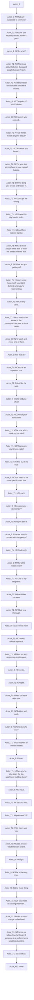

# Trachi/West/Sigmund Plaza/Prefecture/Second Level/Staircase/Roof/Balcony/EV001

```mermaid
graph TD
    745_0["Actor_9"]
    745_1["Actor_9: NWhat am I supposed to see here?"]
    745_2["Actor_71: NYou've just recently arrived, haven't you?"]
    745_3["Actor_9: NPSo what?"]
    745_4["Actor_71: NCThere are about forty-two thousand people living in Trachi."]
    745_5["Actor_71: NAdd to that an uncountable amount of visitors."]
    745_6["Actor_9: NCThe point, if you'd please."]
    745_7["Actor_71: NCHaven't you noticed..."]
    745_8["Actor_71: NThat there's barely anyone about?"]
    745_9["Actor_71: SCOf course you haven't."]
    745_10["Actor_71: SPFor you, this atmosphere is your natural habitat."]
    745_11["Actor_71: SWThe thing you create and foster in."]
    745_12["Actor_71: NCDon't get me wrong."]
    745_13["Actor_71: NPI know this city has its faults."]
    745_14["Actor_71: NCAnd how rotten it can be."]
    745_15["Actor_71: NBut at least people were able to walk the streets without fear."]
    745_16["Actor_9: NPWhat are you getting at?"]
    745_17["Actor_71: NI don't know how much you stand behind what you're representing."]
    745_18["Actor_71: NPCIn any case..."]
    745_19["Actor_71: NYou need to be aware of the consequences your actions cause."]
    745_20["Actor_71: NFor each and every one of them."]
    745_21["Actor_9: NIs that all?"]
    745_22["Actor_71: NCYou're an impatient one."]
    745_23["Actor_71: NJust like he said."]
    745_24["Actor_9: NWho told you what?"]
    745_25["Actor_71: NCOne of your associates."]
    745_26["Actor_71: NThe one who's made up his mind."]
    745_27["Actor_71: SCThis is why you're here, right?"]
    745_28["Actor_71: STo find out if it's true."]
    745_29["Actor_9: NCYou need to be more specific than that."]
    745_30["Actor_71: NCI can't."]
    745_31["Actor_9: NBecause you don't know?"]
    745_32["Actor_71: NAs you said it."]
    745_33["Actor_9: NYou've been in contact with that person?"]
    745_34["Actor_71: NPCIndirectly."]
    745_35["Actor_9: NWho's the middle-man?"]
    745_36["Actor_71: NCOne of my sergeants."]
    745_37["Actor_71: NA reclusive persona."]
    745_38["Actor_71: NPCBut very thorough."]
    745_39["Actor_9: NCan I meet him?"]
    745_40["Actor_71: NCI would advise against it."]
    745_41["Actor_71: NPHe's not very welcoming to strangers."]
    745_42["Actor_9: NEven so."]
    745_43["Actor_71: NAlright."]
    745_44["Actor_71: NHe's on leave right now."]
    745_45["Actor_71: NCPolitics and such."]
    745_46["Actor_9: NWhere does he live?"]
    745_47["Actor_71: NYou've been to Trenton Plaza?"]
    745_48["Actor_9: NYeah."]
    745_49["Actor_71: NThen you've also seen the big apartment building there?"]
    745_50["Actor_9: NCI have."]
    745_51["Actor_71: NCSecond floor."]
    745_52["Actor_71: NApartment 2-C."]
    745_53["Actor_71: NTell him I sent you."]
    745_54["Actor_71: NCode phrase: 'insubordinant briard'."]
    745_55["Actor_9: NAlright."]
    745_56["Actor_9: NI'll be underway, then."]
    745_57["Actor_71: NOne more thing:"]
    745_58["Actor_71: NCIf you insist on visiting that man..."]
    745_59["Actor_71: NMake sure to change beforehand."]
    745_60["Actor_71: NThere's no telling how he'd react if someone in a uniform turns up at his doorstep."]
    745_61["Actor_71: NGood luck."]
    745_62["Actor_461: none"]
    745_0 --> 745_1
    745_1 --> 745_2
    745_2 --> 745_3
    745_3 --> 745_4
    745_4 --> 745_5
    745_5 --> 745_6
    745_6 --> 745_7
    745_7 --> 745_8
    745_8 --> 745_9
    745_9 --> 745_10
    745_10 --> 745_11
    745_11 --> 745_12
    745_12 --> 745_13
    745_13 --> 745_14
    745_14 --> 745_15
    745_15 --> 745_16
    745_16 --> 745_17
    745_17 --> 745_18
    745_18 --> 745_19
    745_19 --> 745_20
    745_20 --> 745_21
    745_21 --> 745_22
    745_22 --> 745_23
    745_23 --> 745_24
    745_24 --> 745_25
    745_25 --> 745_26
    745_26 --> 745_27
    745_27 --> 745_28
    745_28 --> 745_29
    745_29 --> 745_30
    745_30 --> 745_31
    745_31 --> 745_32
    745_32 --> 745_33
    745_33 --> 745_34
    745_34 --> 745_35
    745_35 --> 745_36
    745_36 --> 745_37
    745_37 --> 745_38
    745_38 --> 745_39
    745_39 --> 745_40
    745_40 --> 745_41
    745_41 --> 745_42
    745_42 --> 745_43
    745_43 --> 745_44
    745_44 --> 745_45
    745_45 --> 745_46
    745_46 --> 745_47
    745_47 --> 745_48
    745_48 --> 745_49
    745_49 --> 745_50
    745_50 --> 745_51
    745_51 --> 745_52
    745_52 --> 745_53
    745_53 --> 745_54
    745_54 --> 745_55
    745_55 --> 745_56
    745_56 --> 745_57
    745_57 --> 745_58
    745_58 --> 745_59
    745_59 --> 745_60
    745_60 --> 745_61
    745_61 --> 745_62
```