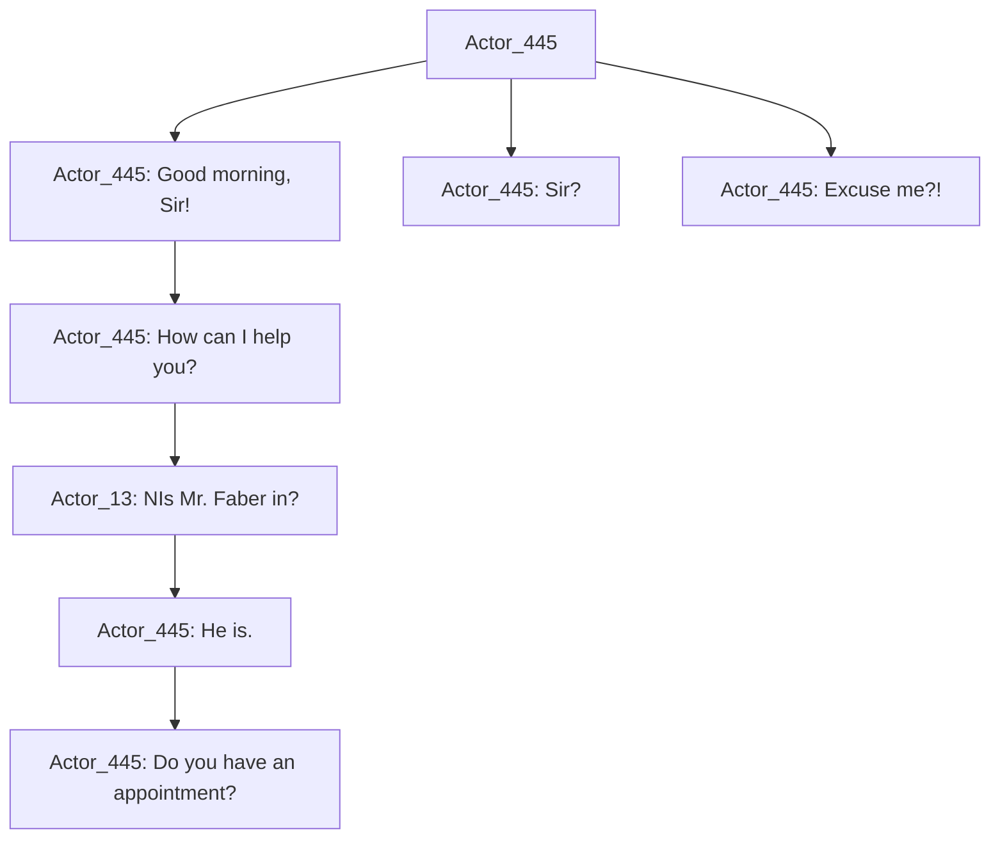

# Trachi/West/Sigmund Plaza/Town Hall/EV004

```mermaid
graph TD
    746_0["Actor_445"]
    746_1["Actor_445: Good morning, Sir!"]
    746_2["Actor_445: How can I help you?"]
    746_3["Actor_13: NIs Mr. Faber in?"]
    746_4["Actor_445: He is."]
    746_5["Actor_445: Do you have an appointment?"]
    746_6["Actor_445: Sir?"]
    746_7["Actor_445: Excuse me?!"]
    746_0 --> 746_1
    746_0 --> 746_6
    746_0 --> 746_7
    746_1 --> 746_2
    746_2 --> 746_3
    746_3 --> 746_4
    746_4 --> 746_5
```