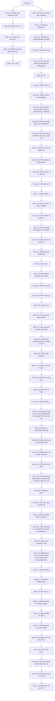

# Trachi/West/Sigmund Plaza/Town Hall/Mayor's Office/Farnswood

```mermaid
graph TD
    748_0["Actor_63"]
    748_1["Actor_63: SWhat's the meaning of this?"]
    748_2["Actor_63: SWho are you?"]
    748_3["Actor_13: SCYou know who I am."]
    748_4["Actor_13: SDon't try to play games with me."]
    748_5["Actor_461: none"]
    748_6["Actor_63: SPYou're earlier than expected."]
    748_7["Actor_13: SCMore importantly..."]
    748_8["Actor_13: SWould you mind explaining yourself?"]
    748_9["Actor_63: SPExcuse me?"]
    748_10["Actor_13: NCYou know perfectly well what I'm talking about."]
    748_11["Actor_63: SP..."]
    748_12["Actor_63: SWCI'm sorry."]
    748_13["Actor_63: SPBut I had to do something."]
    748_14["Actor_63: SSI received a facsimile from Amryn's ambassador, yesterday."]
    748_15["Actor_63: SWCThey know about our arrangement."]
    748_16["Actor_63: SPI had to prove that there wasn't any truth to it."]
    748_17["Actor_13: SIt's not what we agreed on."]
    748_18["Actor_63: SPThat's open to interpretation."]
    748_19["Actor_63: SWYou made it in, after all."]
    748_20["Actor_63: SPDidn't you?"]
    748_21["Actor_13: NCMr. Faber..."]
    748_22["Actor_13: SI'm not here to discuss details."]
    748_23["Actor_13: NCThe matter of the fact is..."]
    748_24["Actor_13: SYou brought this situation on yourself."]
    748_25["Actor_13: SAnd we need to resolve it."]
    748_26["Actor_63: SWhat are you proposing?"]
    748_27["Actor_13: SFor one..."]
    748_28["Actor_13: SWe haven't received our papers."]
    748_29["Actor_63: SWCOf course."]
    748_30["Actor_63: SPThere you go."]
    748_31["Actor_13: SThank you."]
    748_32["Actor_13: NCThat matter being settled..."]
    748_33["Actor_13: SYour ploy lost us about half a day."]
    748_34["Actor_13: SWe'll need extended access to make up for it."]
    748_35["Actor_63: SPFor what purpose?"]
    748_36["Actor_13: SThat is not your concern."]
    748_37["Actor_63: SWCWell, in that case..."]
    748_38["Actor_63: SPI'll have to refuse."]
    748_39["Actor_13: SPCMr. Faber..."]
    748_40["Actor_13: SI thought a man of your rank would realize the situation he's been put into."]
    748_41["Actor_63: SSOh – I understand perfectly!"]
    748_42["Actor_63: SWYou think you can intimidate me!"]
    748_43["Actor_63: SPBut you're not in Ionia, anymore."]
    748_44["Actor_13: SCThat's not the point."]
    748_45["Actor_13: SThe only thing that matters is whether you accept our terms or not."]
    748_46["Actor_63: SPWhat if I don't?"]
    748_47["Actor_13: SPCYou'll have to reimburse."]
    748_48["Actor_13: SOr we'll take this city by force."]
    748_49["Actor_63: SWI could have you arrested on the spot for saying that."]
    748_50["Actor_13: SPAre you listening to me?"]
    748_51["Actor_13: SWhether it's me, or someone else you're having this conversation with..."]
    748_52["Actor_13: SPIs irrelevant."]
    748_53["Actor_13: SAnd if I'm compromised..."]
    748_54["Actor_13: SSo are you."]
    748_55["Actor_13: NCOne thing's for certain, though."]
    748_56["Actor_13: SWe will take our share."]
    748_57["Actor_13: SThrough you, or someone else."]
    748_58["Actor_63: SPWell, we'll see about that."]
    748_59["Actor_63: SWCIn any case..."]
    748_60["Actor_63: SPI'll need some time to think this over."]
    748_61["Actor_13: SCYou have until six o'clock."]
    748_62["Actor_13: SThank you for your time."]
    748_0 --> 748_1
    748_0 --> 748_6
    748_1 --> 748_2
    748_2 --> 748_3
    748_3 --> 748_4
    748_4 --> 748_5
    748_6 --> 748_7
    748_7 --> 748_8
    748_8 --> 748_9
    748_9 --> 748_10
    748_10 --> 748_11
    748_11 --> 748_12
    748_12 --> 748_13
    748_13 --> 748_14
    748_14 --> 748_15
    748_15 --> 748_16
    748_16 --> 748_17
    748_17 --> 748_18
    748_18 --> 748_19
    748_19 --> 748_20
    748_20 --> 748_21
    748_21 --> 748_22
    748_22 --> 748_23
    748_23 --> 748_24
    748_24 --> 748_25
    748_25 --> 748_26
    748_26 --> 748_27
    748_27 --> 748_28
    748_28 --> 748_29
    748_29 --> 748_30
    748_30 --> 748_31
    748_31 --> 748_32
    748_32 --> 748_33
    748_33 --> 748_34
    748_34 --> 748_35
    748_35 --> 748_36
    748_36 --> 748_37
    748_37 --> 748_38
    748_38 --> 748_39
    748_39 --> 748_40
    748_40 --> 748_41
    748_41 --> 748_42
    748_42 --> 748_43
    748_43 --> 748_44
    748_44 --> 748_45
    748_45 --> 748_46
    748_46 --> 748_47
    748_47 --> 748_48
    748_48 --> 748_49
    748_49 --> 748_50
    748_50 --> 748_51
    748_51 --> 748_52
    748_52 --> 748_53
    748_53 --> 748_54
    748_54 --> 748_55
    748_55 --> 748_56
    748_56 --> 748_57
    748_57 --> 748_58
    748_58 --> 748_59
    748_59 --> 748_60
    748_60 --> 748_61
    748_61 --> 748_62
```