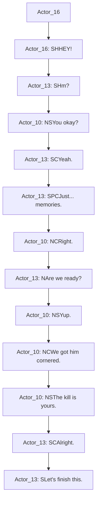

# Trachi/West/Stuart Alley/EV030

```mermaid
graph TD
    757_0["Actor_16"]
    757_1["Actor_16: SHHEY!"]
    757_2["Actor_13: SHm?"]
    757_3["Actor_10: NSYou okay?"]
    757_4["Actor_13: SCYeah."]
    757_5["Actor_13: SPCJust... memories."]
    757_6["Actor_10: NCRight."]
    757_7["Actor_13: NAre we ready?"]
    757_8["Actor_10: NSYup."]
    757_9["Actor_10: NCWe got him cornered."]
    757_10["Actor_10: NSThe kill is yours."]
    757_11["Actor_13: SCAlright."]
    757_12["Actor_13: SLet's finish this."]
    757_0 --> 757_1
    757_1 --> 757_2
    757_2 --> 757_3
    757_3 --> 757_4
    757_4 --> 757_5
    757_5 --> 757_6
    757_6 --> 757_7
    757_7 --> 757_8
    757_8 --> 757_9
    757_9 --> 757_10
    757_10 --> 757_11
    757_11 --> 757_12
```