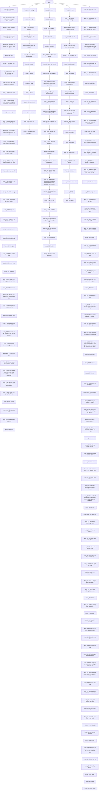

# Trachi/West/Stuart Alley/Stuart Apartments/Staircase/Goose Shed/EV001

```mermaid
graph TD
    758_0["Actor_3"]
    758_1["Actor_3: NHow's the situation?"]
    758_2["Actor_420: SPCA couple of wounded, five people dead, at least."]
    758_3["Actor_3: NWho fired the first shot?"]
    758_4["Actor_420: SCNo one's owned up to it, yet."]
    758_5["Actor_420: SBut a lot of people are saying it was the militia."]
    758_6["Actor_3: NCHm."]
    758_7["Actor_3: NWhat do you think?"]
    758_8["Actor_420: SPCIf I had to put my money on someone..."]
    758_9["Actor_420: SPI'd say it was that girl from the IIS."]
    758_10["Actor_3: NCProbably, yeah."]
    758_11["Actor_3: NWe need to make sure something like that doesn't happen again."]
    758_12["Actor_420: SPCRight."]
    758_13["Actor_3: NHow many men do they have in Rondham?"]
    758_14["Actor_420: SCDoubt it's much more than thirty of fourty."]
    758_15["Actor_420: SCBut they have Heinrich with them."]
    758_16["Actor_3: NCHe could be a problem, yeah."]
    758_17["Actor_3: NWhich is why we need Tanner on our side."]
    758_18["Actor_420: SHow is he?"]
    758_19["Actor_3: NCSuffered a few minor injuries..."]
    758_20["Actor_3: NBut he'll manage."]
    758_21["Actor_420: SIs he ready to talk to the mayor?"]
    758_22["Actor_3: NCI hope so."]
    758_23["Actor_420: SWant me to check up on him?"]
    758_24["Actor_3: NIf you don't mind."]
    758_25["Actor_3: NCHe's in his apartment in Farblein Trail."]
    758_26["Actor_420: NAlright."]
    758_27["Actor_420: NI'll be back in a bit."]
    758_28["Actor_3: NOne more thing."]
    758_29["Actor_420: NWhat?"]
    758_30["Actor_3: NI've asked Eury to keep a watch on him."]
    758_31["Actor_420: NCNo offense..."]
    758_32["Actor_420: SBut do you really think this is a good idea?"]
    758_33["Actor_420: SCI'm not sure if we can trust her."]
    758_34["Actor_3: NCNeither am I."]
    758_35["Actor_3: NBut she's proven very reliable, so far."]
    758_36["Actor_3: NCIf it wasn't for her leaking all that info on arteria..."]
    758_37["Actor_3: NIonia would have already gotten to us."]
    758_38["Actor_420: SCIf you say so..."]
    758_39["Actor_3: NCI appreciate your vigilance, Tillian."]
    758_40["Actor_3: NBut you have to understand that Eury doesn't have anywhere else to go."]
    758_41["Actor_3: NCThe only thing waiting for her in Ionia is a firing squad."]
    758_42["Actor_3: NSo I doubt she'll try anything funny."]
    758_43["Actor_420: SCAlright."]
    758_44["Actor_420: NCYou're the boss."]
    758_45["Actor_420: NSee you in a few, then."]
    758_46["Actor_3: NRight."]
    758_47["Actor_3: NIt's starting?"]
    758_48["Actor_420: SYep."]
    758_49["Actor_3: NEveryone in position?"]
    758_50["Actor_420: SAs far as I saw it."]
    758_51["Actor_3: NWhat about the militia?"]
    758_52["Actor_420: SArrived ten minutes ago."]
    758_53["Actor_3: NGood."]
    758_54["Actor_3: NEnter."]
    758_55["Actor_461: none"]
    758_56["Actor_3: NEury."]
    758_57["Actor_5: NThey're here."]
    758_58["Actor_3: NCPerfect."]
    758_59["Actor_3: NCCome on, Atlas."]
    758_60["Actor_3: NWhat are you waiting for?"]
    758_61["Actor_461: none"]
    758_62["Actor_3: NAtlas."]
    758_63["Actor_13: NOrpheus."]
    758_64["Actor_10: NSEury."]
    758_65["Actor_5: NSDaph."]
    758_66["Actor_3: NCNow that we're all here."]
    758_67["Actor_3: NLet's talk terms."]
    758_68["Actor_10: NCYou think so?"]
    758_69["Actor_10: NSI was rather hoping you'd put up more of a fight."]
    758_70["Actor_3: NCSorry to disappoint you."]
    758_71["Actor_3: NBut there's no need for me to resist."]
    758_72["Actor_3: NCYou've got my brother, don't you?"]
    758_73["Actor_10: NCWhat's left of him, anyway."]
    758_74["Actor_3: NCI figured as much."]
    758_75["Actor_3: NSo... What do you want?"]
    758_76["Actor_10: NCWell, for starters..."]
    758_77["Actor_10: NSYou're gonna come with us."]
    758_78["Actor_10: NSWe'll haul both of you back to Ionia."]
    758_79["Actor_10: NCAnd then, we'll squeeze every little detail out of you, your precious little brother..."]
    758_80["Actor_10: NSAnd that bitch of yours."]
    758_81["Actor_5: NSCOh my."]
    758_82["Actor_5: NSSo confident."]
    758_83["Actor_5: NSCReminds me of myself when I was your age."]
    758_84["Actor_10: NCWith one key difference..."]
    758_85["Actor_10: NSI never lost."]
    758_86["Actor_5: SGReally?"]
    758_87["Actor_5: RGAre you sure about that?"]
    758_88["Actor_3: NI see."]
    758_89["Actor_3: NCThat is... disappointing."]
    758_90["Actor_3: NBut it doesn't change anything."]
    758_91["Actor_10: NCThat's right."]
    758_92["Actor_10: NSYou'll join him, soon, anyway."]
    758_93["Actor_3: NCI don't think so."]
    758_94["Actor_10: SSCReally?"]
    758_95["Actor_461: none"]
    758_96["Actor_10: NSAnd why would that be?"]
    758_97["Actor_3: NCYou still haven't grasped it?"]
    758_98["Actor_3: NYou're outnumbered."]
    758_99["Actor_10: NSI can count well enough, thank you very much."]
    758_100["Actor_13: NPut it down, Daph."]
    758_101["Actor_10: SAtlas?"]
    758_102["Actor_13: NSorry."]
    758_103["Actor_13: SBut I mean it."]
    758_104["Actor_10: SCThis isn't funny."]
    758_105["Actor_13: SCIt isn't."]
    758_106["Actor_13: SPDrop it, now!"]
    758_107["Actor_10: RC"]
    758_108["Actor_10: SWhy?"]
    758_109["Actor_13: NCHe set it all up."]
    758_110["Actor_13: NFrom start to finish."]
    758_111["Actor_13: NCEvery piece of the puzzle, right there..."]
    758_112["Actor_13: NApart from one thing."]
    758_113["Actor_13: NHow did Hyperion know that Lorna wanted to run away?"]
    758_114["Actor_13: NCI had no clue."]
    758_115["Actor_13: NAnd neither did Eury."]
    758_116["Actor_13: NCLorna never told any of us."]
    758_117["Actor_13: SDid she?"]
    758_118["Actor_10: SSCHm."]
    758_119["Actor_10: NCYou got me right there."]
    758_120["Actor_10: NSIt's weird isn't it?"]
    758_121["Actor_10: SSCShe made me promise not to tell either of you."]
    758_122["Actor_10: NCYou know why?"]
    758_123["Actor_10: NBecause as much as both of you loved her..."]
    758_124["Actor_10: SYou never really listened to anything she said."]
    758_125["Actor_10: NCOf all the people in the world..."]
    758_126["Actor_10: NI was the only one who knew what she was going through."]
    758_127["Actor_10: NCAnd yeah."]
    758_128["Actor_10: NI told Hyperion."]
    758_129["Actor_13: SWhat did you tell him?"]
    758_130["Actor_10: NThat Lorna wanted to get away from it all."]
    758_131["Actor_13: SAnd what did he say?"]
    758_132["Actor_10: NCI'm sure we can find a way to fix all this."]
    758_133["Actor_13: SCDaph."]
    758_134["Actor_13: SYou know the story, now."]
    758_135["Actor_13: SCThe sides are set."]
    758_136["Actor_13: SAnd the masks are dropped."]
    758_137["Actor_13: SCI'll give you a choice."]
    758_138["Actor_13: SJoin us, and we'll make him pay."]
    758_139["Actor_10: SCAtlas."]
    758_140["Actor_10: SI meant what I said."]
    758_141["Actor_10: SThere's no one on this world I love more than you."]
    758_142["Actor_10: SCYou saved me from a monster."]
    758_143["Actor_10: SBut Hyperion picked me up."]
    758_144["Actor_10: SCHe showed me something I'm good at."]
    758_145["Actor_10: SAnd I'm not willing to give that up for a person who's been dead for more than four years."]
    758_146["Actor_13: SCAlright."]
    758_147["Actor_13: SThen leave."]
    758_148["Actor_10: NWhat?"]
    758_149["Actor_13: SPCGo and tell Hyperion..."]
    758_150["Actor_13: SPI'm coming for him."]
    758_151["Actor_10: RGDAre you having a laugh?"]
    758_152["Actor_10: NCThere's no way I'll let the three of you off, like that."]
    758_153["Actor_13: SCYou're welcome to try."]
    758_154["Actor_13: SBut I'd rather not waste any time, if I were you."]
    758_155["Actor_10: NCOh?"]
    758_156["Actor_10: NSAnd why would that be?"]
    758_157["Actor_13: NYou never read Solka's letter, did you?"]
    758_158["Actor_10: NSShould I?"]
    758_159["Actor_13: NCI don't think there's any need for that."]
    758_160["Actor_13: NCNot for you, at least."]
    758_161["Actor_13: NCBut for everyone who doesn't know..."]
    758_162["Actor_13: NI'm sure they'll appreciate all the details behind what happened, back then."]
    758_163["Actor_10: SWhat?!"]
    758_164["Actor_13: NCYou heard me."]
    758_165["Actor_13: NIt's public knowledge, now."]
    758_166["Actor_10: SCAre you insane?"]
    758_167["Actor_10: SIf Amryn gets wind of that-"]
    758_168["Actor_13: NThey'll declare war on Ionia."]
    758_169["Actor_10: SYou'd go this far, just for her?"]
    758_170["Actor_5: NCShe was right, you know."]
    758_171["Actor_5: NIonia is a monstrosity."]
    758_172["Actor_10: SCAs if Amryn were any better."]
    758_173["Actor_13: NWho said anything about Amryn?"]
    758_174["Actor_10: SCHuh?"]
    758_175["Actor_10: SWho's paying your bills then?"]
    758_176["Actor_3: NNo one."]
    758_177["Actor_3: NCYou said it yourself."]
    758_178["Actor_3: NPeople like us can't help ourselves."]
    758_179["Actor_3: NCJust like this city..."]
    758_180["Actor_3: NWe want to be free."]
    758_181["Actor_10: NCThis just gets better and better."]
    758_182["Actor_10: NSYou think you can cause a war and get away with it?"]
    758_183["Actor_10: RGDThe entire IIS will be up your arse in a week!"]
    758_184["Actor_13: NWe'll see about that."]
    758_185["Actor_13: NCJust keep in mind that we have a list."]
    758_186["Actor_13: SAnd your name's on it, too."]
    758_187["Actor_10: NCNow that's more like it."]
    758_188["Actor_10: NSAlright, let's have it your way."]
    758_189["Actor_13: SCSorry, Daph."]
    758_190["Actor_13: NIt's nothing personal."]
    758_191["Actor_10: NCRight."]
    758_192["Actor_10: NSI'll remind you of that when I come back and put this city to the torch."]
    758_193["Actor_13: SCFeel free to."]
    758_194["Actor_13: SNot today, though."]
    758_195["Actor_10: NCYeah."]
    758_196["Actor_461: none"]
    758_197["Actor_10: NSNot today."]
    758_0 --> 758_1
    758_0 --> 758_47
    758_0 --> 758_61
    758_0 --> 758_88
    758_0 --> 758_109
    758_1 --> 758_2
    758_2 --> 758_3
    758_3 --> 758_4
    758_4 --> 758_5
    758_5 --> 758_6
    758_6 --> 758_7
    758_7 --> 758_8
    758_8 --> 758_9
    758_9 --> 758_10
    758_10 --> 758_11
    758_11 --> 758_12
    758_12 --> 758_13
    758_13 --> 758_14
    758_14 --> 758_15
    758_15 --> 758_16
    758_16 --> 758_17
    758_17 --> 758_18
    758_18 --> 758_19
    758_19 --> 758_20
    758_20 --> 758_21
    758_21 --> 758_22
    758_22 --> 758_23
    758_23 --> 758_24
    758_24 --> 758_25
    758_25 --> 758_26
    758_26 --> 758_27
    758_27 --> 758_28
    758_28 --> 758_29
    758_29 --> 758_30
    758_30 --> 758_31
    758_31 --> 758_32
    758_32 --> 758_33
    758_33 --> 758_34
    758_34 --> 758_35
    758_35 --> 758_36
    758_36 --> 758_37
    758_37 --> 758_38
    758_38 --> 758_39
    758_39 --> 758_40
    758_40 --> 758_41
    758_41 --> 758_42
    758_42 --> 758_43
    758_43 --> 758_44
    758_44 --> 758_45
    758_45 --> 758_46
    758_47 --> 758_48
    758_48 --> 758_49
    758_49 --> 758_50
    758_50 --> 758_51
    758_51 --> 758_52
    758_52 --> 758_53
    758_53 --> 758_54
    758_54 --> 758_55
    758_55 --> 758_56
    758_56 --> 758_57
    758_57 --> 758_58
    758_58 --> 758_59
    758_59 --> 758_60
    758_61 --> 758_62
    758_62 --> 758_63
    758_63 --> 758_64
    758_64 --> 758_65
    758_65 --> 758_66
    758_66 --> 758_67
    758_67 --> 758_68
    758_68 --> 758_69
    758_69 --> 758_70
    758_70 --> 758_71
    758_71 --> 758_72
    758_72 --> 758_73
    758_73 --> 758_74
    758_74 --> 758_75
    758_75 --> 758_76
    758_76 --> 758_77
    758_77 --> 758_78
    758_78 --> 758_79
    758_79 --> 758_80
    758_80 --> 758_81
    758_81 --> 758_82
    758_82 --> 758_83
    758_83 --> 758_84
    758_84 --> 758_85
    758_85 --> 758_86
    758_86 --> 758_87
    758_88 --> 758_89
    758_89 --> 758_90
    758_90 --> 758_91
    758_91 --> 758_92
    758_92 --> 758_93
    758_93 --> 758_94
    758_94 --> 758_95
    758_95 --> 758_96
    758_96 --> 758_97
    758_97 --> 758_98
    758_98 --> 758_99
    758_99 --> 758_100
    758_100 --> 758_101
    758_101 --> 758_102
    758_102 --> 758_103
    758_103 --> 758_104
    758_104 --> 758_105
    758_105 --> 758_106
    758_106 --> 758_107
    758_107 --> 758_108
    758_109 --> 758_110
    758_110 --> 758_111
    758_111 --> 758_112
    758_112 --> 758_113
    758_113 --> 758_114
    758_114 --> 758_115
    758_115 --> 758_116
    758_116 --> 758_117
    758_117 --> 758_118
    758_118 --> 758_119
    758_119 --> 758_120
    758_120 --> 758_121
    758_121 --> 758_122
    758_122 --> 758_123
    758_123 --> 758_124
    758_124 --> 758_125
    758_125 --> 758_126
    758_126 --> 758_127
    758_127 --> 758_128
    758_128 --> 758_129
    758_129 --> 758_130
    758_130 --> 758_131
    758_131 --> 758_132
    758_132 --> 758_133
    758_133 --> 758_134
    758_134 --> 758_135
    758_135 --> 758_136
    758_136 --> 758_137
    758_137 --> 758_138
    758_138 --> 758_139
    758_139 --> 758_140
    758_140 --> 758_141
    758_141 --> 758_142
    758_142 --> 758_143
    758_143 --> 758_144
    758_144 --> 758_145
    758_145 --> 758_146
    758_146 --> 758_147
    758_147 --> 758_148
    758_148 --> 758_149
    758_149 --> 758_150
    758_150 --> 758_151
    758_151 --> 758_152
    758_152 --> 758_153
    758_153 --> 758_154
    758_154 --> 758_155
    758_155 --> 758_156
    758_156 --> 758_157
    758_157 --> 758_158
    758_158 --> 758_159
    758_159 --> 758_160
    758_160 --> 758_161
    758_161 --> 758_162
    758_162 --> 758_163
    758_163 --> 758_164
    758_164 --> 758_165
    758_165 --> 758_166
    758_166 --> 758_167
    758_167 --> 758_168
    758_168 --> 758_169
    758_169 --> 758_170
    758_170 --> 758_171
    758_171 --> 758_172
    758_172 --> 758_173
    758_173 --> 758_174
    758_174 --> 758_175
    758_175 --> 758_176
    758_176 --> 758_177
    758_177 --> 758_178
    758_178 --> 758_179
    758_179 --> 758_180
    758_180 --> 758_181
    758_181 --> 758_182
    758_182 --> 758_183
    758_183 --> 758_184
    758_184 --> 758_185
    758_185 --> 758_186
    758_186 --> 758_187
    758_187 --> 758_188
    758_188 --> 758_189
    758_189 --> 758_190
    758_190 --> 758_191
    758_191 --> 758_192
    758_192 --> 758_193
    758_193 --> 758_194
    758_194 --> 758_195
    758_195 --> 758_196
    758_196 --> 758_197
```