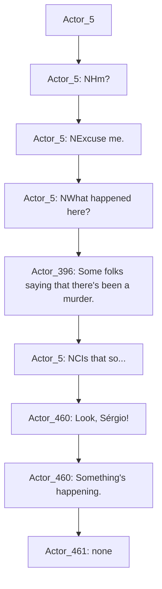

# Trachi/West/Trenton Plaza/EV015

```mermaid
graph TD
    765_0["Actor_5"]
    765_1["Actor_5: NHm?"]
    765_2["Actor_5: NExcuse me."]
    765_3["Actor_5: NWhat happened here?"]
    765_4["Actor_396: Some folks saying that there's been a murder."]
    765_5["Actor_5: NCIs that so..."]
    765_6["Actor_460: Look, Sérgio!"]
    765_7["Actor_460: Something's happening."]
    765_8["Actor_461: none"]
    765_0 --> 765_1
    765_1 --> 765_2
    765_2 --> 765_3
    765_3 --> 765_4
    765_4 --> 765_5
    765_5 --> 765_6
    765_6 --> 765_7
    765_7 --> 765_8
```