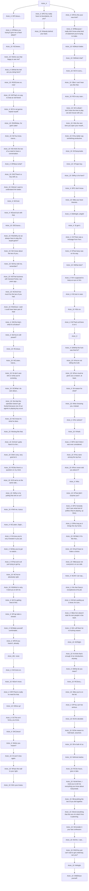

# Trachi/West/Trenton Plaza/Heria Apartments/First Floor/Third Floor/Icarus Apartment/Icarus Nova

```mermaid
graph TD
    779_0["Actor_4"]
    779_1["Actor_4: SPCJesus..."]
    779_2["Actor_4: SPWere you trying to give me a heart attack?"]
    779_3["Actor_10: NCAwww..."]
    779_4["Actor_10: NSAre you that happy to see me?"]
    779_5["Actor_4: SWhat the hell are you doing here?"]
    779_6["Actor_10: RGDCome on, now!"]
    779_7["Actor_10: NSThat's no way to treat an old friend!"]
    779_8["Actor_4: SCI'm not gonna repeat myself."]
    779_9["Actor_10: RGDRelax, for god's sake!"]
    779_10["Actor_10: NCYou know, Icarus..."]
    779_11["Actor_10: NSI think the two of us need to have a conversation."]
    779_12["Actor_4: SPAbout what?"]
    779_13["Actor_10: SSCThere's a boy with us."]
    779_14["Actor_10: NSAnd I want to understand him better."]
    779_15["Actor_4: NCCool."]
    779_16["Actor_4: NGood luck with that."]
    779_17["Actor_10: SSCIcarus..."]
    779_18["Actor_10: RGDWhy do we always have to play this stupid game?"]
    779_19["Actor_10: NCI know about the two of you..."]
    779_20["Actor_10: NSYou told me, remember?"]
    779_21["Actor_10: NSThat business with General Forten, two years ago..."]
    779_22["Actor_10: NCAnd how much fun the two of you had."]
    779_23["Actor_10: RGDGod, I wish I could have been part of that!"]
    779_24["Actor_4: SSCSo that's what it's all about?"]
    779_25["Actor_4: NGYou're still pissed?"]
    779_26["Actor_10: RCJesus."]
    779_27["Actor_10: NCListen, Icarus..."]
    779_28["Actor_10: NI don't care who or what you're screwing."]
    779_29["Actor_10: SCWhat I do care about..."]
    779_30["Actor_10: SIs that this operation doesn't get fucked because one of our agents is playing boy scout."]
    779_31["Actor_10: NCI know it's what he does."]
    779_32["Actor_10: NActing like that."]
    779_33["Actor_10: SCAnd I gotta hand it to him..."]
    779_34["Actor_10: SHe's very, very good at it."]
    779_35["Actor_10: RCBut there's a question on my mind."]
    779_36["Actor_10: SCIf we're on the same side..."]
    779_37["Actor_10: SWhy is he pulling that shit on us?"]
    779_38["Actor_10: NTell me, Icarus."]
    779_39["Actor_4: NCListen, Daph..."]
    779_40["Actor_4: NI know you're very invested in your job."]
    779_41["Actor_4: NCBut you've got to realize..."]
    779_42["Actor_4: NThat we're all just trying to get by."]
    779_43["Actor_10: NCYou're absolutely right."]
    779_44["Actor_10: NSWhich is why I need you to tell me."]
    779_45["Actor_4: NCI'm getting tired of this."]
    779_46["Actor_4: NI'll go take a shower."]
    779_47["Actor_4: NCMake yourself comfortable..."]
    779_48["Actor_4: NPCIf you haven't, already."]
    779_49["Actor_461: none"]
    779_50["Actor_4: NCCome on."]
    779_51["Actor_10: NDon't move."]
    779_52["Actor_4: NPCThere's really no need for that."]
    779_53["Actor_10: NShut up!"]
    779_54["Actor_4: SCThis isn't funny, you know."]
    779_55["Actor_4: SACJesus!"]
    779_56["Actor_4: SAAre you insane?"]
    779_57["Actor_10: SI won't miss again."]
    779_58["Actor_10: NFace the wall to your right."]
    779_59["Actor_10: NOn your knees."]
    779_60["Actor_4: NPCYou really have no boundaries, do you?"]
    779_61["Actor_10: NHands behind your back."]
    779_62["Actor_4: NPCIs this your new kink?"]
    779_63["Actor_4: NPBecause I really don't know what kind of statement you're trying to make."]
    779_64["Actor_10: NSMuch better."]
    779_65["Actor_10: NWhat's that?"]
    779_66["Actor_10: NCI'm sorry..."]
    779_67["Actor_10: SBut I can't hear you like that."]
    779_68["Actor_10: RCIn any case..."]
    779_69["Actor_10: NI'm afraid I don't have the time to play cat and mouse with you."]
    779_70["Actor_10: NSo the next time you open your mouth..."]
    779_71["Actor_10: NYou better say something productive."]
    779_72["Actor_10: SCGanymede."]
    779_73["Actor_10: STrojan boy."]
    779_74["Actor_10: SWhy is he here?"]
    779_75["Actor_4: SPCI don't know."]
    779_76["Actor_10: NBut you have theories."]
    779_77["Actor_4: SWAlright, alright!"]
    779_78["Actor_4: SI get it."]
    779_79["Actor_4: SCThere was a message from Fero."]
    779_80["Actor_4: NThat Gany was on his way."]
    779_81["Actor_10: NWhat else?"]
    779_82["Actor_4: NI'm supposed to keep an eye on him."]
    779_83["Actor_4: NCJust in case."]
    779_84["Actor_10: NGo on."]
    779_85["Actor_4: NCThat's all there is to it."]
    779_86["Actor_0"]
    779_87["Actor_4: SAWhat the fuck was that for?"]
    779_88["Actor_10: NYou're not telling the truth."]
    779_89["Actor_10: NFero must've given you a reason, at least."]
    779_90["Actor_4: SA reason for what?"]
    779_91["Actor_10: NNot choosing you, instead."]
    779_92["Actor_4: SFor arteria?"]
    779_93["Actor_10: NYeah."]
    779_94["Actor_4: NPCI don't think I was ever considered."]
    779_95["Actor_10: NYou were among the top four."]
    779_96["Actor_10: NFero never told you about it?"]
    779_97["Actor_4: NNo."]
    779_98["Actor_10: NThat didn't surprise you?"]
    779_99["Actor_4: SPCI honestly don't care what kind of politics they're playing, up there."]
    779_100["Actor_4: SPAs long as it brings the city home."]
    779_101["Actor_10: NCWell, if it's like that..."]
    779_102["Actor_10: NYou'll have to make a choice."]
    779_103["Actor_10: NBecause not everyone's on our side."]
    779_104["Actor_4: NCAll I can say..."]
    779_105["Actor_4: NIs that Gany's exceptional at his job."]
    779_106["Actor_4: NCHe's putting up a show, for sure..."]
    779_107["Actor_4: NBut he's doesn't stab his own people in the back."]
    779_108["Actor_4: SOr cuff them for no fucking reason."]
    779_109["Actor_10: NCRight."]
    779_110["Actor_10: NI think that's enough of an introduction, anyway."]
    779_111["Actor_4: SWhat do you mean?"]
    779_112["Actor_10: RCSorry..."]
    779_113["Actor_10: SBut you're on the list."]
    779_114["Actor_4: SPYou can't be serious."]
    779_115["Actor_10: NCIt's decided."]
    779_116["Actor_10: SCNo reason to hold back, anymore."]
    779_117["Actor_10: SFor both of us."]
    779_118["Actor_10: NAlmost twelve."]
    779_119["Actor_10: RCSix hours, give or take."]
    779_120["Actor_10: NUntil then, I need you to tell me everything you know about Ganymede."]
    779_121["Actor_10: NEverything the two of you did together."]
    779_122["Actor_10: NAnd everything that this son of a bitch Fero is planning."]
    779_123["Actor_10: NConsider it your last confession."]
    779_124["Actor_10: NCHm, I see..."]
    779_125["Actor_10: RGDYou just can't wait to get underway, can you?"]
    779_126["Actor_10: NAlright."]
    779_127["Actor_10: SNEBrace yourself."]
    779_0 --> 779_1
    779_0 --> 779_60
    779_0 --> 779_62
    779_1 --> 779_2
    779_2 --> 779_3
    779_3 --> 779_4
    779_4 --> 779_5
    779_5 --> 779_6
    779_6 --> 779_7
    779_7 --> 779_8
    779_8 --> 779_9
    779_9 --> 779_10
    779_10 --> 779_11
    779_11 --> 779_12
    779_12 --> 779_13
    779_13 --> 779_14
    779_14 --> 779_15
    779_15 --> 779_16
    779_16 --> 779_17
    779_17 --> 779_18
    779_18 --> 779_19
    779_19 --> 779_20
    779_20 --> 779_21
    779_21 --> 779_22
    779_22 --> 779_23
    779_23 --> 779_24
    779_24 --> 779_25
    779_25 --> 779_26
    779_26 --> 779_27
    779_27 --> 779_28
    779_28 --> 779_29
    779_29 --> 779_30
    779_30 --> 779_31
    779_31 --> 779_32
    779_32 --> 779_33
    779_33 --> 779_34
    779_34 --> 779_35
    779_35 --> 779_36
    779_36 --> 779_37
    779_37 --> 779_38
    779_38 --> 779_39
    779_39 --> 779_40
    779_40 --> 779_41
    779_41 --> 779_42
    779_42 --> 779_43
    779_43 --> 779_44
    779_44 --> 779_45
    779_45 --> 779_46
    779_46 --> 779_47
    779_47 --> 779_48
    779_48 --> 779_49
    779_49 --> 779_50
    779_50 --> 779_51
    779_51 --> 779_52
    779_52 --> 779_53
    779_53 --> 779_54
    779_54 --> 779_55
    779_55 --> 779_56
    779_56 --> 779_57
    779_57 --> 779_58
    779_58 --> 779_59
    779_60 --> 779_61
    779_62 --> 779_63
    779_63 --> 779_64
    779_64 --> 779_65
    779_65 --> 779_66
    779_66 --> 779_67
    779_67 --> 779_68
    779_68 --> 779_69
    779_69 --> 779_70
    779_70 --> 779_71
    779_71 --> 779_72
    779_72 --> 779_73
    779_73 --> 779_74
    779_74 --> 779_75
    779_75 --> 779_76
    779_76 --> 779_77
    779_77 --> 779_78
    779_78 --> 779_79
    779_79 --> 779_80
    779_80 --> 779_81
    779_81 --> 779_82
    779_82 --> 779_83
    779_83 --> 779_84
    779_84 --> 779_85
    779_85 --> 779_86
    779_86 --> 779_87
    779_87 --> 779_88
    779_88 --> 779_89
    779_89 --> 779_90
    779_90 --> 779_91
    779_91 --> 779_92
    779_92 --> 779_93
    779_93 --> 779_94
    779_94 --> 779_95
    779_95 --> 779_96
    779_96 --> 779_97
    779_97 --> 779_98
    779_98 --> 779_99
    779_99 --> 779_100
    779_100 --> 779_101
    779_101 --> 779_102
    779_102 --> 779_103
    779_103 --> 779_104
    779_104 --> 779_105
    779_105 --> 779_106
    779_106 --> 779_107
    779_107 --> 779_108
    779_108 --> 779_109
    779_109 --> 779_110
    779_110 --> 779_111
    779_111 --> 779_112
    779_112 --> 779_113
    779_113 --> 779_114
    779_114 --> 779_115
    779_115 --> 779_116
    779_116 --> 779_117
    779_117 --> 779_118
    779_118 --> 779_119
    779_119 --> 779_120
    779_120 --> 779_121
    779_121 --> 779_122
    779_122 --> 779_123
    779_123 --> 779_124
    779_124 --> 779_125
    779_125 --> 779_126
    779_126 --> 779_127
```