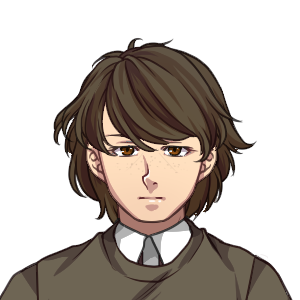

---
tags:
    - CoExA
    - IIS
---

{ width=200, align=right }

??? bio "Bio"

    **Name**: Gregor Stojanov  
    **Born:** 21st July 1899 || Scupi   

    **Career**:   
    [CoExA][] [1916]  
    [IIS][] [1921]
    AIO [1923] 

## Background
Orpheus was born into a family of low-ranking civil servants in the province of Macedonia. Shortly after his birth, his family had to flee the approaching Amrynian army during the [Thalassian War](). As an official of the state, his father received employment in the city of Byzantion, where Orpheus spent the rest of his early childhood.