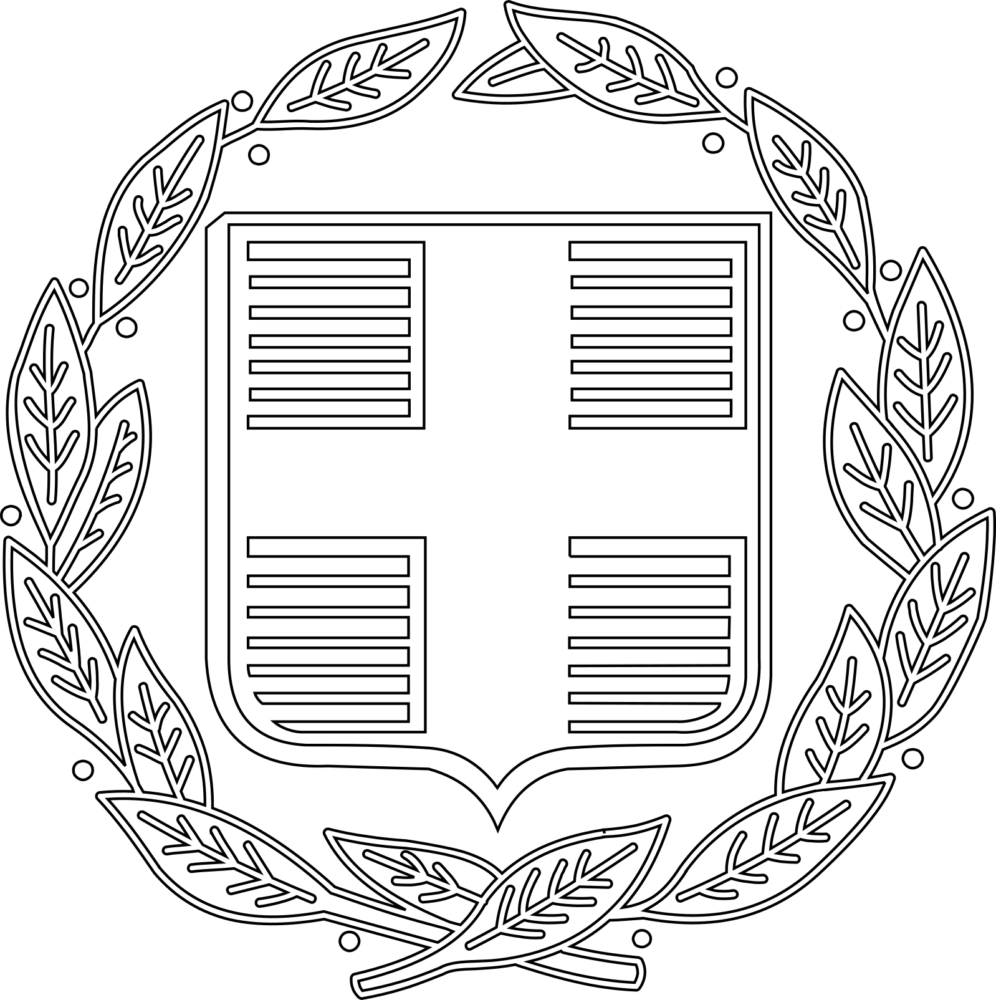

---
tags:
    - EnKAD
    - IIS
    - AIO
---

{ width=200, align=right }

??? bio "Bio" 

    **Capital**: Aion  
    **Founded:** 6th July 1905 || Smyrna   
    **Current Government:** Ionian Party  
    **Religion:** Neo-Paganism  
    **Ideology:** Futurism  
    **Sign**: Eternally.

Ionia was born when *Hellas* died. While its predecessor claimed lineage reaching back to Alexander, Ionia bears little resemblance to its ancient namesake. Except for a few points of continuity, the nation is by all accounts a product of the 20th century. 

## Hellas
Following its peak during the early modern age, the Autokratoria of Hellas had been in decline since mid-17th century. An attempt to reassert dominance over Thalassa Megale exhausted the country, culminating in its defeat at the battle of Rhodos on September 26th 1889. The treaty of Split saw Hellas cede control over eastern Anatolia, Syria and most of the southern Balkans. Severe reparations led to economic depression – while limitations on the size of its military left it open for wide-spread revolts. From 1890 to 1896, Hellas transformed into a landmass without a state. 

{ width=200, align=right }

## Chaos
Inflation turned into hyperinflation. Workers began to demand payment in food and basic goods. Factory owners resisted – unable to fix a price with rural landowners. Soon enough, proletarians went on strike. Protests became occupations, occupations brought about sabotage. Industrialists abandoned the government and enlisted destitute veterans to break strikes. 

Plagued by the drums of war, former soldiers grew into their new profession. On the morning of May 6th 1899, a group of eighty-seven stormed the Magnolia shipyards on the orders of its proprietor Mihail Philanthropenos. Counting both sides, 102 people lost their lives.

## EnKAD
While the intervention led workers in Nikomedia to abandon their strikes, it galvanized lower strata across Helas. By the turn of the century, more and more factories came to a halt. In the Peloponnesian Peninsula, strikes began to spread to the countryside. As the writer Elias Savvidis describes: 'If a farmer and a worker agree on something, it's a law.' However, neither land- and factory owners were obliged to follow a powerless government. Although the first few encounters between occupiers and enforcers supposedly started with words, almost all of them ended with deaths. 

The cycle of resistance and subjugation engulfed the entire nation. Neither the abdication of the Autocrat – nor the proclamation of a constitutional republic in 1901 managed to ease the tension. The initial elections produced a dispersed parliament. Torn between royalists, liberals, socialists and conservatives, none of the parties managed to form a majority. 

Continued paralysis of the coalition talks provoked a growing number of activists – matched by the size and amount of paramilitary organizations. A continuation of esprit de corps – bolstered by a sense of revanchism – translated into local organizations. In 1902, six regional leaders met near the city of Prussa, formed the council of Strategoi and elected Pjotr Thoma as Archon. Every member enlisted to any of the six Regions henceforth belonged to a central organization – the Endo-Kathartic Dialect. 

{ width=200, align=right }

## Smyrna
During the course of the following months, EnKAD rapidly grew in size. Revanchist newspaper flocked to its side, preaching an end to chaos and the return of national unity. On March 3rd 1903, the civilian branch of EnKAD announced the formation of the Ionian party (ION). 

As the name of the party implies, the reclamation of Smyrna became a core tenet of the Ionian manifest. Radical sections of the party saw its fulfillment an immediate necessity. The Strategos of EnKAD's Nikomedia section – Daniil Preston – marched several hundred of his members towards Smyrna on April 6th. To the world's surprise, he and his detachment passed through Helas' and Smyrna's checkpoints unopposed. Further confusion arose when Preston declared Smyrna as the provisional capital of Ionia. 

By May 1903, the liberal, conservative and parts of the socialist party elected the first government of the Hellenian Republic. Prime minister Giannis Baros promised to facilitate a compromise between workers, farmers, landowners and industrialists within a month. At the same time, he ordered a full account on all members belonging to any paramilitary organization. As the Archon of EnKAD, Pjotr Thoma was called to face members of the parliament in public hearing. While most of EnKAD's leadership ridiculed the decree, Thoma agreed to appear.

!!! construction
    The following paragraphs are due to be extended.

## Byzantian Stairs
As Pjotr Thoma ascended the stairs of the curia, shots emerged from the crowd. Thoma was hit twice in the torso – and succumbed to his wounds on the way to hospital. Several suspects were brought in for questioning, but the damage to the reputation of Hela's government had been done. While ION was already projected a double-digit share of the votes in the 1905 general election, Thoma's supposed martyrdom propelled it towards a leading position. As it garnered 34% of the votes, ION was set to become a major force in the parliamentary opposition. In a surprising turn of events, the conservative Party approached ION with a proposal: They'd agree to lend their votes, if ION were to uphold the constitution.

## Enlightenment
What felt like a cry of conviction across Ionia, raised a chuckle throughout the continent. Just two years ago – the Masillian Observer commented on black squadrons marching into Smyrna: 'The sick man of Europa makes a mockery of his grave'. Just a few weeks later, Perga – then Gordium and Ancyra fell. Prophets of Ionia's demise found their voice again, when the Dichotomy brought the young nation to the brink of a civil war. After the 'Eternal State' not only kept the promise of its name – but also annexed greater Kenovice – a conference on the future of southeastern Europe was called.

## Situation
'Bulgaria, no more', said a proclamation signed by Amryn, Rossia, Albion, Gallica and Ionia. Barring a few diplomatic incidents, peace has reigned in Europa since 1915. According to the Ionian Secretary of Foreign Affairs, 'Ionia reclaimed its lands and its people'. Most governments maintain a cautious, but appeasing pose. After all: Memories of the millions that died in the war 25 years ago don't vanish over night. The fact that Amryn stood alone when it accused Ionia of conducting Wilkert Forten's assassination, speaks volumes about Europa's commitment to a firm response.

## Future
Thus it falls to the journalists and academia to speculate on the continent's future path. Some pamphlets warn of an Ionian intervention in Syria, others see it coercing Trebizond. Given that Rossia moved large parts of its fleet to Sevastopol, Ionia would be hard pressed to project itself in the Black Sea. By far the most likely scenario is the intensification of covert operations across the Balkans. If Ionia truly were responsible for the bloodbath in Siginum – and perhaps the recent events in Dusa, too – it could just as well target any city in the region. 

Once the Balkans are properly in flames, subjugation to a foreign oppressor could lose its sting. As history taught us countless times: Chaos serves a nation on the rise.