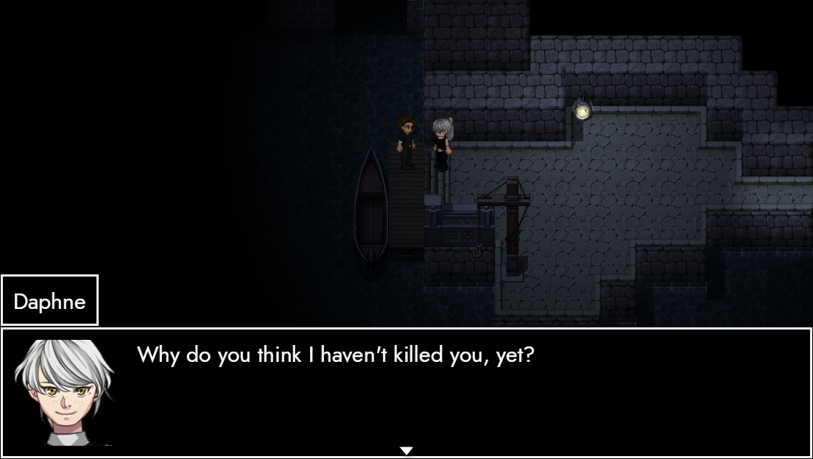
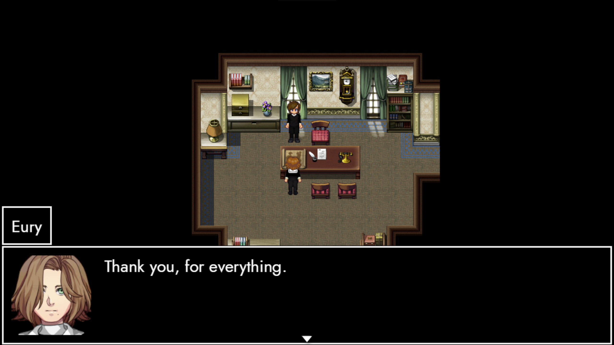

# Almost there

**Hey friends!**

This will be the **final devlog** before the release **TRACHI 1.4**. 
Feels kinda weird now that it's so close, but I guess all things must come to an end.
Anyways, normally I'd do a preview here. But since most of the content is technically already out, I will use this post to highlight a couple of other things, instead.
So let's hop into it!

<!-- more -->

# BetA
I've uploaded the beta build to itch yesterday. Compared to the Alpha, there's tons of bugfixes - both general and more specific.
In addition, I added a butt-load of flavour, including NPC dialogue, interactable events and a few new pieces of music.
There's still one or two things I'm planning to add. However, I am firmly convinced that this version can already stand for itself.
And as always, I'd love to hear your feedback on it.
Because there's something else in the pipeline.

# SteAm
Over the last week, I've put in all the necessary requirements for TRACHI to be hosted on Steamworks. 
Starting from the 24th November, you can download and **[play TRACHI through Steam](https://store.steampowered.com/app/1811440/TRACHI/)**.

So please, do feel free to put it on your **wishlist** if you want to get notified as soon as the game goes live. And as always, don't hesitate to **contact me if you run into any trouble**.
As promised, the game is and will be entirely **free for you to play**. 
**No micro-transactions, lootboxes, cosmetics or anything the like**.

"But Nory, how are you gonna support yourself financially? :O" -
I'm glad you asked. Because there's more.

# PAtreon
TRACHI now has its very own [Patreon page](https://www.patreon.com/trachi), in case you want to support development through financial means.
The highlight comes in the shape of **exclusive merchandise** for backing a certain tier for a specific number of months.

I'm still finalizing the rewards and might add more in the future. So please let me know if there's a specific reward you'd like to see.
However, and I give you my word on this:
 **I will never put any exclusive game content behind a paywall.** Neither timed nor permanent.
Furthermore, there won't be any shenanigans like NPCs being named after backers, exclusive polls or anything the like.

**TRACHI** as a project is there **for everyone to enjoy**. And I will leave it up to you how much you want to support it.
Not because I don't value money, but more because** I don't want to exclude anyone**. 

Rest assured, though, that I will do my utmost to **appreciate, integrate and compensate every single contribution**, no matter its quantity or shape. You're all part of it now. And **I'll make sure that this will be a home to you, too**.
For that matter, I want to express a dedicated thank you to everyone who helped me recoup some of the investment I made into TRACHI over the past ten years.
## Thank you Areh, Cerby, Jase, Jerome, Ve & Yingy.

And of course, **thank you to all the other supporters**, as well.
Without you, TRACHI would still be a half-finished mess of disconnected storylines which I'd probably never bother to finish.

**So from the bottom of my heart, one more time:**

This Saturday, an era comes to an end for me. And with it, a new one begins.
There's many more stories to be told, and I'm looking forward to announce them in due time.

For now, though, I will come to a close. 
Because there's still some work to be done.

As always, thank you for your interest and I hope you have an amazing week!
See you on Saturday.

Much love
Nory
