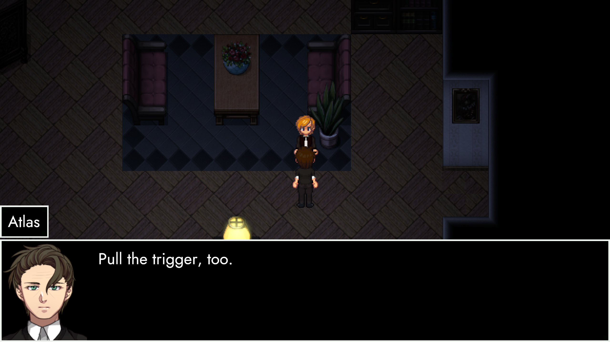
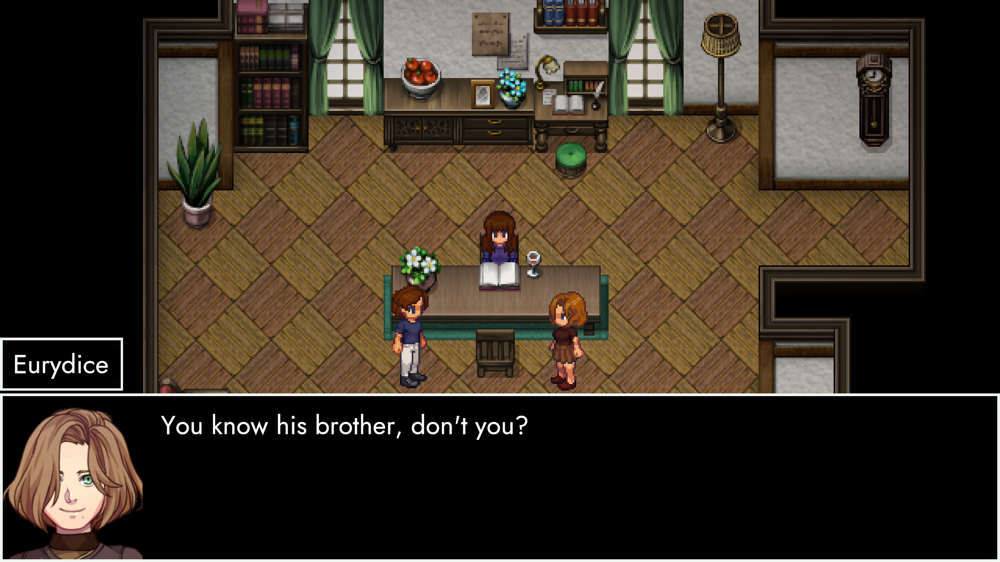
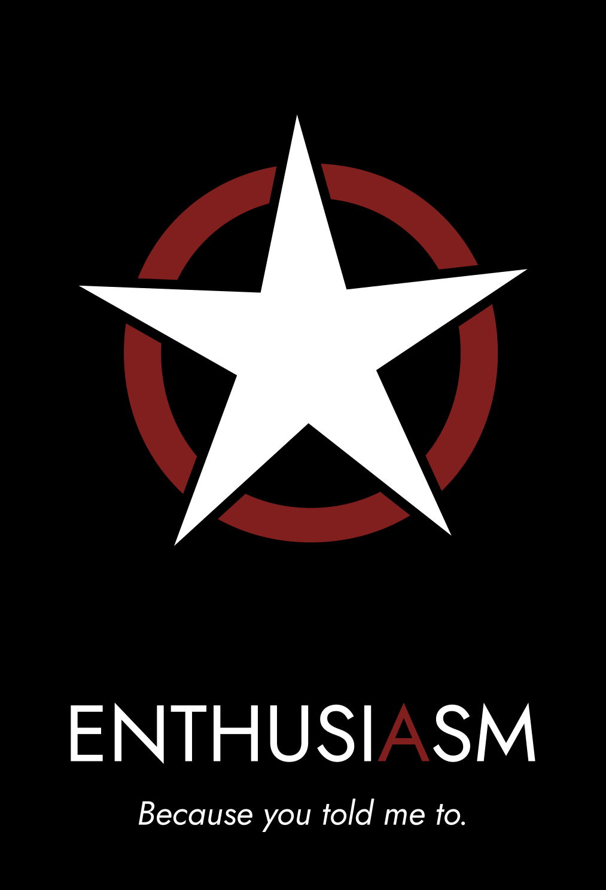

# TRACHI – InvAsion
Heyo peeps,

I've been terribly quiet, I know.
The odd post here and there, with a prefixed apology.
Just like the old days.
But there was a reason for this. Because one of the things I'm most afraid of is to disappoint others. I had to be absolutely sure whether it's feasible or not.
So yeah, it is.

That's right.

**August 26th**, **TRACHI – InvAsion** **will be released.**
It's a sort-of addendum for AUTONOMY, though technically fully stand-alone. Because it's made in Unity.
Take a look at this:
Same people, different times.

<!-- more -->
**A technical prototype**
I've tried to recreate AUTONOMY's look and feel as closely as possible, while utilizing Unity's strengths at scalability.
As you can see, the RPGMaker-esque blurriness on higher resolutions is gone. This means that everything looks a lot sharper and clean. 
 In most cases for the better, for worse in a few. But that's where polishing comes in.

Same people, same times.

**A narrative appendix**
Of course, I don't just want to show off a few new tricks I've learned.
Because the technical side is just a vessel for me to tell a story.
For that matter, I chiefly want to use this DLC to answer some of the questions left over from the main game.
This includes a lot of things. Whether it's narrative gaps or emotional send-offs â€“
InvAsion's got it all.
And obviously â€“ this means that a good bunch of established characters will take the stage again.

Same people, same place.

**An interactive play**
As of today, InvAsion is fully playable, barring two scenes.
A first build (InvAsion 0.5) has also been released as an internal Alpha.
It's still kinda hard to gage how long it's going to be runtime-wise, but I'm aiming for around **45 minutes to an hour**, give or take.

And yeah! It's going to be chock-full of dialogue, essentially scrapping the exploration bits to fully focus on the narrative.
In other words, this is me trying to play into the strengths of AUTONOMY, without the filler in-between. For that reason, I'm taking great care for every single line to be meaningful in some shape or form.
But of course, that's not all.
Same people, different place.

**A one-way trip**
There's a storm coming. And we want to have all our bases covered when it hits.
Which brings us to the final – and probably most important – reason for InvAsion to exist. It's role as a bridging element.

Simultaneously to putting the finishing touches on AUTONOMY and creating InvAsion, I've spent a lot of time trying to conceptualise the future of TRACHI. I won't go to deep into this, as we don't want to get ahead with ourselves.

So let me just say this:
Take a good look at these people.
And think about how it would feel to lose them all.
With that, I'll come to a close.

There's around 2 1/2 weeks left on AUTONOMY's clock before it stops. After that, I'll put my full attention on InvAsion until August 26th.

Accompanied by regular devlogs along the way.
If you'd like to participate in development or get a closer look behind the scenes, feel free to join the [official discord](https://discord.gg/SvaYDEUasg) and/or shoot me a message either there, here or through any of the other channels.

In the meantime, I wish you the best of days and weeks to comes.
And remain – as always – a deep admirer of yours.

Much love
nory
