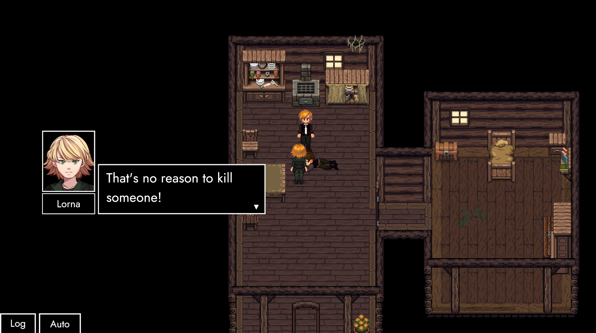

# ExcommunicAtion

## Hey friendos!

We're cruising with increasing excitement towards **August 28th**.

Four years ago, **[TRACHI – AUTONOMY](https://store.steampowered.com/app/1811440/TRACHI__AUTONOMY/)** was released to the public for the very first time. In other words:

### TRACHI's birthday is coming up! 🥳
 If you've been reading [the previous post](https://store.steampowered.com/news/app/2169000/view/6741373241922724912?l=english), you're already aware of last year's event. If not, don't worry! Because I'm here to provide exactly that kind of **context** to you.

### Remember 2022? I certainly do! I also recall that TRACHI got another game to its name. A cute little **interactive novel**, widely known and feared as **InvAsion**. Primed and ready to bring AUTONOMY vibes from RPGMaker straight to Unity.

### Rules of narrative
**InvAsion** embraced **AUTONOMY's** biggest selling point and slammed all its figurative eggs into the **story** basket. For about three quarters of an hour, the **characters and their words** got to carry us through increasingly disturbing events.

### Structurally
I wanted to apply a similar scope to this year's 2808. To deliver a **short and straight-forward experience** presenting the current **state of development**. And of course – add a whole new page to the TRACHI saga.

### New frontiers
If you've been following the [ANARCHY devlogs](https://www.youtube.com/playlist?list=PLA2lQHRVfM3ad227SUAKALMUJXTbPVcmB), you're probably aware that the game itself strives to marry **RPG driven combat with dialogue-driven storytelling**. After close to **four months of development**, I think it's high-time you got to experience the first fruits of that.

### 2023
Next Monday, **[TRACHI – ANARCHY](https://store.steampowered.com/app/2169000/TRACHI__ANARCHY/)** enters **early access**on Steam. The initial release (0.1) not only features the majority of the **game's eventual infrastructure**, but also– most importantly – the game's full introduction.

### ExcommunicAtion
Coming your way is a **multi stage battle** that condenses ANARCHY's current combat elements into a single encounter. A **10-20 minute dance** between **two characters** you of all people should be more than familiar with. So it probably won't come as a huge surprise when I tell you that there's a bit of a story there.

### I won't dwell on it
But I want to tell you one thing: For a the last six months or so, I've worked on building a bridge. In **AUTONOMY**, I presented an **early 20th century micro cosmos**. In ANARCHY, the world might look different, **but the people are still the same**.

### Hop, skip and a jump
If you can, think of ANARCHY as an **odyssey**. A journey through foreign space, viewed through a memory called *home*. Most – if not all – events are **reconfigured representations of in-world historical events**. Supplemented by an entire arsenal of old-world scenes of course.

### Speaking of..
Similar to AUTONOMY, **historical exposition** in ANARCHY also heavily relies on **flashbacks**. You might recognize some of these scenes, because **InvAsion** itself will also eventually be completely integrated into **ANARCHY**.

### In other words
We'll be looking much closer at each of these **people**. We'll help them rediscover their **memories**, both through the present and the past. One way or another, **the story of TRACHI goes on**. And at the end of it, hopefully both we and the characters understand ourselves and each other a bit better.

### To conclude
As always, I want to thank you very much for reading this. The "artist" in me hates to admit it. But **I wouldn't be doing this, if it wasn't for you**.

### Two days from now
The clock strikes ANARCHY. Going forward, it's your story as much as it's mine. Because of that, and many many other reasons, I can only encourage you to share whatever impressions, concerns and wishes you have.

For the next 3 years, **I'll be right here**. Making the best version of TRACHI – **together with you**! 😊

Until then and beyond – with **deep admiration from your most passionate fan** –

**much love**  
nory
