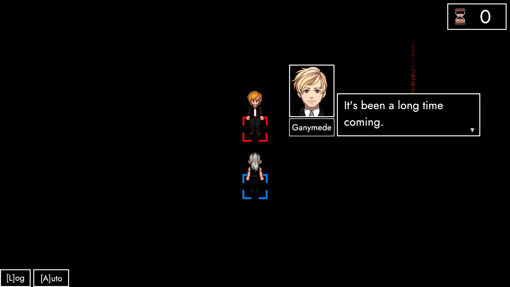
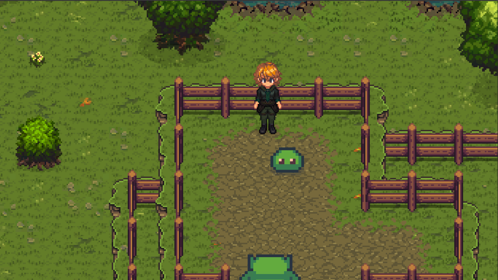

# ANARCHY 0.1

## Hey friends!

#### ANARCHY's first public build has just been released! 🎉
As an **early-access** build, there's inevitably a couple of "ifs" and "buts" attached. And since I love nothing more than being on the same page as you, I wanted to accompany this release with a couple of clarifications regarding **scope and features**.

### ExcommunicAtion

This is **ANARCHY's introduction** and should automatically launch once you hit "PLAY" for the first time. I won't spend too many words on it here, because I believe this one's mostly able to **speak for itself**. There are, however, two or three things I'll mention in regards to core features down below.

### ParAdise (Prototype)

A very early version of **ANARCHY's prologue** in its current state. Please see this mostly as a **technical showcase**, without any aspiration to resemble the final product. In fact, I've been struggling on whether to include this at all. However, I definitely wanted to show you **where the road is going**, and would be incredibly delighted if you could **weigh in with any thoughts and takes** you might have.

### Stats and stuff

At the **end of ExcommunicAtion**, your progress will be recorded and synced via [**Steam Stats**](https://partner.steamgames.com/doc/features/achievements). This means that it's persistent **across all devices and versions** as well. In other words: Unless something goes wrong, **you won't have to replay the intro** again. Either way, please do get in touch with me if this particular piece of content remains inaccessible to you.

### Dialogue

In some cases **dialogue bubbles** place themselves on the **edge of the screen**. If that should happen to you, please let me know. In case any meaningful bits of the dialogue get cut off, please use the **message log** as a temporary workaround.

### Input

ANARCHY 0.1 aims to offer **full mouse**, **keyboard** and **controller support**. Unfortunately, with the amount of devices out there, it's impossible to test every configuration. In other words: if you find yourself unable to complete an in-game action, please reach out to me.

### Outlook

During **September**, I'll try to focus on **bug-fixing** et al. Come **October**, work on **ParAdise** will commence. As you can imagine, I can't wait to get underway and **build a world together with you**. But before we get there, please enjoy everything that's out right now to your hearts content! 😊

### To Conclude
0.1 is the product of hundreds of hours of work. Please understand that – at it's core – **TRACHI** is a **one man project**. As a result, I both need and appreciate **every bit of help** I can get. If you'd like to get involved, please do **shoot me a message** either via Steam or Discord anytime.

One way or another, I remain **your most fervent admirer**.
And – from the bottom of my heart – wish you the very best! 🤗

**much love**  
nory
