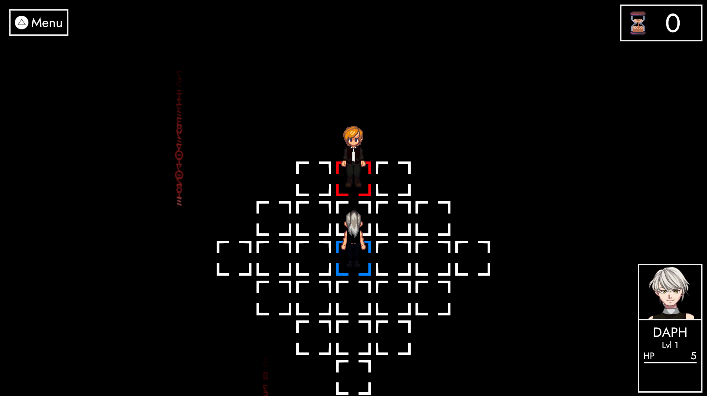
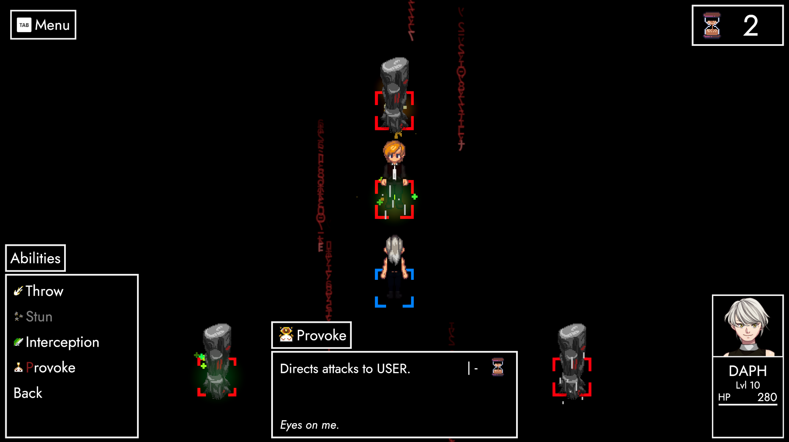

# Cheers! 🥂

**Hey handsomes! 😊**

It's been ten days since **ANARCHY 0.1** came out. So I think it's high time we sit down and have a cute little chat about a couple of things. **First and foremost**, though:

#### You guys are killing it! 🥳 
In its first week, ANARCHY blasted through AUTONOMY's records – both in regards to **distribution** and **player retention**. Don't take my word for it, though! Have a little diagram, instead:

#### Upwards trajectory
Be it the new engine, the combat system or any other additions ANARCHY brings to TRACHI – one thing is abundantly clear: **The results are all thanks to you! 🥰**

So please give yourself a loving pat on the shoulder, whenever you can! In the meantime, I'll try to **keep my promise** and give you as much insight into **development** as I can. Speaking of: Let's take a little look at some of the things coming with **ANARCHY 0.1.1**!

<iframe allowfullscreen="" frameborder="0" src="https://www.youtube.com/embed/SWTrjUjmicg"></iframe>

### The future
ANARCHY's **first patch** will include a whole bunch of **fixes** and **QoL elements**. Most of these features were already implemented pre-release, but needed a bit more **testing**. Now that we've got a bit of time on our hands before the next major release, I think it's the perfect chance to roll them out!

### Status
In 0.1, the **status screen** is only available in field mode. Come 0.1.1, it'll also be accessible during encounters. Pressing the **info button** will then either display the stats of the currently **active combatant** or the **selected target**. Most of these stats are currently nonfunctional for ExcommunicAtion, they will however play a big role in ParAdise and on.

### Glyphs
All over the game, **button prompts** will display a glyph of the corresponding **input**. These dynamically adapt to the device your last input came from – i.e. **keyboard** or **controller**. Not only is this great for overall accessibility, but also opens the door to design a UI that utilizes a whole range of input keys.

### !Conversation
A new option in the Main Menu can now set a global flag to **skip all conversations**. If you're gunning to **replay ExcommunicAtion** for the combat, this option's tailor-made for you. A button for in-conversation skipping is also planned, along with a couple of adjustments both to the message log and auto mode.

### Threat
At the moment, **AI** combatants choose their targets based on **proximity**. There is however already an implementation to override that. Going forward, I'd like to test these features to generate a more **dynamic aggro table** and also give both the players and enemies **more tools** to forcefully **redirect attention**.

### Un Deux Trois
As a first step, Phase 3 of ExcommunicAtion will undergo a slight rework. **Ganymede** will now always **prioritize Monoliths** over the player. More than that, he'll also get a shiny new skill called "Un Deux Trois". This ability simultaneously hits all enemy monoliths and turns them to Ganymede's side.

To counteract this, the player also gets a new ability called "**Provoke"**. This places a buff on its user, forcing all enemies in the vicinity to attack them for a specific duration (currently 4 Turns).

### ParAdise on Earth
And of course, a couple of building blocks for **Lornz'** big great adventure are included as well! Most of these concern **combat segments** that precede ExcommunicAtion. Among the restored features are **AOE spells** as well as proper **EXP & loot allocation**, along with several balance adjustments.

### To conclude
It's a big patch, considering it's versioned as a minor update. More than ever, I'd be super duper happy if you could take a gander once **0.1.1** is released. As for the date itself, I'm aiming for September 21st. 

I'll post a proper announcement once we're there, so feel free to keep an eye on the game, if you can. 👀

Either way, it's been a real pleasure releasing this! Once again, **thank you tons for all the support**! If there's anything you'd like to see realized within the game, please always feel free to get in touch with me.

Until then, big hugs from a friend.

**much love**  
nory
