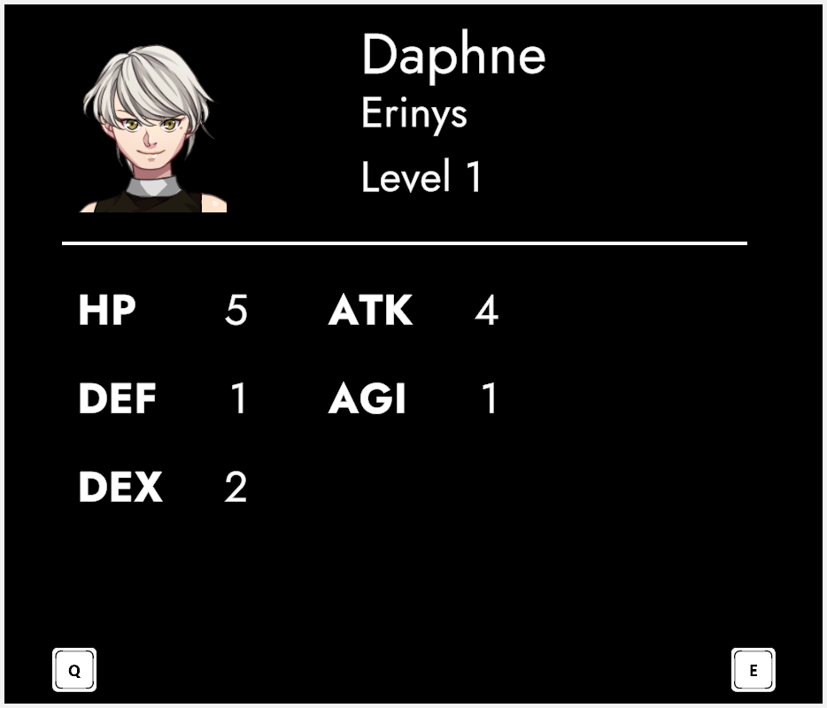
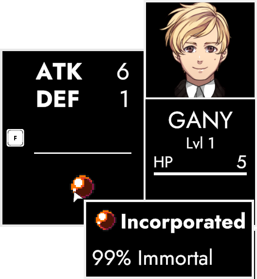
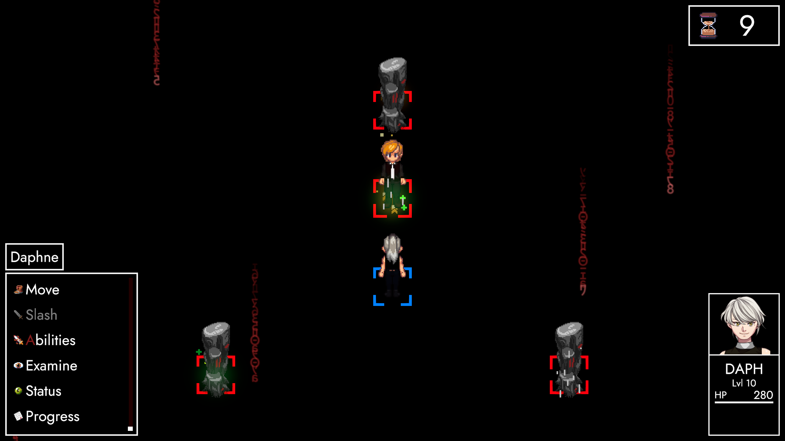
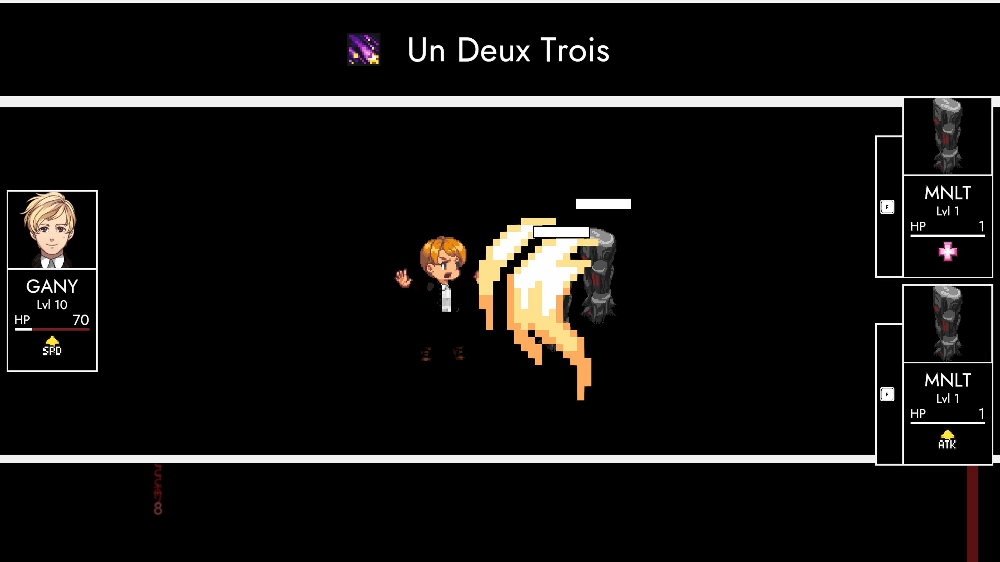
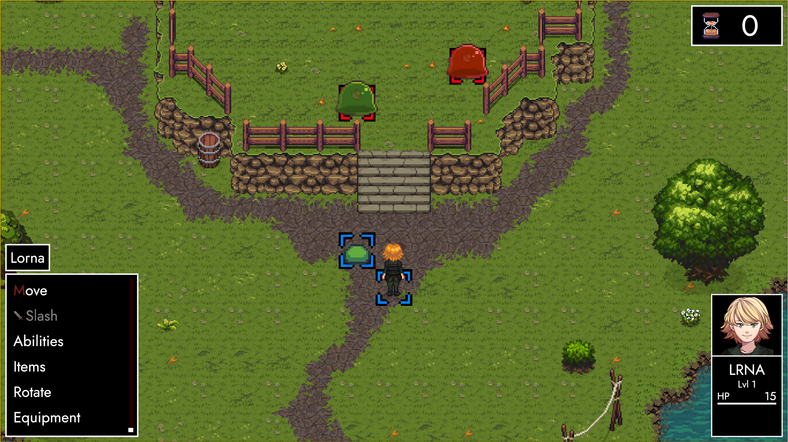
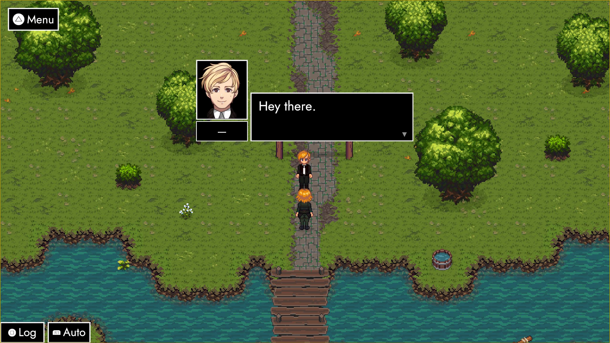
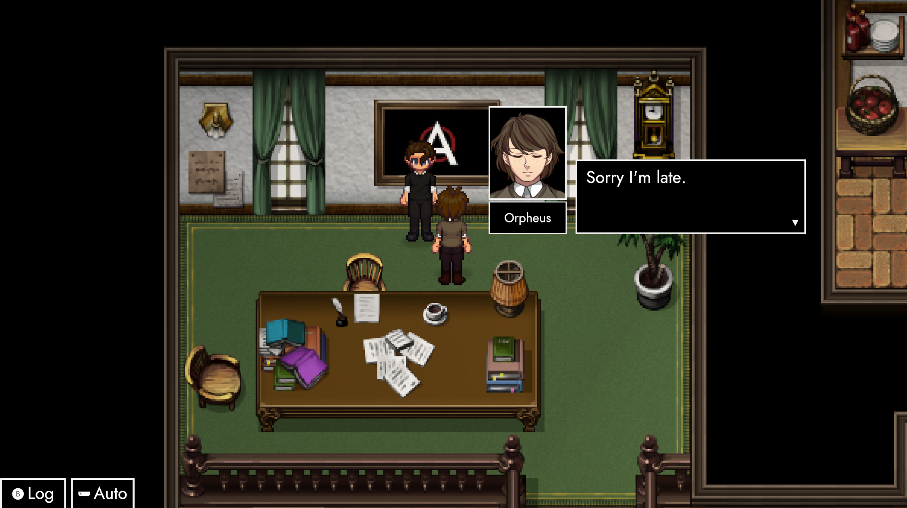

# Un Deux Trois

### **Hey friends & family! 😊**

**ANARCHY's first update is finally here!**

**0.1.1 (Trois)** comes with tons of **new features**, changes and improvements ALL across the board. From **Combat** to **RPG Elements**, a lot more bits of **ParAdise**, **UI**, **camera** and **backend improvements** – this one has it all. And seeing as the two of us are already here –

### Let's have a little chat!

You've already seen it: **Achievement(s)**! This one's awarded for completing **ExcommunicAtion** and goes hand in hand with **unlocking ParAdise**. If you've already done that during 0.1, you'll get it when you start 0.1.1 for the first time.

### Status Screen

As announced in the **[preview](https://store.steampowered.com/news/app/2169000/view/3686813676048584147?l=english)**, the **Status Screen** displays an extended overview of your **current character's stats**. Noteworthy are **HP** (Hitpoints), **ATK** (Attack) and **DEF**(Defense). These directly drive **damage calculations**, and you can track their **growth** throughout the **phases of ExcommunicAtion** and your **playthrough of ParAdise**.

### Target Info HUD
In a similar fashion, you can also get more info on the currently selected target. The **Target HUD** now comes with a little **Info Box** you can fold out to show both **extended stats** and **passive abilities**. 

Currently, **passives** are just **cosmetic** and mostly there for **lore** reasons. They're however already set up to individually **customise combatants** through passive (unlockable) **traits**.

### Glyphs

These were already touched upon in the **[preview](https://store.steampowered.com/news/app/2169000/view/3686813676048584147?l=english)**, as well. You've also likely spotted them in the previous sections. These **dynamic glyphs** display **input keys** and have now been implemented all over the game. They update automatically to reflect your individual **key mappings** set in the **Input screen** and your current **input device**.

### !Conversation

A new option – **Conversations** – allows you to **toggle ExcommunicAtion dialogue** on and off respectively. Think of this as the equivalent of a "story-mode" difficulty – just reversed. You'll get all the **combat and gameplay segments**, without being interrupted by dialogue.

### Mono Trouble

ExcommunicAtion's **phase 3** has undergone a rework focusing on **AI target selection**. Previously, Ganymede had a **5% chance** to hit an **enemy Monolith** and turn it back to **his side**. Going forward, he'll be much more persistent.

### Un Deux Trois

Starting with **0.1.1**, Ganymede has his eyes on the field. He'll probe it for Monoliths you've turned and **collectively hits them** with a shiny new ability. It's pretty unfair, all things considered. But also something that can be dealt with.

### ProvocAtion

To counter Ganymede's fixation on Monoliths, our very own **Daphne** will receive a new ability to apply a provoking **status effect** on herself. This not only increases her **Defense**, but also **forces Ganymede to attack her and only her**.

### Green Country

Speaking of combat encounters, battles in **ParAdise** have been almost completely restored and **enemies** now have their own **status developments**. A prime example of this change comes with the addition of a new big bad enemy that haunts Lorna during the early parts of her adventure.

### Progression

Naturally, the **player's people** won't be stuck at **level 1**, either. Contrary to ExcommunicAtion, levelling up is not done through beating up Ganymede (over and over again), but driven by **EXP** instead. EXP itself is gathered by – you guessed it – **killing things**. But there's also **completing quests** and **challenges**, among many other ways to further progress your characters.

### Equipment

The **equipment system** is already present in ExcommunicAtion, but without a way to functionally interact with it. For ParAdise, **equipment** will play a massive role. So it's only reasonable that you're provided with both the **individual pieces** and the infrastructure to **see and modify** who's wearing what to which effect.

### Last but not least

The few **story segments** in ParAdise have also been completely restored. This paves the way for future updates to continue the story of Lorna and her – soon to be introduced – friends. I'm super excited to get into this once the initial segments have been fleshed out a bit more.

### Speaking of Story

It's more of an **outlook** than anything else. But since we're approaching the end of the post anyway, I'd like to at least give you an idea of **what's next**. I've teased it a couple of times already. This time around, I want to be a lot more concrete.

### That's right!

**InvAsion is coming home!** I won't get to deep into it here, but **0.1.2** will put a heavy focus on polishing **dialogue interactions** and creating a sustainable **tile-mapping infrastructure**. InvAsion is thus the perfect poster child to not only **prototype** and **polish** these features, but also the perfect opportunity to integrate it into **ANARCHY proper**.

### To Conclude
If you're reading this, **ANARCHY 0.1.1 is live**. Even though it's a huge update, the game itself is still in the early stages of **Early Access**. I can't express how thankful I am both for your **trust** and **continued interest**, especially from those who've already invested hours into either ANARCHY and/or AUTONOMY. 

It's nothing compared to the kindness you're giving me. But I want to leave you with **a little something**. **Boot ANARCHY** and grab the **achievement** for completing ExcommunicAtion, if you haven't already. Word on the street is, it's good to have it when **0.1.2** comes out.

Beyond that, feel free to grab a licence of **InvAsion**, too – if you don't mind. There'll be more announcements down the road, but chances are **it won't be available the way it is right now** forever.

https://store.steampowered.com/app/2015930/TRACHI__InvAsion

As always,**thank you tons for reading this**. I hope you'll enjoy both 0.1.1 and all the future updates to come! If there's anything I can do for you, you're always welcome to get in touch.

Until then, big hugs and kissies from a friend! 😘

**much love**  
nory
