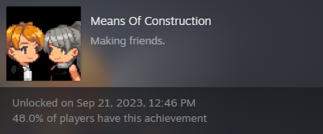

# Vanguard

#### Hey non-fictional friends! 👋 

As promised, here's more info on **ANARCHY 0.1.2 (Encore)**. We're dangerously close to **release** – a perfect chance for a little heads-up, a gentle reminder and a couple of deets!

#### Let's do exactly that!
The final **development** stretch is going exceedingly well. As of Thursday, we're **feature complete**. Highlights include the first set of **InvAsion** scenes, a rework of **ExcommunicAtion's Phase 4** – and a record-shattering amount of additions to **ParAdise**.

I'll squeeze in bit of extra **QA** this weekend to make sure it's all nice and pretty for you. 
Which means it's time for me to commit myself. 😳

### **October 23rd 📅**
Next Monday, **ANARCHY 0.1.2** goes live. I'll cover the features in a separate **post** published alongside the update. We'll also have an in-depth look at it during this Sunday's **devlog**.

<iframe allowfullscreen="" frameborder="0" src="https://www.youtube.com/embed/Wopskz2cv-s"></iframe>

Needless to say, I'm stoked! This update is the first step towards bridging **AUTONOMY** and **ANARCHY**. It feels like coming home to a new place – and what better way to celebrate than to give back to a couple of friends? 

## Standing Out

Remember the **achievement** for completing ExcommunicAtion? I [mentioned](https://store.steampowered.com/news/app/2169000/view/3713837177195369430?l=english) early-bird **rewards**. There was a lot of back and forth during development, but I'm incredibly proud to announce that there's already a functioning **prototype** system in place.

## VariAtion

Launching 0.1.2 for the very first **time** runs a check on whether you've **completed ExcommunicAtion**. If you did, you'll get a new **appearance** for **Daphne**. In addition to her **default** look, you can have her hop into an **EnKAD uniform** – with different sprites and a matching set of portraits.

## Deadline
Chances are, you're already part of the **eligible 50%**. If not, there's still a good amount of time. Especially considering there's settings allowing you to jump straight into ExcommunicAtion's later phases – and/or **skip conversations**. But you didn't hear that from me, okay? 😏

Either way, I'll end it here and resume the playtesting grind. **Thank you** – as always – very much for your valuable time.

Have a great weekend, champs! 😊

much love
nory
