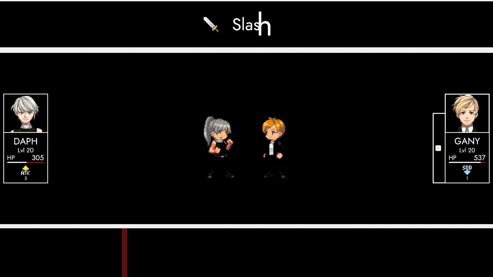
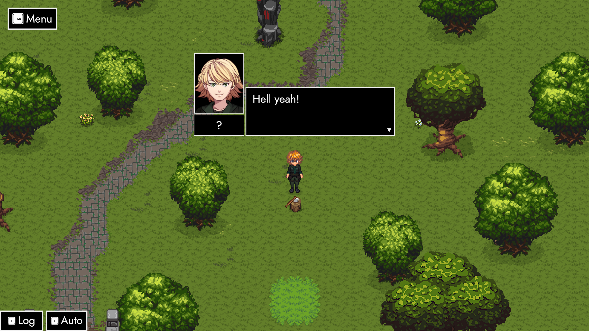
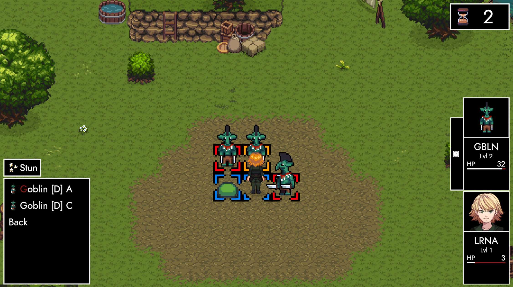
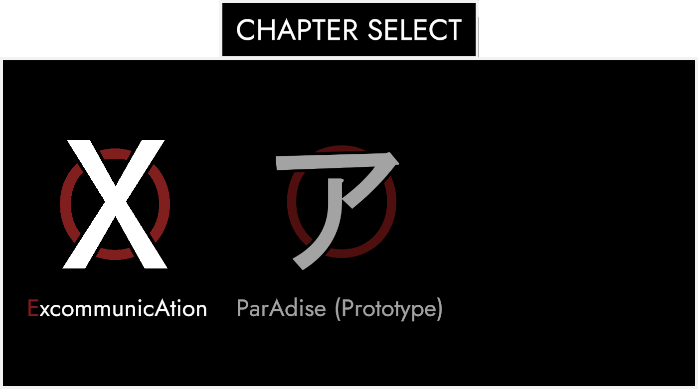
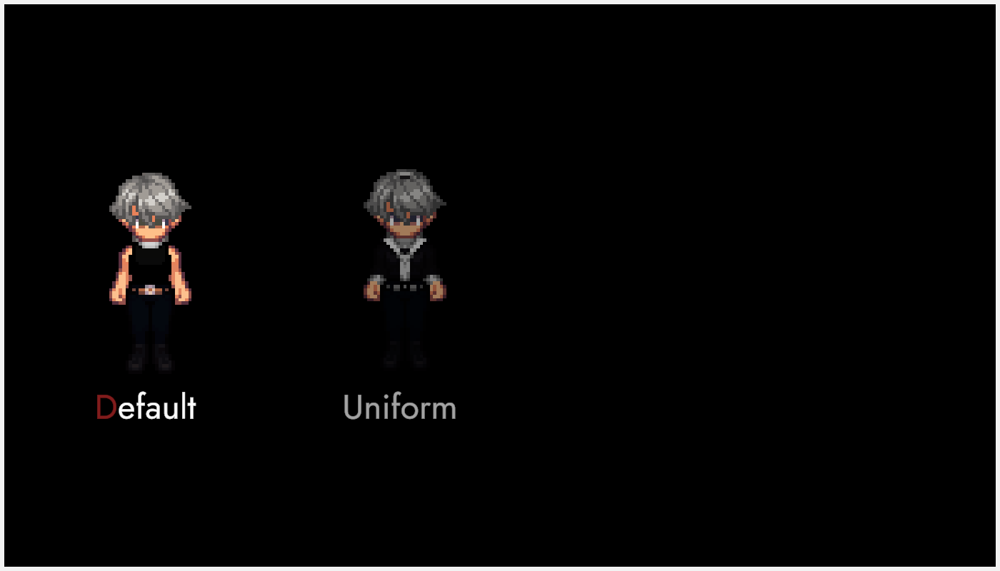
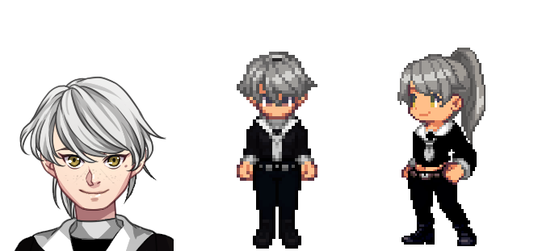

# Encore

### **Howdy-ho, friends! 🤗**

At long last, ANARCHY's **second update** is finally here. 
There's so much to cover – and so little time.

### **Let's jump in!**
Development of 0.1.2 revolved around three primary goals: Implementing the first set of **InvAsion scenes**, reworking **ExcommunicAtion's Phase 4** and adding mountains of content to **ParAdise**. I'm very proud to announce all three milestones were met!🎉 In addition, there's general **UI improvements** alongside a prototype for cosmetic **VariAtions**, topped off by a new patch-wide **challenge**.

### **Top to Bottom**

The first thing you'll notice is that there's two new**achievements**. One of them – eerily similar to the picture above – sports the faces of **Icarus** and **Ganymede**. There's a story between these two. And I think it's time for us to admit we know how it went. For the duration of this patch, **I'd love to see people recreate this particular scene**. 👀

### **Method**

In a continued effort to polish **ExcommunicAtion**, **Phase 4** underwent a slight rework. Going forward, **Ariadne** will do her best to set you up. All her efforts go into a devastating **arena-wide spell** that reduces the **HP** of all targets to **1**. Afterwards, **the stage is yours**.

### **Tact**

On a related note, **all stats** have been carefully **readjusted** for each individual **phase**. Attacks feel a lot more deadly and the phases themselves flow a bit **quicker**. Naturally, this also has an effect on **ParAdise**. Enemies generally live longer, but **Equipment** makes a much bigger difference now.

### **LiberAtion**

To kickstart **Lorna's** adventures, she'll now receive a **weapon** through a little **event** just a couple of steps away from the initial spawning point. And since Lorna's story is all about taking matters into her **own hands**, she now gets to wield a very special **axe**. 🪓

### **Goblins**

In addition to an overall **stats** and **loot table** reworks, a tribe of Goblins intend to cause big trouble in little ParAdise. They're not all too clever, yet. But word on the street is, they'll learn to **coordinate**, soon. Until then, feel free to **hack away at them** as much you please. Though be advised that they're already a lot stronger than the other enemies you've faced.

### **Frontier**

The **tiles** of Paradise's first map have been massively reworked. **Hilltops** now have their own distinctive color and the **ground** is in general is **much less busy** on the eyes. **Trees** have been repositioned to allow for smoother **movement** across the map. Next to a lot more **props** all over the place, the outside parts of a **toll-house** now overlook the river separating north from south.

### **Black Market**

If you've been looking for a way to spend your **Polygons**, Ari's got your back! From **consumables** to starter **equipment**, she loves nothing more than sorting you out. There's rumors she even temporarily got her hands on some **special stuff**. 👀

### **Ostrakon**

Oftentimes in **history**, we see the past only through little **fragments** here and there. It's for us to connect these bits and pieces in an effort to make sense of it. Although the **old word** is lost, it's **not forgotten**. On the contrary! Like a present, it's waiting to unwrap itself in front you.

### **Nostalgia**

Interacting with **Fragments** triggers an old world **memory**. Players get to witness a moment in TRACHI's history, currently represented by a collection of **InvAsion scenes**. They offer a snapshot of a moment in the **character's previous lives**. The characters get to remember, and you get to find something out about them. And maybe, you get to keep a little **souvenir**.

### **NavigAtion**

Sometimes things don't go as planned. Sometimes you'd rather be **somewhere else**. Going forward, you can return to the **Start Menu** (almost) whenever you please. As a bonus, the **chapter selection** has also received a slight **visual** rework.

### **VariAtion**

They say: "Clothes make the man". Does that go for **fictional people**, too? In ANARCHY, characters are represented as **base classes** with a whole set of different **VariAtions**. At the moment, the system itself is mostly used within **Fragment Scenes**. Though I'd love for you to have additional options for **customization**, too!

### **Field Trial**

As a thank you to the absolute awesome bunch of people that invested their valuable time to overcome **ExcommunicAtion** during **0.1.1**, a new **skin** is now available for **Daphne**. Going forward, I'd like to at least include one VariAtion per patch. These will be tied to a monthly challenge represented by a special **achievements**.

### **Vanguard**

If you like what you see and haven't completed **ExcommunicAtion** yet – don't worry! There'll be plenty more opportunities to grab this **cosmetic** down the line. Beyond potential **reruns**, there are also plans to couple VariAtions with **Steam's Inventory System** and thus open the door for **trading**, **buying/selling** on the **market** and/or purchase the item as a **DLC**.

### **Conclusion**

As you can see, there's tons of elements going into **ANARCHY**. It's my **responsibility** to not only work on these segments, but also tie them together in a **meaningful way**. Your presence helps me to discern **essential features** from **flavor stuff** – and serves as a continuous **encouragement** for me to keep going. 

As such, I'd like to – once again – **thank you so much for all the support**! 😊

I hope you'll enjoy this update as another big leap forward to transform the world of **TRACHI** into a video game. I'll be back soon to talk more about the next **milestone** – henceforth known as **ANARCHY 0.1.3 (Marché)**. In the meantime, **here's to you having a great couple of weeks**! 🍻

Big hugs and kissies! 🥰

**much love**  
nory
