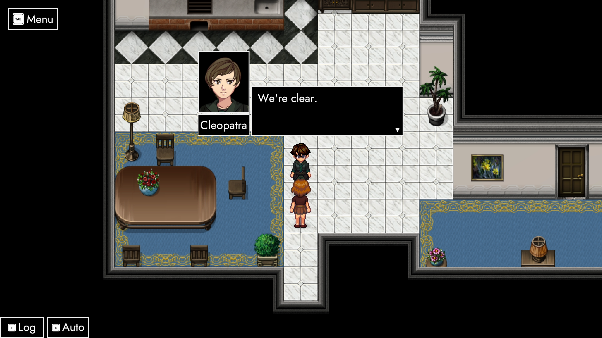
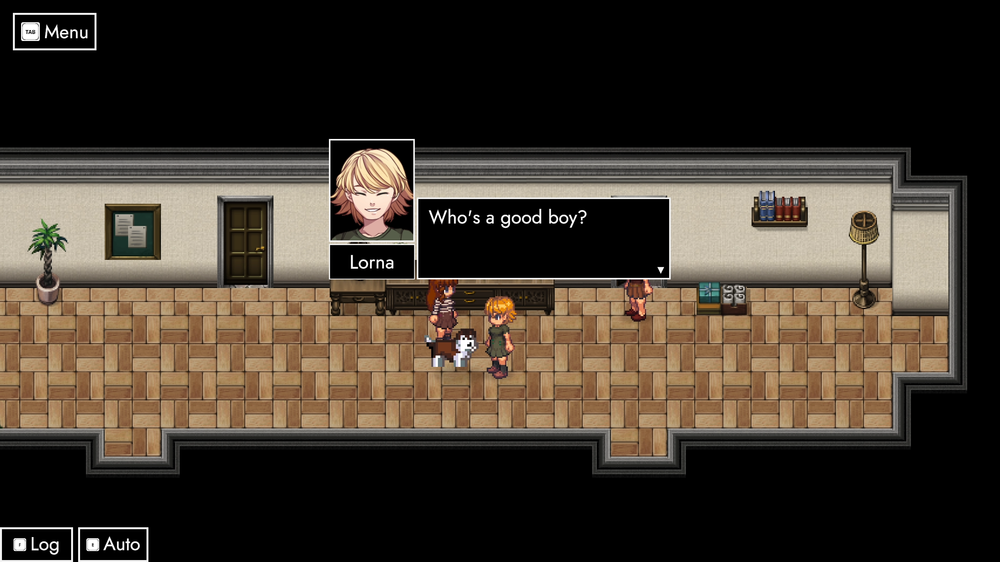
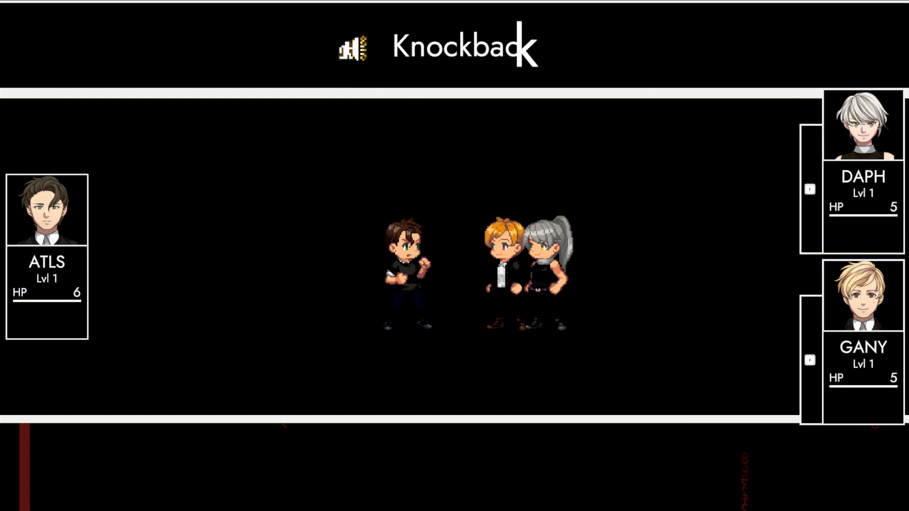

# Marche (Preview)

## **Hey friends and family** 👋

We gather again **just in time** for a little **preview** of ANARCHY's next **monthly update**. 

## Point 1.3

The name ***Marche*** implies: This patch will be all about **movement**. Features so far include a **multi-stage Fragment** going way into the past, more **main story quests**, **patrolling NPCs**, a **Knockback ability**, and – of course – a bunch of **variAtions**!

## ImmigrAtion 🧳

**AUTONOMY**-friends recognize the place. In 1913, **Lorna**, her **sister** and a close **friend** of the family are about to start a **new life**. **And we'll be right there!** We'll get to witness them **settle** and **adapt** to a space they'll call **home** for the next **5-6 years**. You can imagine that there's a lot of **excitement**, but a fair share of **anxiety** too.

## Introduction

The **entire segment** will eventually become part of **ParAdise's intro**. We'll kick our journey off in **familiar places** and subsequently **tear down** the world's **tapestry** bit by bit. Large parts of it are still **conceptual**, but I think you can see big efforts to bridge **Old** and **New-World** content.

## Argonautica

Speaking of **new worlds**: ParAdise's **main quest** received a bit of **love**. Previously, players could go **north** after a short **conversation** with **Ganymede**. A semi-friendly **NPC** now prevents her from **progressing** in that direction unless she can deliver **proof of her identity**. Thankfully, there's a special **fragment** that holds a special **item** – and **Lorna's name** is written **all over it**! 💳

## Locomotion

<iframe allowfullscreen="" frameborder="0" src="https://www.youtube.com/embed/cdtu1GGR0Aw"></iframe>

Grabbing Lorna's **service card** will be the first real **roadblock** of the game. The **enemies** surrounding the **Fragment** might just eat you alive at **level 1**. However, certain **encounters** can also be avoided. Some of the **Field Impostors** responsible for triggering battles now actively **patrol** their corresponding areas, giving you the opportunity to **sneak** by.

## Manipulation ✋

In regards to actual **battles**, there's a bunch of **new abilities**. One of them goes by the name ***Knockback***. The ability itself consists of two primary elements. First, the attacker tries to push the **primary target** away by one tile. If the destination is **empty**, the target is **relocated**. If the **destination** is occupied or blocked, the target stays where it is and both entities take **150% of the attacker's ATK as damage**.

## Return of the 👑

**Experimental abilities** are ideally prototyped in a **safe environment**. And since I was planning on reintroducing a **very important character** anyway – I wanted to give you a little peek at something **cool**. It's a while off, but there's definite plans to celebrate **0.2** next **February** by adding an *extra* chapter to **ExcommunicAtion**. In **ExtrapolAtion**, you'll get to join team **ATLAS** and teach both **Ganymede** and **Daph** a couple of good reasons not to play with **fire**. 🔥

## Quid pro Quo

Last but not least, **0.1.3** also comes with a special **variAtion** for players that completed **0.1.2's challenge**. There will probably be another **temporary achievement** – at least until the **Steam Inventory System** is fully hooked in. As for the **variAtion** itself: I'm still bouncing between a couple of **candidates**. Here's **one** of them:

## Subject #801e1e

From September 1923 to October 1926, **Ganymede** was interned at one of **Ionia's** many **black-sites**. Under the guise of a busy **hospital**, the **Wenger Asylum** is a place where **agents** with **questionable motives** get *debriefed*. Thankfully, **Ganymede** loves nothing more than giving **you** the **answers** you **want** to hear.

## Conclusion
All in all, ***Marche*** will be a bit **smaller** than its **predecessor** due to special **day-job commitments** this month. The good news is: Everything you see here is already live on the public **beta** **branch**. Starting **November 18th**, I'll take a little vacation and fully throw myself into **development** until release. This gives me more than a week to **clean** up **0.1.3** and mayhaps even include a **feature** or two originally planned for **0.1.4**.

Either way – I'll get back to you at the latest with a little **overview** of **0.1.3** – ***Marche*** once it's released on **November 28th**. 😊

Until then, I hope you have a **great couple of weeks**. 🥰

**much love**  
nory
