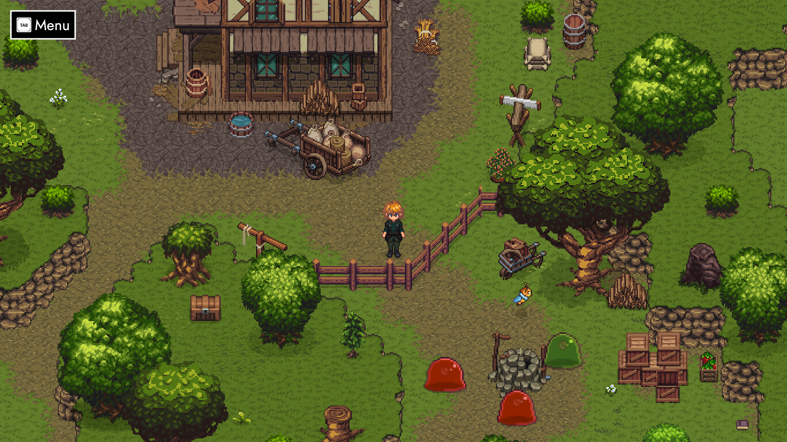
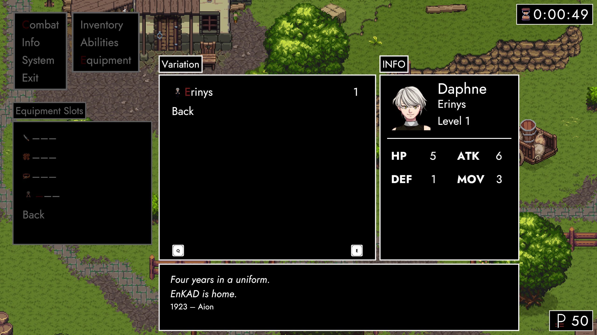
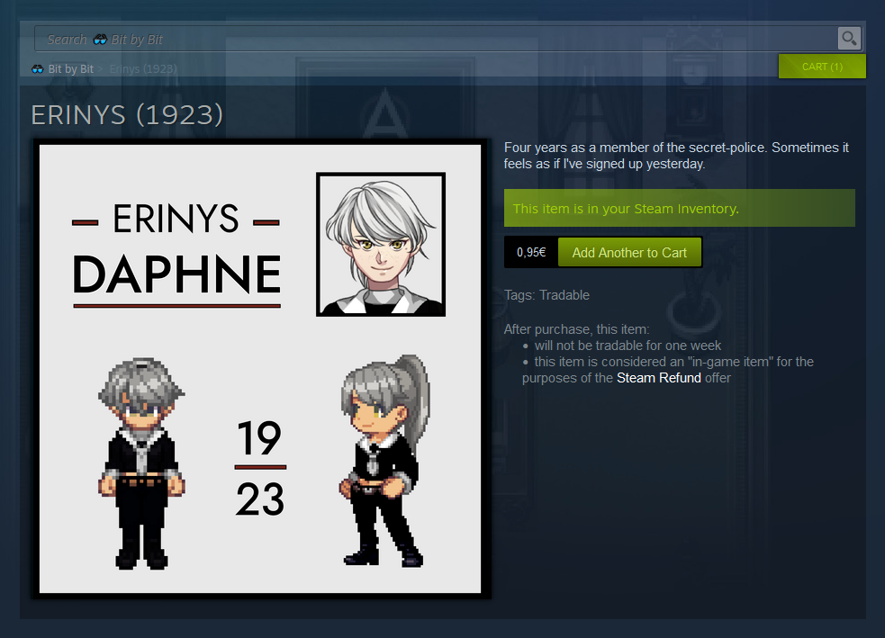

# Rendezvous (Preview)

### Hey party people! 👓

We're just about two weeks into December – halfway towards **ANARCHY 0.1.4**! 

**Rendezvous** (previously Varieté) transforms ParAdise into a battlefield and achievements into Steam Inventory Items. All of that – and more – because TRACHI's people can't wait to leave a good impression on you.

### **Loose Ends**

<iframe allowfullscreen="" frameborder="0" src="https://www.youtube.com/embed/KBpbJAUYMoQ"></iframe>

In [Marche's preview](https://store.steampowered.com/news/app/2169000/view/3749869144024608259?l=english), I mentioned a desire to make ParAdise more **dynamic**. One way of achieving that was to have *Battle Triggers* (aka *Field Impostors*) roam the map. 

Eventually, I settled for a **barebone implementation** moving enemies back and forth. Complex **behaviours** (fleeing / chasing) would require these entities to be actual combatants. At which point we might as well duke it out right there.

### **Battlefield**

Starting with 0.1.4, field maps are populated by **enemy combatants**. Battles are triggered the same way, but the actual encounters take place where you meet your enemies. Every combatant in range (including Lorna) is placed on the grid and you get to deploy your people in a grid-shaped radius around you.

Structurally, battles follow the same rules as before. ParAdise's **terrain** however already has a big effect on strategic options. Fortunately, you'll now be able to see who you'll be fighting where.

### **TRAnsition**

Following your **victory**, your friends despawn and you pick things up right where you left off. Compared to the old system, that's two loading screens we'll never have to see again. On the other hand, there's a whole new level of possible interactions between exploration and combat.

At some point, combatants passing by might be able to join a **running battle**. Throw both friendly and enemy patrols into the mix – and we're well on our way to breathe life into ParAdise.

### **Souvenir**

If you'd like to take something with you, go right ahead! From **December 28th** this year, you'll have plenty of opportunities to add more Items to your **Steam Inventory**. What's more, the Items are also used to change your characters' appearance.

Every character will have their own **equipment slot** with a different set of Variations. To equip one of these, you need to have the corresponding Item on your Steam Account. The character's appearance reflects the piece you have equipped – outside of Fragments.

### **Dues**

One of the items does exactly what **Vanguard** currently does. Both cover the same Variation of Daphne. Everybody who has unlocked the achievement automatically receives the Item on the **28th**.

Similarly, people that achieved ***Broken Wings*** are rewarded with Ganymede's (long promised) first **variation**, too. It's no secret he likes dressing up – especially if he's got a date. 😏

### **Enter ParAdise**

Naturally, 0.1.4 comes with another **monthly challenge**. A new achievement – **ParAtrooper** – is awarded for **winning** your first battle in **ParAdise**. 

Contrary to previous iterations, this reward is shipped with the update itself. In other words: You'll receive your Item as soon as you get the achievement – until 0.1.5 goes live.

### **Bread and Roses**

If you'd rather sit this one out, but are still eager to get your hands on any of the rewards – we've got your back! *Rendezvous* also launches ANARCHY's [**Item Store**](https://store.steampowered.com/itemstore/2169000/), where you can browse the current collection at your own convenience.

Barring that, we're also evaluating the ability to **trade** and or **buy/sell** these on the **Steam's Community Market**. The jury is still out on that one, so it would be great if you could let us know what you think.

### **In Sum**

ANARCHY 0.1.4 puts the finishing touches on 2023 – with big ambitions for 2024. Not only is our own little spin on **monetisation** set up and ready to go, we've also made big leaps towards finding our stride in ParAdise.

The next two weeks will mostly be dedicated to **troubleshooting** both of these features extensively. However, I'll also work in the other [**feedback**](https://steamcommunity.com/app/2169000/discussions/0/3877093297627672205/) I've received (big thanks to **(-_-!)** and everyone else). 🤗

Either way, I hope all of you have a splendid couple of holidays. No matter where and in which kind of constellation – you can be sure I'll be thinking of you! 🥰

**much love**  
nory
