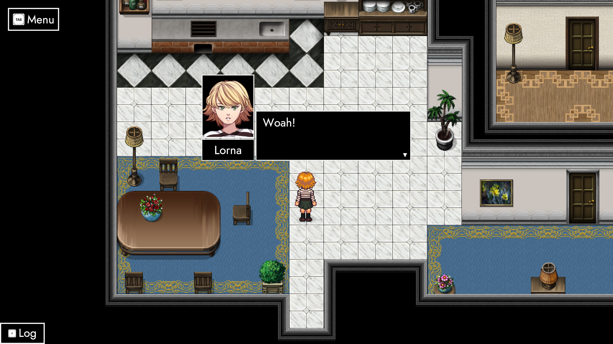
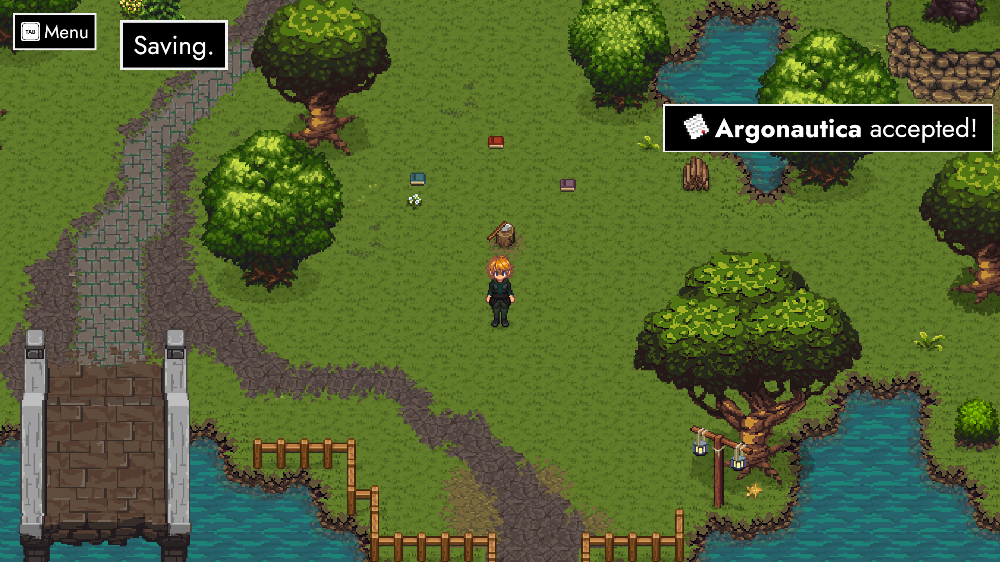
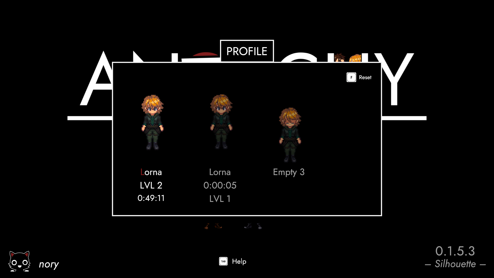
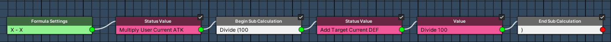
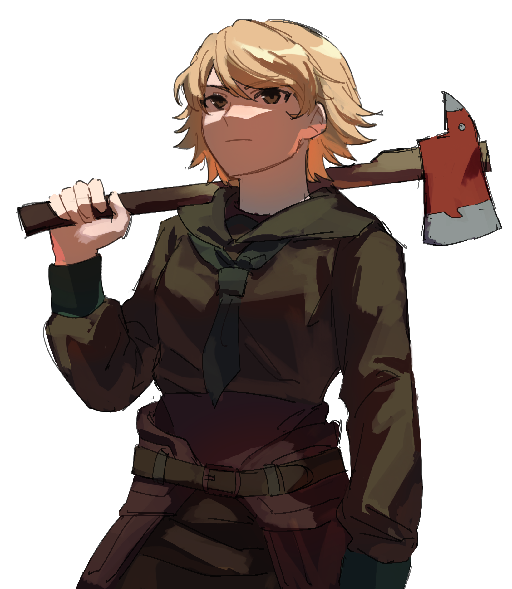

# Silhouette (Preview)

### Heyhey, fellow 2024s! 👋

It's been two weeks since the release of ***Rendezvous***. Even though it feels like yesterday, we're once again already halfway towards the release of ANARCHY's next update on January 28th. 

***Silhoutte*** is about to introduce **roaming combatants**, a follow-up scene to **ImmigrAtion**, collectible **lore**, a **profile** selection screen, improvements to the way **conversations** flow, and much much more!

### **Artificial Intelligence**
If you remember November's update (*Marche*), you might also recall me being hellbent on getting both enemies and friends to **roam** the field. This eventually led to the removal of *Field Impostors* in favour of actual combatants in ANARCHY 0.1.2 (*Rendezvous*).

Building on top that, every combatant on the field now follows a **behaviour tree** comprised of four different states: Following random waypoints around their initial spawn, idling for a couple of seconds, chasing a player if they happen spot one and – last but not least – returning to their original destination if they lose track of you.

### **Line of Sight**

<iframe allowfullscreen="" frameborder="0" src="https://www.youtube.com/embed/ND2Dc2JkdB8"></iframe>

All the movements mentioned above include a **check** that verifies whether the corresponding AI actor is actually able to see you. Fences and other objects, including the hills separating high- from low-ground all break line-of-sight.

In other words, you won't have to worry about accidentally pulling a pack from a hill or from beyond a fence. The same goes for the rules controlling which combatants join a running battle. Speaking of which – there's some changes to that, too!

### **Chain Reaction**

Now that we've got a map full of roaming entities, we'll regularly see combatants **hot-join** the fight on either side. If they get close enough to a combatant that is already part of the battle, they'll become part of the battle and then further also pull in enemies close to them.

If you combine what I just mentioned with AI behaviours, you can already imagine how important it is to pick the places where you fight. A small-scale fight can quickly escalate into situations we're you're fighting so many enemies you might as well book a trip back to the Monolith.

### **Victory**

Considering that battles have become much more volatile and fierce – it's good to have friends around. Friends that got your back. Friends you can trust and rely on when you're in a pinch. And what better devil than the one you know?

Starting with *Silhouette*, **Daph** will make her introduction to ParAdise. There'll be a little encounter, where you save her from a couple of slimes. Or rather: Save the slimes from her by putting a quick end to them. As a reward, she'll join you for the road ahead – and you get an **achievement** that automatically unlocks a new variation for as long as 0.1.5 is live.

### **Dorothy**

In 1919, Daphne recently graduated from the college of Kenovice with a major in behavioural psychology. She's all about a person's mind – which comes in quite handy, if you're an **eighteen-year old girl** working for the nation's secret police.

It's undoubtedly a more timid, much less confident version of Daph. However, we're also aware TRACHI's people have learned a couple of tricks for ANARCHY. I won't spoil it too much – but if you want a piece of advice: Don't judge a girl by her cover! 😏

### **Certain things**

Sometimes segues write themselves. That's the case for the one we just did. However, we're obviously not confining our fantasies to the scope of announcements, as cute as our interactions here might be. Above all, we want to make a banger video-game – and that requires a proper stage.

*Silhouette* hence adds another piece to the puzzle known as **ImmigrAtion**. The Faragos' famous home is now an actual apartment – including two furnished bedrooms and a little storage niche. There's currently no loading screens, since it's all one big scene. In fact, you can even see what's going on in the other rooms.

### **Have to be said**

No matter how much time you spend exploring Lorna's new **home**, all roads lead to this place. Lorna's room saw her turn from a sheltered younger sister to the woman we all know and love. Given we're watching moments that (seemingly) occurred in 1913, you can imagine there's a lot of excitement going around.

However, we've also picked up hints that both she and her sister's move to Aion wasn't entirely voluntary. You could even say they're more or less on the run. Which is a perfect setup for breaking even bigger news to her.

### **Horizon**

If you've played AUTONOMY, ImmigrAtion feels a bit off. We know what happened both to Lorna and Ekaterina (then Eurydice) down the line, so the entire segment is giving off huge prequel-vibes. It's frankly a bit eerie and uncanny seeing these two behave like that.

There's moments when **Ekaterina** suddenly tenses up. It's like she's about to break into tears, if it weren't for decades of practice not doing that. Lorna will notice something's changed – and so will you.

### **PreparAtion**

I'm normally not in the habit of announcing things that aren't done – especially if they're not shipped with the update we're currently looking at. However, *Silhouette* is also the final patch of the 0.1 arc. With the release of 0.2 on **February 28th**, we'll add the third and final segment to what will one day be ParAdise's intro.

In other words: We'll close the gap between ImmigrAtion and ParAdise. It's my way of introducing big changes – both to Lorna and to you. Taking the lessons learned from InvAsion, I'll give it my all to do it right this time! 😤

### **Story**

In a similar way, I also finally got around to implement something I've been wanting to do since AUTONOMY. As you know, TRACHI puts a big focus both on **knowledge** and perspective. World-building is mainly achieved through dialogue, without a narrator to guide your hand.

Given this circumstance, there was always a bit of a narrative bottleneck. I didn't want to shove thousands of pages of in-universe facts through dialogue alone, so I had to come up with another way to present it all to you.

### **History**

If you open the Info section on the ingame menu in 0.1.5, you'll not only find quests, challenges and a catalogue of enemies you fought. A new option named ***Lore*** introduces a variety of pseudo-quests you can use to track your knowledge of certain things – starting with where Lorna is and when.

At the moment, there's no rewards – so the min-maxers won't feel bad about missing these. The idea is to provide a space where I can present additional knowledge about the world and its people. Since we're using the quest system as an infrastructure, we'll also be able to update existing entries with more information as you're making your way through ANARCHY.

### **Persistency**

Considering the many things mentioned in the preceding paragraphs, it's clear ParAdise is slowly but surely coming alive. While that's great and all, it also pushed me to think more about your own individual **journey** through ANARCHY.

In other words: More content means you're more likely to take a break. The ability to save and load your progress in ParAdise has been there from the start. The system itself worked great, except a couple of whoopsies along the way. However, I wasn't too happy with the way its presented to you.

### **Awake()**

Going forward, three things happen when you jump ParAdise. First off, the game checks if there's an existing save. If that's not the case, you'll head straight in. If one of the slots already has a save, you'll be greeted with the menu above. 

It's both a menu for loading and a starting new game. A **profile** that already has a save can be reset by pressing the Menu Button (TAB by default). Compared to what we had before, this is a huge step up in quality of life – and a big shift towards encouraging you to continue a save versus starting new.

### **Everything else**

There's obviously also a ton of smaller changes. From UI Icons you might've spotted while I was presenting the *Lore* menu to ogres receiving a full visual makeover – complemented by further improvements to pathfinding and conversation controls.

As if that weren't enough, there's also a bunch of other things I'd like to implement. I won't go too deep into them, but I still wanted to give you a glimpse of the biggest one.

### **Status Values**

Leveling up in ParAdise feels a bit weird, if we're perfectly honest. HP values increase massively with each level and ATK had to be bumped up in turn. DEF on other hand gives far too much value per individual point.

First of all, we'll rework the overall **damage formula**. ATK needs to hit harder per individual point, whereas DEF has to be cut down to size a little. l'll try to get the adjustment shipped 0.1.5, but it'll definitely be there for 0.2 on February 28th.

### **Giving Back**

In Rendezvous' release announcement, I mentioned a desire to reach out to a couple of artists I've been admiring for a while. One of them is known on Twitter as [**babykatafan**](https://twitter.com/babykatafan). He's drawn up the wonderful sketch you can see above.

There's a lot more in the works from a couple of other artists as well. At the moment, we're trying to get a groove going where I put something around two-hundred USD per month towards art. We're just about to reach that mark for January – but there's still plenty of room for ideas starting with February.

### **Long Story Short**
We're putting a lot of love towards every major aspect of ANARCHY. Since the release of 0.1 last September, the game has evolved from a technical prototype to something that grows ever more confident in calling itself a **video game**.

There'll be two big milestones to hit this year. First, there's 0.2 in February. As was the case with 0.1, we'll be pushing five major updates on a monthly basis as we go along. On August 28th, we'll celebrate ANARCHY's birthday by releasing 0.3. In other words: We're down bad for 2024!

### **Above All**

I want to thank you from the bottom of my heart for being here these last few months. Developing ANARCHY out in the open together with you has been – no cap – the most gratifying experience of my entire life.

So if you ever get into a mood where it feels like no one really cares, please think of the fact that I do. Every single bit of ANARCHY is there not because I like to dream – but because I'm thinking of **you**.

I'll be back next week with a set of update notes, coupled with the release of 0.1.5 on the **public beta** branch.

Until then, I remain – as always – your biggest fan! 🤗

**much love**  
nory
