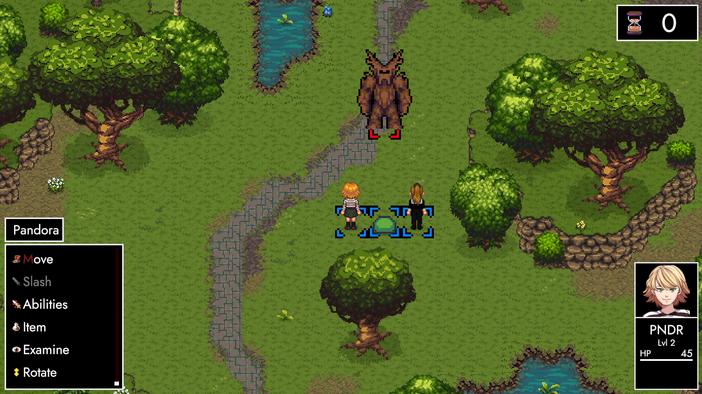
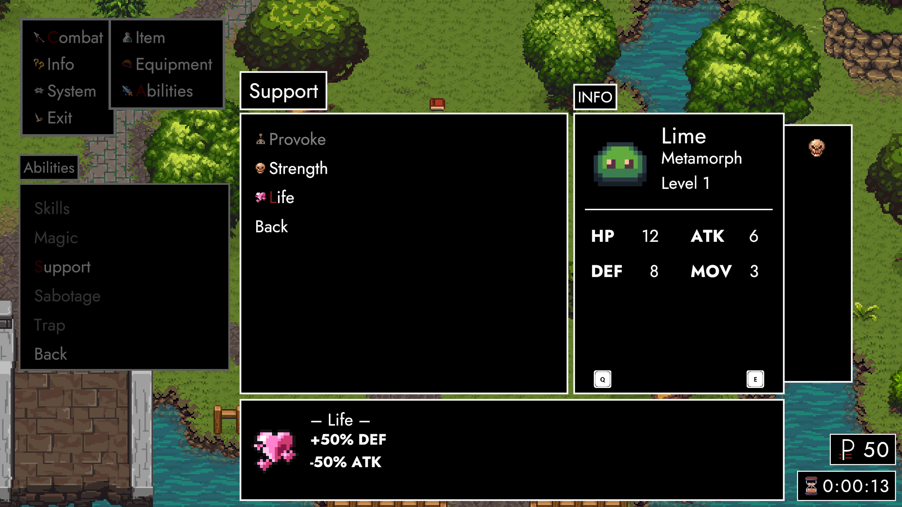
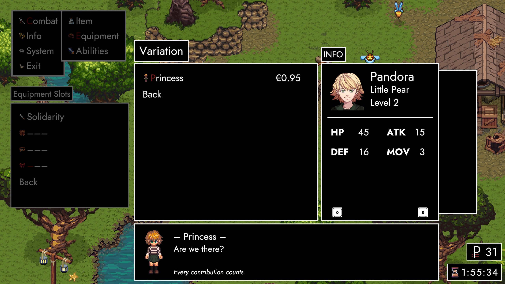
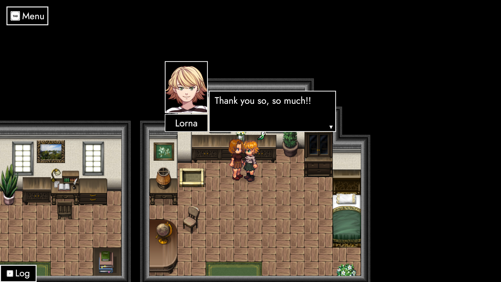
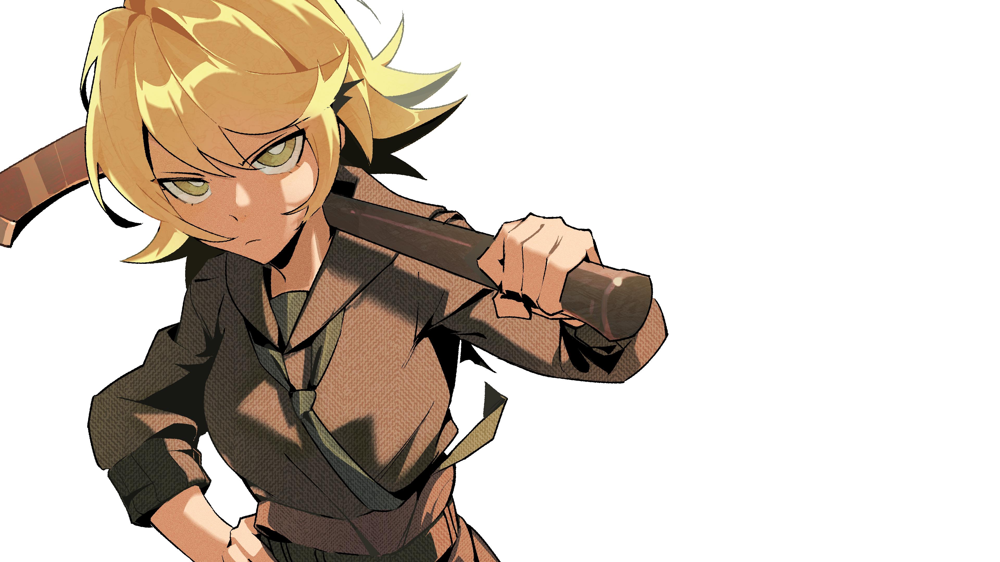

# Merci (Preview)

### **Salutations, friends! 👋**

It's February 2024 and we're about to hit the six month mark in our cooperative efforts to build a video game. On the 29th of February, we'll officially enter the second phase of development. 

### **Abstract**

**ANARCHY 0.2 (*Merci*)** not only connects the dots between ExcommunicAtion and ParAdise by adding a whole new scene to ImmigrAtion, but also formally introduces Pandora (Lorna) as a protagonist. 

Her first goal in the new world is to **kill a tree**. To that end, a new indoor area (*Checkpoint*) adds a grand total of ten new NPCs. It's our first glimpse into the social dynamics of ANARCHY. We're not just here to kill things, but to build a better future with our own human hands. 

Last but not least, *Merci* also implements a whole new set of **abilities**, coupled with several features aimed at improving **quality of life**. From a pixel perfect camera to target-based AOEs, revamped UIs and dynamic buttons to purchase Steam Items from within the game – 0.2 is a standing ovation with us shouting for more.

### **Civilisation**

Imagine a place stuck in cycles. Now picture a girl with a **red axe** stepping in. Her mind is preoccupied by thoughts about her sister, but we know the story is much bigger than that. Here's someone who's way more blunt than the people we've seen so far. It's like throwing a firebrand into ParAdise.

Over the next couple of months, we'll work on ***Thermopylae***'s primary narrative. Witnessing a world that's not good and taking the first step towards a better one. Our main quest is to kill a tree. To do that, we'll need a whole bunch of people.

Completing individual quests is our most convincing argument to prove that times are ripe for change. Once we've achieved critical mass, we can trigger a big **showdown** with the tree. Either we lose and things go back to the way they were, or we smash it into bits – and successfully reshape part of the world.

### **Party**

In addition to everything else, the ***Checkpoint*** also showcases another new feature. Pandora herself might still be a bit timid, but the same can't be said of everyone. A big part of the escalating discourse will be driven by party members who like to stir shit up.

To get to these interactions, you'll naturally have to bring **people** together first. This leads us to a clear road of progression for ParAdise. You'll not only do side-quests for NPCs, but also advance long-running companion quests that unlock new interactions and in some cases even drive the main story forward.

### **Tree**

The monsters roaming ***Thermopylae*** act under the protection of a uber-baddy known as the **Treant**, or TREE for short. No matter whether you fight him with or without a reinvigorated bunch of NPCs, he'll be a multi-stage fight that requires not only careful planning, but other forms of preparation too.

Fortunately, we already have a bit of experience regarding **multi-stage battles**. Depending on the tree's HP, he'll display different combat behaviours that also force you to adjust your strategy. Initially, he'll try to stomp you to death. Though there's also add-phases, single-turn DPS checks and a whole range of different AOEs in the works.

### **Abilities**

The *Stomp* employed by the tree works similarly to a new ability called ***Cleave***. You pick a target and if there's enemies to the left and right of it, you'll hit them too. This rudimentary **target-based AOE** is our blueprint from which we can extrapolate more advanced abilities – like dealing damage on the main target and/or weakening secondary targets.

Another new type of ability appears in the shape of **toggleable status effects**. Lime has learned his first two *Metamorphosis* skills that make him shift his status values at his own convenience. Down the road, we can not only extend this with more metamorphic abilities, but also modify them through traits gained by levelling up and/or unlocking them through the eventual talent tree.

### **A whole bag of things**

<iframe allowfullscreen="" frameborder="0" src="https://www.youtube.com/embed/79yg1Dr-ZwE"></iframe>

Before we move on to the big flagship addition coming with *Merci*, let's have a quick round-up of **smaller changes** throughout. Status effects, applied for example by Lime's Metamorphosis abilities, are now displayed in Status HUDs embedded into ingame Menus.

Next to further improvements to Pathfinding, **player controls** were adjusted so running against walls doesn't cause animation flickering anymore. The entire screen now also profits from Pixel Perfect camera modules, heavily reducing tile jittering. Last but not least, we've also added unique weapon skills that characters internalise as they're wielding the corresponding weapon.

### **Convenience**

Obviously, there'll also be a new **achievement** and a new **variation**. I'm still playing with concepts, though I can say already that Lorna will very likely get her 1919 summer dress you might know from AUTONOMY's Act 3.

Speaking of variations: They've been split into Store and Legacy versions. Both work the same on a technical level, but the Legacy (Patch Reward) items are time-exclusive and thus in limited supply. The store versions are unlimited and can now also be purchased from within the game.

### **Contribution**

With that, [**ANARCHY's store**](https://store.steampowered.com/itemstore/2169000/browse/?filter=all) is also brought to life. I've been going back and forth between the 'when', since I'm not sure if the game is ready to be monetised. I had the same discussion with myself throughout all of AUTONOMY. However, there's a crucial difference: ANARCHY has a minimally-intrusive way for you to show your love.

Cosmetics are not only the lesser, but by far the least evil form of making a dime. If people buy enough of these, we can call it there and never need to worry about monetisation ever again. We'll talk more about concrete numbers we need to reach down the line. For now, let's get to the part we've all been waiting for! 👀

### **Regalia**

*Silhouette* famously introduced the third stage of **ImmigrAtion**. Lorna found her room and a bird who shouldn't have been there. What follows is an emotional scene between Lorna and Eury, where the two of them finally get a chance to say things they should've said a long time ago.

Eury's demeanour already betrayed there's more at play. Being observant as we are, we already noticed her 1923 attire. Compounded by what we've seen of Ganymede and Daphne, we can surmise the year is anything but 1913. Our theory has been out in the wake for about a month – and I think it's high time we lifted the veil.

### **EmigrAtion**

There's a series of cracks, as if a window shatters. We find ourselves on a balcony overlooking a pitch black sky. As the **RAIN** starts to pour, Lorna appears in her 1919 variation. It's a lot to take in, both for players and Lorna herself. As we're trying to make sense of the situation, Eury starts talking about dates and events some of us still remember.

It might seem agonising at first, but Eury's questions – coupled with Lorna's answers – give us a little perspective. It's not 1913, nor is it 1918. Lorna's final service card was issued in 1919, which means it's either that or later. We're left to fill in the blanks in our heads, as we're hurled back into the green shades of *Thermopylae*.

### **– Merci –**

During the next two and a half weeks, we'll make sure the features above are properly integrated into the game. We've already established it as a working routine, but there is a striking difference between previous updates and *Merci*. Earlier patches had to set up a lot of infrastructure – at the cost of content. 

For this one here, it's almost reversed. A lot of features are built on top of things we've established months ago. As a result, there's plenty of time for overall quality assurance and general optimisation. If everything goes well, I might even get around to implement a little surprise feature or two! 😳

### **February 29th**

One way or the other, **ANARCHY** is about to grow up. We're entering our second semester both with confidence and humility. The game has massively outgrown its original form. ExcommunicAtion used to be our primary selling point, but ParAdise is about to grab that crown.

This year, we'll not only celebrate ANARCHY's first birthday on August 28th – but AUTONOMY's fifth on the exact same day as well! The artwork above is part of a beautiful piece graciously created by [**RacoonButler**](https://normalhumanboy.carrd.co/) as the first in a monthly series accompanying us towards TRACHI's date of dates.

### **Conclusion**
For some reason, I can't stop going on about how integral you are to our little adventure here. I'm not the best at engaging nor building a community. However, I try to make up for it by improving the game instead. In other words: If you can find it in your heart, please leave a review either for ANARCHY and/or – especially – [**AUTONOMY**](https://store.steampowered.com/app/1811440/TRACHI__AUTONOMY/). 

https://store.steampowered.com/app/1811440/TRACHI__AUTONOMY/

Every cent spent on TRACHI goes to people that care. There's no need for us to grow big – just raise enough to feed a bunch of individuals who love making video-games. If we can achieve that, I at the very least won't ask for anything more from this world.

We'll see each other again next week with a full changelog flanked by Merci's release on the public beta branch. Until then, it's my privilege – as your biggest fan – to wish you a great couple of days! 🤗

**much love**  
nory
