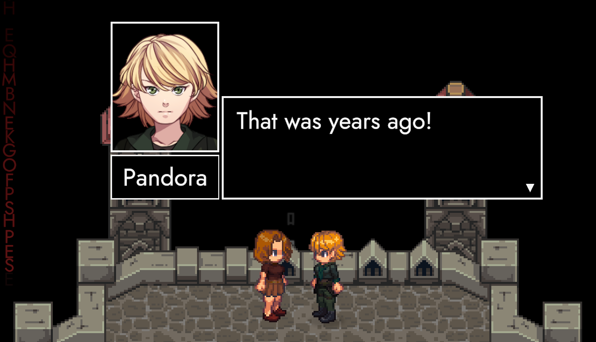
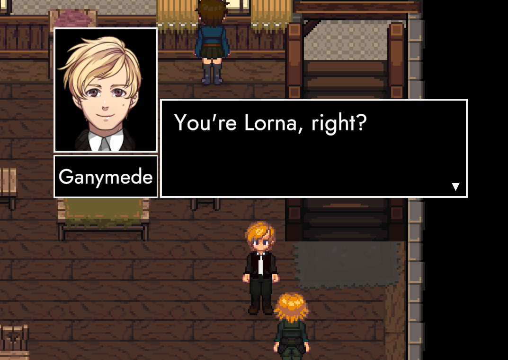
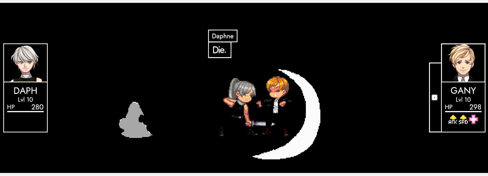
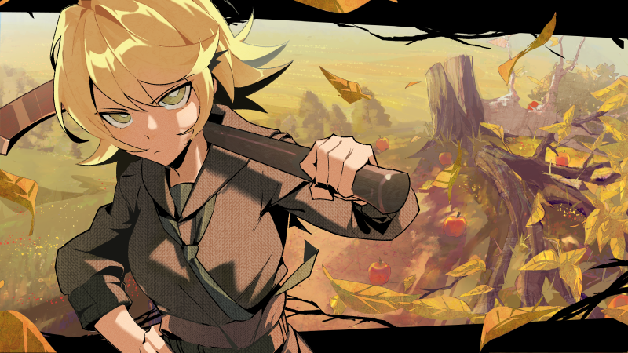

# Merci

## Hello, friendly people! 👋

Today is February 29th! That's six months since **TRACHI 2.0** set foot into this world. One hundred eighty-five days after the fact, **ANARCHY 0.2 (*Merci*)** is here.

Most of the new content was covered in the [**preview**](https://store.steampowered.com/news/app/2169000/view/4061752935703119910?l=english) and in the [**release notes**](https://store.steampowered.com/news/app/2169000/view/7951737850180654364?l=english). In other words: we have all the space in the world to tie everything together here.

We'll take a look at what kind of **game** ANARCHY aims to be. A '**story-driven hub-based tactical RPG**', is a lot to take in – so let's break it up into individual elements and measure our progress on these fronts from August 2023 to February 2024.

## Story-Driven
#### Old World

For the lack of a better term, the 'Old World' consists of around 30 years of **fictional history** (1890-1924). It's the **backbone** of AUTONOMY and will continue to play a major role in ANARCHY. Even though the world itself is overwritten, ANARCHY follows the TRACHIAN paradigm that history defines people and their actions.

Already in September 2023, **ExcommunicAtion** boldly raised the issue of continuity: "What year is it?". Six months later, we're not only asking the same question again in **ImmigrAtion**, but also sport a whole collection of old-world content represented by '**Fragments**'. Some of these are optional, others are driving factors of the main story quest.

#### New World

Beyond the historical precedence (aka the past), we'll have to figure out the **rules** that shape the world. Thankfully, we can once again draw inspiration from **reality** itself: Characters are objects in a **video-game**. They're still struggling to survive and thrive within a fictional world – we're just way more honest about what's going on.

ExcommunicAtion proved that fact. It takes a single **action** by a player to kill someone. Shortly afterwards, the victim is reconstructed in front of everybody's eyes. This exact dynamic is now baked into **ParAdise** through **monolith-cycles**. Going forth, we'll explore the implications of a **digital existence** even more explicitly.

## Hub-Based
#### Civilisation

Given TRACHI's fictional nature, there's two major **groups**. One is obviously us – aka humanity. The other group is a bunch of fictionals, who are more or less aware of our presence. From their perspective, we might appear as **supernatural** entities. However, that doesn't mean they're thinking about us all the time.

In other words: There's overarching questions of life and there's **daily routine**. AUTONOMY married itself to the latter, whereas ExcommunicAtion doubled-down on the extravagant. ANARCHY in turn tries to strike a balance between these two extremes. The recently introduced ***Checkpoint*** is not only an homage to AUTONOMY, but also shows that social structures and their dynamics carry on.

#### Field

Most JRPGs featuring tactical combat forego **exploration** in favour of a linear chapter-based approach. ANARCHY instead opts to be inspired by games like Knights of the Old Republic, Divinity: Original Sin or Baldur's Gate. Bluntly put: We're not just flipping through pages in a chronicle, but live and breathe in the same **world** we're fighting in.

Our first foray into that arrangement is **ParAdise**. In 0.1, there was a patch of grass with two or three interactables next to a bunch of triggers that teleported us into a battle arena. Nowadays, we're exploring, conversing and fighting in one seamless experience without breaking a sweat.

## Tactical
#### Combat

TRACHI might be a monument to the individual, but it's ultimately about **people** and **societies**. Tactical turn-based combat is a perfect fit, since it puts the spotlight on a group and their collaborative efforts. 

This aspect is barely pronounced in ExcommunicAtion. There's Monoliths, Icarus and Ariadne, but the focus is on Ganymede and Daph. ParAdise in its initial stage starts with a party of two, and since January we're able to recruit a third. Soon enough, we'll bump that number up to five.

#### Battles

ExcommunicAtion was conceived as a demonstration of a **multi-stage fight**. In contrast, there's a whole load of small-scale **skirmishes** in ParAdise. A key feature is that battles aren't static in terms of who's taking part. On the contrary – individual encounters can escalate to involve all actors on a given map.

It's a long shot from the way it used to be. Your pre-battle position now directly defines your starting spot. What's more, you can also **pull** enemies away from each other to pick them off one-by-one. This is especially important for battles that involve elite encounters like the recently added Treant. 

## Role Playing Game
#### Character Growth

If you recall what's been said about TRACHI's history and how it defines the current state of things, you can see why it's a perfect fit for an RPG. AUTONOMY centred around abstract **values** such as knowledge and trust, whereas ANARCHY throws concrete numbers like HP, ATK and DEF into the mix.

In addition to combat-focused values, there's meta stats like EXP. After reaching a set amount, a character's **LVL** goes up by one. The LVL then contributes towards ATK, DEF and so on. If you combine that with the combatant's equipment in addition to passive and active effects, you arrive at a character's capability to make a change.

#### World-building

Just like TRACHI is nothing without you, actions aren't worth much if they're without effect. Even in AUTONOMY, you left your mark by **progressing** the story. Even though the game itself won't win any awards for interactivity, it's still vastly different from a movie where you just press play.

ExcommunicAtion then introduced a **failure state**. Daphne's HP hitting zero leads to Ganymede being healed back to full. However, that pales in comparison to the things we can do in ParAdise. We're now able to open chests, manipulate ladders and doors, respawn enemies and friends via monoliths and last but not least: complete quests.

## The Message

ANARCHY is not afraid to follow AUTONOMY's footsteps. At the same time, we're wearing much bigger shoes. A massive project like this makes it necessary to evaluate each feature's contribution to the overarching experience. All of the aspects mentioned above are **core features** that comprise the game's cornerstones.

In terms of content, we've added four areas, three quests, three major and thirteen minor conversations, two new ability types, two new status effects and last but not least: the final segment of ImmigrAtion in the span of a month. All of that is tied into a non-linear progression that raises ParAdise from a showcase playground to a prototype for a – well – **story-driven hub-based tactical RPG**.

## The Clause

Before we take a look ahead, one last thing regarding Merci. So far, most updates included a new achievement and a **variation**. I originally intended to make this a monthly thing, but there's been a slight change of plans. The character builder's update (scheduled for December) hasn't been released.

As a result, Merci neither includes a new variation nor a new achievement. To make up for that – and to celebrate the release of 0.2, we'll do a rerun of every existing variation. If you've unlocked an achievement outside a promotional window, you'll receive it when you launch the game until the end of March.

## The Future

August 28th 2024 will see the release of **ANARCHY 0.3**. We'll keep the monthly schedule we've established at least until then. Our immediate next step aims to comprise a major rework of stats, a skit system (heavily inspired by the "Trails of" series) and a big-picture talk involving Lorna, Daphne, Anton and Ganymede.

Following that, we'll set our eyes on the **goblin camp** and rework that into a much more hostile area. There'll be at least one building similar in scope to the Checkpoint, just with a whole bunch of meanies inside. In there, we'll try to find Daph's long-lost necklace and also run into an old friend.

You probably recognize him – he's one of AUTONOMY's **main characters** after all. He'll appear in ParAdise, but will also get his own spin on ExcommunicAtion. I'm super excited for both – so I'll save the details for the corresponding previews.

## The Cause

Last but not least, two more things. First of: Here's the full **illustration** by a person I wholeheartedly admire and adore. [**RacoonButler**](https://normalhumanboy.carrd.co/) has delivered an earth-shattering piece of art. Word on the street is: There's another one in the works. 👀

Secondly: A massive shoutout to all you handsome people! Above everything else, *Merci* is me confessing my undying love for you. **Thank you** very much for your attention, your patience and your continued support! 

I'll see you mid-march for our first preview of ANARCHY 0.2.1 (*Café*). ☕

Many, many hugs from your biggest fan! 🥰

**much love**  
nory

[Discussions](https://steamcommunity.com/app/2169000/discussions/0/ style=button) [Feedback Form](https://forms.gle/7inHPoscAwGENGSY9 style=button)
