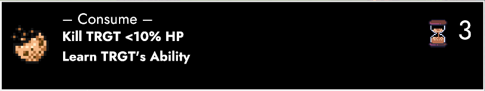

# Café (Preview)

### **Greetings, TRACHIANs! 👋**

Halfway into March – time for our routine! The topic at hand is **ANARCHY 0.2.1 (*Café*)**. For this step of the road, we're putting a big focus on **character interactions**, quests and abilities. 

To track these and all the other changes, I've set up a [**public roadmap**](https://trello.com/b/wmLgU9xx/anarchy) where we can measure our progress towards **0.3 (*Renaissance*)** – to be released on August 28th this year.

## **Café**

In February's Update (*Merci*), we introduced our first set of new-world indoor areas. The ***Checkpoint*** sits at the tail end of *Paradise*, overlooking a river separating north from south. It's supposed to be a place that – well – checks people and their IDs.

However, it's become more of a pub-like environment with a whole lot of people that don't plan on leaving anytime soon. There's a vibe of a bunker/sanctuary that protects its residents from the big bad outside world. This aspect is currently only partially represented in the game itself. 

*Café* aims to remedy that. All of the 10 NPC conversations in the *Checkpoint* have effectively quintupled in size. This trend is likely to continue, as we're not only adding dialogue, but also optional quests to breathe life into these people.

## **Fragmentarian**

Incidentally, one of the NPCs received a huge amount of love. I won't go too deep into his background, since we're exploring that through dialogue anyway. As a matter of fact, I consider him my first attempt at writing a character whose interactions heavily lean into exposition.

After an introductory back-and-forth about Georgios, the Checkpoint and Lorna's service card, the mood suddenly shifts. Turns out that old-world objects (aka *Fragments*) trigger all kinds of memories. From that point onward, **Miro** is your primary address when you'd like to talk more about the way things used to be.

At the time of this writing, we've already extended this interaction to the book of books (*IONIA*). If you talk to Miro while it's in your inventory, you can choose to show it to him. This not only nets you extra exposition, but also a new accessory (*NIONIA*).

## **Familiarity**

In regards to the present and future, 0.2 confronted us with a closed door. After waiting about a month, we finally get to go inside. The **conversation** kicks off with a minor exchange between Lorna and Ganymede, before Daph steps in. About two and a half (slightly) innocent lines later, G & D are doing their thing again.

Luckily for us, Helios (formerly Anton) reels the conversation back in. We're not just here for chit-chat, but to plan an excursion towards an old manor overlooking the western end of Paradise. There's rumours that it's full of goodies – chief among them Fragments like Daph's long lost necklace.

After our little prep-talk, we have a chance for a **one-on-one** with our individual party members (new and old). Everybody has gotten additional dialogue, exposing more about the world, its people – and what Lorna makes of it.

## **Character Growth**

Writing dialogue has me feeling right at home. However, we also want to have a quality-time duking it out in the field. To that end, we've added a total of **five new abilities**. Helios, for example, comes with *Rage*. This doubles his DMG, while no longer listening to your commands.

Ganymede, to no surprise, has a *Charm* ability that seduces enemies into attacking their own kind. Beyond that, there's minor additions like Bees' **Sting** paralysing the MOVement of their victim by setting it to 0. A new enemy (Wolf) bites to inflict *Bleed*, an effect that punishes moving by dealing 30% of the affected entity's Max HP as DMG.

Last but not least, Lime can now *Consume* an enemy below 10% HP in order to permanently learn one of the victim's abilities. On that note, this only works on *medium-* and *small-sized* entities. This category, alongside inherent *Species* traits (Human, Wildlife etc.) is also used to drive modifiers – for example a piece of equipment specifically increasing your DMG vs. Goblins.

## **Big Picture**

Speaking of our miniature sized friends, the northwestern section of Paradise has undergone a major rework. What used to be a shed and a bunch of objects has now turned into a gauntlet leading to a massive villa. It's a building reminiscent of old-world countryside manors, not unlike the one where Lorna and Eury were raised.

However, this particular structure forms the **headquarters** of the new Goblin Camp. At the moment, it's marked as a construction site, but you can already explore the area and exterminate its inhabitants. In the updates following 0.2.1, we'll extend this section to become a major narrative turning point.

Come 0.3, we'll have parlayed with the Goblins. There will be betrayal, pheromones – and two lovers finding back to each other in a tunnel that leads all the way back to the Checkpoint's basement. 

We'll cause a proper shitstorm in Paradise, revitalise its people – and finally lead them to victory through a multi-phase battle against a big bad tree. 🌲

## **Two Weeks**

Day job commitments in early-March left me only a couple of days to spend on development so far. For that reason, 0.1.3 (Café) follows a slightly modified schedule. The release will still be on the **28th** – with the first public beta hitting Steam sometime next week.

However, we're not adding any major features this time around. Ergo we can pretty much push content up until the very end. Unfortunately, the character builder's update isn't out yet, so we'll focus our attention on things like conversations, abilities, items and equipment.

In other words: *Café* is our oyster! If you'd like to see anything in particular, please let me know either in the comments or this [**thread**](https://steamcommunity.com/app/2169000/discussions/0/3877093297627689763/).

One way or another, I'll be back with the release notes and a public beta sometime next week.

Until then, big admiration from your biggest fan! 🥰

**much love**  
nory

[Roadmap](https://trello.com/b/wmLgU9xx/anarchy style=button) [Feedback Form](https://forms.gle/7inHPoscAwGENGSY9 style=button)
