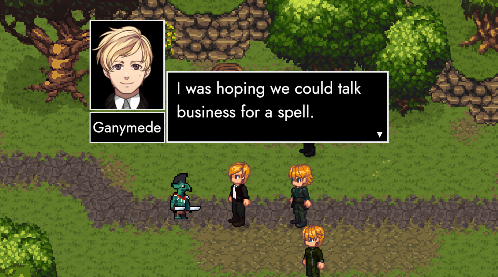
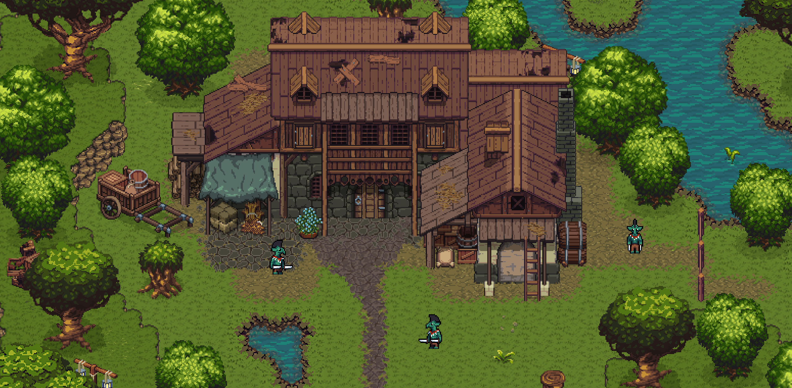
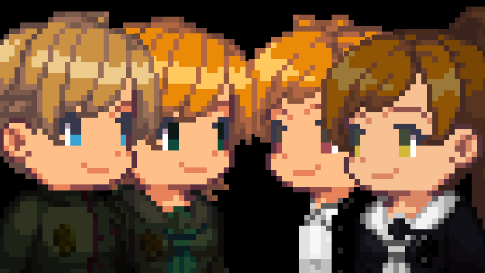

# Café

### **Salutations, friends! 👋**

Today is March 28th, our monthly date where we celebrate TRACHI taking another step towards greatness. The matter at hand is **ANARCHY 0.2.1 *(Café)***, a wholesale package full of new content and overall improvements to pretty much every aspect of the game. 

Most of these were covered by the [**preview**](https://store.steampowered.com/news/app/2169000/view/4125931766236263683?l=english). Normally I'd also point at the changelog in the beta announcement. Unfortunately, we skipped out on that this month. I'm super sorry about that, but I'll say a couple words in regards to that and our future release schedules later down the line.

For now, let's refocus on the changes coming with *Café*!

### Synopsis

Highlights include the continuation of the main quest (*Argonautica*) through two new quest taks: Sanctuary and Familiarity. In-between these two interactions there's a chance to engage with individual party members. On top of that, Fragments have been further intertwined into the story through the introduction of Miroslav – a former military man with a special knack for history. 

On the gameplay side, there's eight new abilities – five of which introduce new dimensions to battles in the field. These aim to not only sharpen our own party's potential, but also heavily increase the threat posed by monsters all around ParAdise. Last but not least, there's a whole array of bugfixes, bundled with optimisations to several core systems powering ANARCHY.

### Westwards

*Café* picks up right where *Merci* left off. We're about to embark on a trip towards hostile territory. Following TRACHIAN tradition, there's a lot of plotting and scheming, conveyed through dialogue. Next to essential, story-driving conversations, there's also optional one-on-ones with individual party members.

Whether you engage in these or not, the group is making their way to the *Orchard* currently occupied by Goblins in the northwestern section of Paradise. The main goal of 0.2.1 regarding Argonautica is to prepare the stage for a more condensed sequence of story-segments. We'll talk more about it in the outlook section towards the end of this post.

### Past Tense

Beyond the interactions following the core group of characters, each NPC now has a short conversation that tries to shine more light on the current situation in and around the Checkpoint. While this too is a setup for future updates, it nevertheless aims to present a first glimpse into the everyday life of an individual living in Paradise.

The most striking example is the introduction of Miro the Fragmentarian. As pointed out in the preview, his role is to offer additional context for interacting with optional fragments. As we're adding more and more of these to the game, it should become a routine to turn items gathered from these experiences in with Miro – even if it's just to get our hands on the rewards.

### Evolution

Regarding new items, equipment and abilities: For one, every monster now has a signature skill. This should not only give battles across Paradise a little extra spice, but also makes Lime's ability to consume enemies and incorporate their abilities into his own kit even more valuable.

Overall, every combatant now also has a 'Species' attribute to separate Humans, Goblins and Wildlife. One example of applying this distinction comes in the shape of equipment pieces that massively increase damage towards a certain species. Here too, we're putting a big emphasis on the road ahead, with hostilities between Humans and Goblins about to increase dramatically.

### Preparation

Although the details are not set in stone, Paradise's narrative structure is now mapped out in broad strokes. The Orchard and the Checkpoint – along with an underground area connecting the two structures – form the backdrop to the second movement of ANARCHY's first act.

As mentioned above, we're about to embark into a much more condensed experience. We had a lot of freedom in our movements around Paradise so far, but the next few steps will force players into a certain zone until specific conditions are met.

### Roadmap

It's at this precise point where our monthly release schedule has to come to a (temporary) end. I'd hate to lock players out of Paradise proper until the entire sequence is implemented. Add to that the fact that testing each and every release build in itself already takes me the better part of two days – not to speak of my day-job and the doctoral thesis I'm working on several hours each and every day.

Most importantly, I've also had to come to terms with an uncomfortable fact: As much as I love ANARCHY's formula, engagement has dropped significantly since the release of *Silhoutte*. Given the current trajectory, it's unrealistic to except the game to generate attention anytime soon.

For that and all the other reasons I mentioned, I'll start treating ANARCHY in the same way I treated AUTONOMY and InvAsion – as a hobby-project driven by passion next to my actual work. This ultimately means fewer updates and larger intervals in-between, but will hopefully alleviate the self-inflicted pressure of working two full-time jobs at the same time.

### In Sum

*Café* might be around for a while. I'll try to push a new beta at least once a month, but release builds will very likely happen irregularly. This of course also highly depends on the community's support, given that the game is already getting too big for me to playtest on my own.

On that note, I've had a lot of help from a lot of great people over the last nine months. Special mentions go to (-_-!), Sereon and Hibari for their respective work. I'm full of appreciation towards both them and you. Even though my head is going through a massive reality-check right now, I'm still excited for the future. Either way, I'll be back with more info on what's on the horizon – not necessarily next month – but definitely very soon.

Until then, big hugs from a friend! 💖

**much love**  
nory

---

## ANARCHY 0.2.1
### Aka *Café*
#### **Quests**
- Added 🥂 "**Familiarity**".
  *Let's try diplomacy.*
- Added 🐊 "**Monstrosity**"
  *I brought what you asked for.*
- Adjusted 🏡 "**Sanctuary**"
  *We wanted to go somewhere, right?*#### **Areas**
- Reworked 🥗 "**Goblin Camp**"
  *New home, new us.*#### **Enemies**
- Added "**Wolf**"
  *The full pack.*#### **Conversations**
- Added 📚 **Fragmentarian**
  *You look like you've been around.*
- Added **Companion Dialogue**
  *Hey Lornz.*#### **Abilities**
- Added "**Consume**"
  *Kill TRGT <10% HP, learn ABLTY*
- Added "**Bite**"
  *50% DMG | BLEED*
- Added "**Rage**"
  *+100% ATK, -50% DEF, lose control*#### **Items**
- Added "**Apple**"
  *Heals 5% HP*#### **Equipment**
- Added "**NIONIA**"
  *+50% ATK vs GBLN*#### **Visual**
- Added **Camera Borders**
  *To keep our eyes on the content.*
- Adjusted **Combat Animations**
  *Standardised Animation Flow.*
- Adjusted 🎨 **Dialogue Portraits**
  *Streamlined & unified.*

[Roadmap](https://trello.com/b/wmLgU9xx/anarchy style=button) [Feedback Form](https://forms.gle/7inHPoscAwGENGSY9 style=button)
