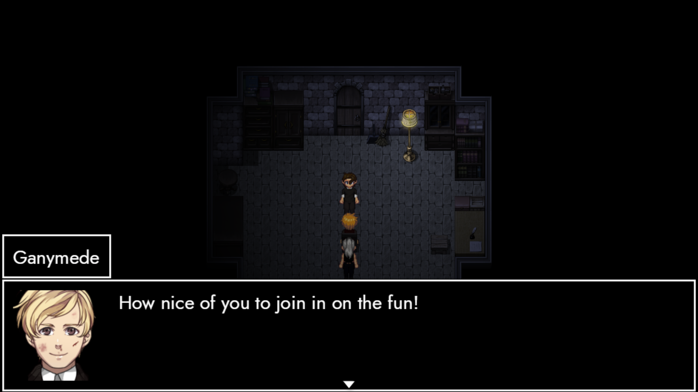
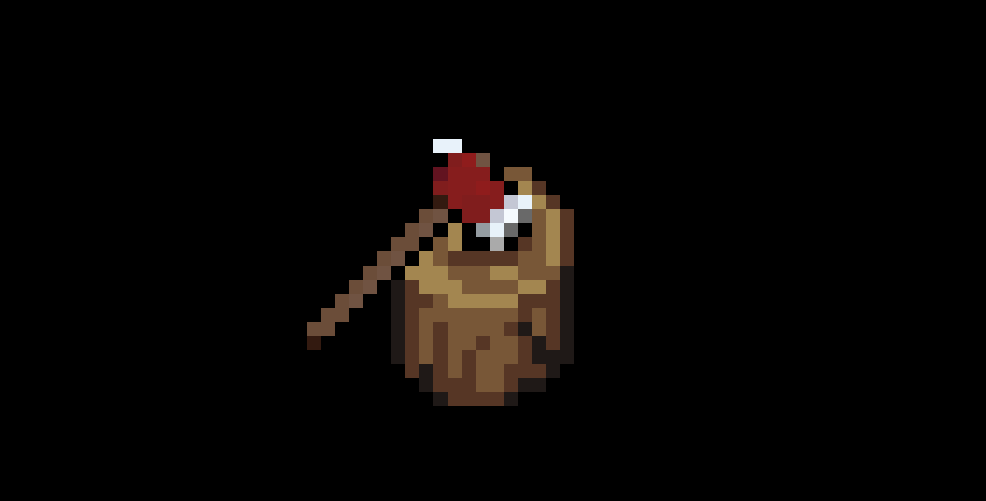
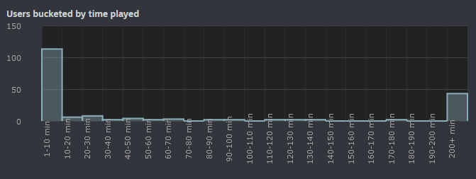

# Renaissance (Preview)

### **Howdy-ho, friends! 👋**

It's been two months since our last dance. The release of *Café* was followed by – well – just about sixty days of eerie silence. Today I'd like to break that streak. At the core of this post thus lie three major talking points: the **state**, **future** and **ambition** of ANARCHY.

### Retro

Here's the story so far: ANARCHY was conceived in May 2023. Over the course of ten months, we managed to build the foundation of a tactical RPG. Specifically: we established the segments ExcommunicAtion, InvAsion and – most importantly – the first few hours of ParAdise.

I would have loved to keep that pace until August 2028 at least. On the other hand, a man's got to earn a living. I pushed ridiculous hours into ANARCHY, severely neglecting my PhD. This became undeniable in February – and public knowledge on March 28th. Going forth, ANARCHY couldn't be my top priority.

So where does that leave us? Has ANARCHY drawn its final breath?

### Future

Let's face it: I'm obsessed with TRACHI. Sixteen days ago, I dropped a little [post](https://store.steampowered.com/news/app/1811440/view/4179980671855860892?l=english) on the AUTONOMY-andies, covering the mischief I've been up to through April and May. There's even a bit of ANARCHY in there! Which is the core of the message I'd like to make right here.

Incidentally, TRACHI turns five on August 28th. I've been going back and forth as to what we should do for this super-special day. I dabbled with Discord Bots powered by Large-Language models trained on TRACHI dialogue. I spun up RPGMaker, dreaming about AUTONOMY 1.6. 

Eventually, I had to make a choice. It all came down to a single question: Which of the TRACHI projects do I like working on the most? I'll let you in on it – if you promise not to tell anyone! 😊

### ExtrapolAtion

In 2022, we continued AUTONOMY's story with InvAsion. ANARCHY picked up the pieces and called it ExcommunicAtion. However, there's still a gap between that and the earliest point of ParAdise – i.e. ImmigrAtion. In other words: We need to build a bridge between Ganymede & Daphne singing in the rain to Lorna moving into 'totally-Aion-1913'.

I mentioned at several points that Atlas plays a key role in all of that. We've seen the odd screenshot of him confronting Ganymede & Daphne. However, it didn't sit right with me to throw you into a battle and call it a day. It worked for ExcommunicAtion because Daphne meeting Ganymede on August 28th happens every year.

To produce our favourite trio on the screen, we can't just pick any year. It's got to be a special one.

### Three's a crowd

Think back to the first couple of AUTONOMY scenes. We remember Daphne visiting Ganymede for the third and final time in 1926. Following that, the game transports us to the point where most of the story takes place. That's three people and a city – Trachi 1923.

I'd love to go on about how nicely the numbers match up. On the other hand, I already feel like a walking excel-sheet. So let me just state the following: ExtrapolAtion is 2024's InvAsion/ExcommunicAtion. 

The plan is to have three sets of scenes. The Sanatorium in 1926, an undisclosed location in Trachi 1923 and – last but not least – the place we know from ExcommunicAtion. I'll talk more about the latter two as we approach August. 

For now, I'd like to focus on the first segment, since that's already 80-90% done.

### Reception

The scene starts off with Daphne under our control. AUTONOMY threw you into a cutscene, including a conversation with the receptionist. This time, we can move around immediately. There's two reasons for that. First off, interactivity. Secondly, it's our first hint that something's off.

Every part of the tileset is where it used to be. However, the people play it a bit differently. There's small changes in the dialogue here and there. Above all, one of the scripts (let's call it 'D'), doesn't behave the way it (she) used to.

### Destiny & Agency

With freedom comes responsibility. In this case, I had to introduce a gate-keeping NPC. After all, we want you to go and have that chat with our friendly but short-sighted receptionist. It's a perfect example of how a cutscene can make it easier on the developer to keep the immersion intact.

Either way, we're on our way to the west-wing. There's the familiar conversation between two guards. One of them asks us to follow, which we do in our own time. We'll eventually arrive in front of a door. Two knocks and we step inside.

### Danymede

Knowing what we know, it's exciting to think about the words they'll say. Then again, which version of themselves are they, anyway? Seasoned RPG-enjoyers might take a look at the ingame or the quest menu. Either way, I believe this scene combines the best of all the previous iterations. 

There's the innocence of AUTONOMY, the degeneracy of InvAsion and the absurdity of ANARCHY. It's two people dancing the same dance for the fourth time. Incidentally, it's also the first segment of ExtrapolAtion. A three-parter that'll find its conclusion on August 28th. 

Since we're exactly three months away from that, let's revive a little tradition!

### Renaissance

If all goes well, we'll ship the first part of ExtrapolAtion with ANARCHY 0.2.2 (Renaissance) next month. I'll try to have it wrapped up around Mid-June and push a beta build at the usual time. There will also be a couple of bugfixes and QoL things in there.

After that, we'll add another segment each month. The full package should hence be ready for TRACHI's 5th. Everything beyond that depends on how hard my day-job is pushing me. Which is the perfect segue into the last couple of points I'd like to make.

### Ambition

In case you're wondering what'll happen with ParAdise – you're not alone! One one hand, I've used my hiatus to conceptualise the rest of the act. This includes both the structure of new-world areas and the main-story fragments showing the turning points of Lorna's old-world life.

Even so, I couldn't get rid of a thought in the back of my head. 'Have I bitten off more than I can chew?' To be honest, I don't know. Maybe ANARCHY proper is one of those games that'll never be completely finished. Maybe it'll take us ten years instead of five.

### Beyond

The good news is: We'll have all the time in the world. The decision to relegate ANARCHY to just 'another thing' ultimately means less content more irregularly. On the other hand, I can let go of monetary ambitions. The first consequence of that is to scrap the fomo-baiting Variation events. 

Until further notice, you'll be able to unlock everything whenever you want. This goes both for the current suff, and for the three Variations coming with ExtrapolAtion. I wouldn't expect too many following that – until the 'December' 'update to Stella's Character Generator comes out.

### Scope

Next to the financial aspect, there's an even more important thing. Let's call it discoverability and player retention. The first part describes how many people start the game, whereas the latter denotes the ratio of players that stick with it.

My focus is undoubtedly on the second metric. A better game means it's more likely for someone to play it for more than just five minutes. At the moment, one out of four players end up spending more than 3 hours in ANARCHY. In AUTONOMY, that ratio was around 1 out of 11. Simply put: ANARCHY does a far better job at keeping people engaged so far. 

In regards to discoverability: That's majorly down to Steam's algorithm, driven by reviews and wishlists. We've recently had a major push in players thanks to our fifth review – while being 100% positive across the board. Even though it's not the only reason why I can't let go of ANARCHY, I'd be lying if I said it didn't make me smile for days.

### Sum

So before I try to do the same for you, let's take a moment to highlight two super-duper special individuals! 

First, there's [(-_-!)](https://steamcommunity.com/id/Teijen/). He's almost single-handedly filled an entire thread with bug reports. Please show him his gratitude for making sure that ANARCHY is in a playable state. Furthermore, a massive shoutout to my man and the heir-apparent, [Ser](https://steamcommunity.com/id/Sereon/)! If I one day don't show up anymore, he'll have 20 fictional people in his care.

Last but not least, there's you! If you're reading this, you're a real champ! I know it's been up and down and back and forth. I'm terrible at maintaining things – especially relationships! Nevertheless, I've been writing devlogs for almost five years. Not that it shows, but at least I know it's worth it in the end.

All thanks to YOU! 💖

**much love**  
nory

[Roadmap](https://trello.com/b/wmLgU9xx/anarchy style=button) [Feedback Form](https://forms.gle/7inHPoscAwGENGSY9 style=button)
