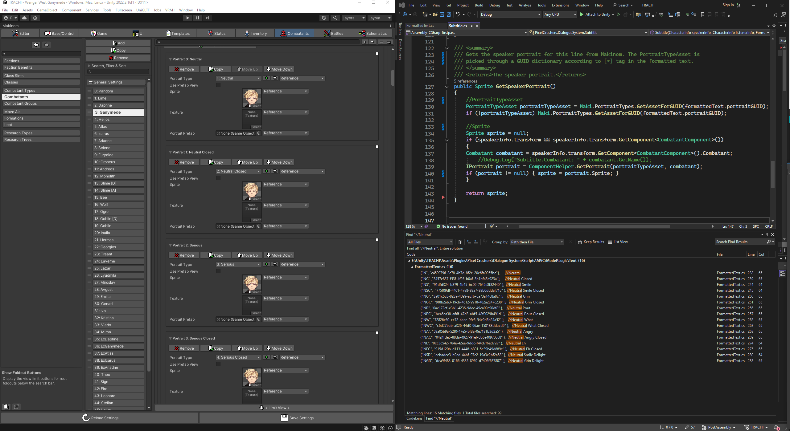
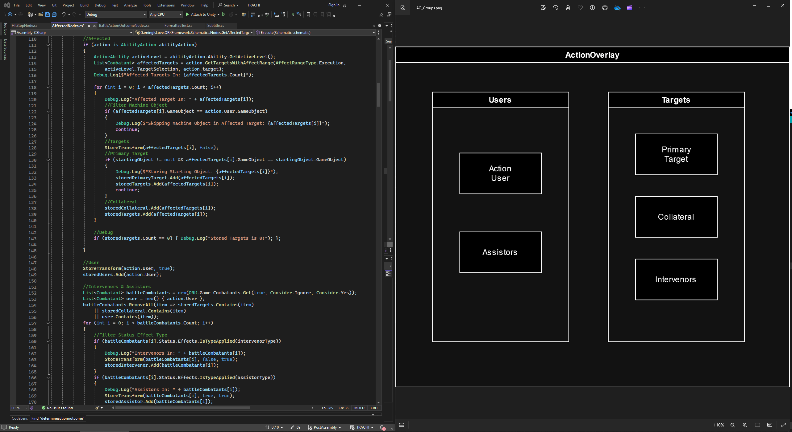
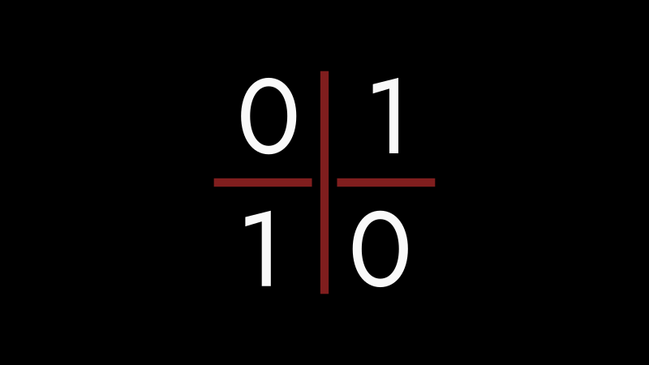

# Technically

### Hey friendy-friends!

I recently [announced](https://store.steampowered.com/news/app/2169000/view/4188989134099863984?l=english) a triplet of monthly updates. Each of them packs a piece of this year's special event - **ExtrapolAtion**. I also mentioned that the first part – ExtrapolAtion A – was about 80%-90% done.

Just a week later, we're almost feature complete. This left a bit of room to sit down and finally polish some of ANARCHY's core systems. In this post, I'd like to present these optimizations and also provide a more in-depth technical overview.

### Visualisation

From the get-go (i.e. InvAsion), I put a big effort into making the character's visual appearance customisable and scalable. Thanks to Unity's [Sprite Libraries](https://docs.unity3d.com/Packages/com.unity.2d.animation@10.0/manual/SL-component.html), we're able to run all the characters on a single [animation tree](https://docs.unity3d.com/Manual/class-AnimatorController.html). We're also using inheritance to derive individual [character prefab](https://docs.unity3d.com/Manual/PrefabVariants.html)s from a single base-combatant. This means that changes to colliders, path-finding and many other pieces of logic don't need to be adjusted one-by-one.

However, Variations introduced a bit of a problem. We're running most of the game through [ORK](https://orkframework.com/), while handling [Dialogue](https://assetstore.unity.com/packages/tools/behavior-ai/dialogue-system-for-unity-11672) separately. Each Variation added a bit of redundancy, since I not only had to make two sets of portraits per Variation – but also create another prefab.

The complexity of this system could also cause desyncs here and there. Switching Variations effectively respawned the character's object. In some cases, the Dialogue System wouldn't recognize that new object as the same character and thus wasn't able to anchor the character's dialogue bubble. In other cases, the camera unhooked itself.

### Portrayal

About two weeks ago, I finally came up with a solution. Instead of defining a set of portraits in both ORK and the Dialogue System, I rewrote parts of the latter so it would pull the corresponding portrait directly from ORK. In effect, we now only need one [Dialogue Actor](https://www.pixelcrushers.com/dialogue_system/manual2x/html/dialogue_actor.html) per character. That – in combination with a little script handling the different sets of sprites – means we can run all Variations of a character on a single object.

This means less headaches for me and more stability for the game overall. There is an even bigger upside, though! Changing a set of sprites to another is much less invasive than respawning the entire object. In effect, we can now equip Variations almost everywhere.

One result of that is you being able to alter Daphne's appearance all throughout ExcommunicAtion – even while she's in the middle of a dialogue line. The same goes, of course, for ParAdise. As a bonus, there'll be no more camera issues caused by respawning characters. This ties in nicely with another optimization.

Every time you loaded into a new scene, it could be that the [camera](https://docs.unity3d.com/Packages/com.unity.cinemachine@2.3/manual/CinemachineBodyFramingTransposer.html) hadn't adjusted itself to the characters. We diminished that problem by hard-coding about 0.5 seconds of delay before fading in the screen. Since a couple of days ago, the game now properly waits for the camera to be set up – i.e. no more artificial delay.

### Abilities

There's a couple of miscellaneous adjustments, but I'd like to tackle a major one right here. I mentioned ExtrapolAtion A being just about done. Without revealing too much, let's say that the 1926 encounter between Daphne and Ganymede in ANARCHY will be much more physical than AUTONOMY's. I promised it would combine the best of all worlds – and I intend to keep my word.

Generally spoken, ExcommunicAtion is a bit of a tutorial for ANARCHY's basic combat interactions. ExtrapolAtion aims to do something similar for advanced mechanics. One of them is the *Knockback* we introduced in ANARCHY 0.1.3 (Silhouette). Simply put, the ability tries to push a target one tile away from the user.

That leaves us with three points. An origin (user), a target and a destination. If the destination is an empty cell, the target is pushed back. If something's in the way, the target ends up back where it was – and we'll deal a hefty amount of damage to the target and whatever's occupying the destination. The ability itself is super rewarding, but its implementation has always been a bit undercooked.

You could say the same about ANARCHY's combat in general. Major parts of it were ad-hoc solutions, making the system increasingly hard to work with. To illustrate that point, let's take a look at what happened whenever a combatant uses an ability.

### Problem

We start in our regular top-down view and gather the combatants involved in the corresponding 'Battle Action'. An 'Action Overlay' appears and so do a couple of HUD elements. The characters, as 'Side-View' sprites, are then placed on predefined spots. There's a couple of animations, sound and visual effects, as the action itself goes through its motions.

Since we're swapping forth between Top-Down and Side-View perspectives, I had to create a custom solution for that. One of the biggest challenges was picking up the right characters, storing their original positions, rotations and scale – all the while making sure it would work both for single- and self-targeted abilities and for cell- and target-based AOEs. Not to speak of special cases like *Interception*, *Construct* or *Knockback*.

At some point, the entire system got so convoluted – I was afraid to touch even a single line. Imagine if you'd like to have a *Counterattack* where you wanted one or several targets to retaliate. Ideally, we wouldn't close the Overlay between the 'Main Action' and the corresponding Counter. We'd want to open the Overlay, run the initial attack and follow it up with a Counter straight away.

### Setup

Twelve months into development, I have a much better idea of what the 'Action Overlay' should and shouldn't do. Each Action has a 'User', a 'Target' and a varying amount of 'Collaterals' (for Cleaves / AOEs) at the very least. In addition, there's, 'Intervenors' and 'Assistors'. You've already seen an example of the former. When Icarus sacrifices himself, he's what we now call an 'Intervenor'.

The reason for putting Combatants in abstract boxes like that is to account for all possible scenarios. Going back to our *Knockback* example, we want to differentiate between entities that are knocked back and those that are in the way. If you think about *Knockback* projecting a line from the 'User' through the 'Target', we can automatically tell the 'Collateral' has to be on the same line.

In the Side-View, on the other hand, we always want the 'User' on the left and the 'Target' on the right. We thus know that the 'Collateral' has to be placed even further to the right. By creating boxes within boxes, we're accounting for that fact.

### Static

To place the combatants, we need more than just a direction – even for simple cases like this right here. We could place them on preset spots depending on what kind of box they're in. Incidentally, that's how we've been handling it for almost a year. It served us nicely, but two major problems became increasingly hard to ignore.

For one, we had to predefine spots for specific abilities. *Interception*, for example, places the 'User' further to the left. *Knockback*, as we saw, has a 'User', 'Target' and a 'Collateral' spot. *Cleave* – hitting the Target and one Combatant to the Target's left and right – thus uses a 'Target' and two 'Collateral' spots along the y-axis.

Now, the last example might have you asking: "Even if you put 'Target' and 'Collateral' in two boxes, how do you know which 'Collateral' is which?". In the scenario above, the 'Collateral' further to the north should also occupy the northernmost spot, right? So why don't we just take their Top-Down constellation and translate it to the side-view?

### Trigonometry

For every case that works, there's three that won't. In order to represent the original configuration, we have to check the relation between 'User' and 'Target' first. Once again, we can form a line from left to right (x) – and then a line from the bottom to the top (y). Noting the position of the User user(x, y) and target(x, y), we subtract the user's coordinates from those of the target and get a relative position r(x, y). Now we draw a line from (0, 0) to the x and y in r(x, y).

Say the 'User' is one step to the north of the 'Target'. That would be user(2, 2) and target(2, 3). Our relative position would be r(2-2, 3-2), i.e (0, 1). Now draw a line from (0, 0) to (0, 1), and compare it to the line defining the x-axis. The angle would be 90°. If the 'User' is straight to the left of the 'Target', that could be user(2, 2), target(3, 2) – resolving to r(3-2, 2-2) -> r(1, 0). That line would match the x-axis, which means their angle would be 0°.

Now try to rotate the picture in the middle by 180°, and the right one by 270°. We can apply this to every possible configuration to derive an angle by which to rotate the entire thing and end up at the 'User' being left of the 'Target'. Every 'Collateral' is thus placed in relation to its Top-Down position relative to the 'User'.

Simply put: We only need a single preset position as our 'anchor'. With that, we're able to translate Top-Down constellations in terms of their angle and order from left to right. As a bonus we also get their relative distance at the same time. This means that shooting a target from 5 cells away is now accurately represented as well.

### Extension

<iframe allowfullscreen="" frameborder="0" src="https://www.youtube.com/embed/dTPu0tprbbg"></iframe>

The same logic applies to 'Interception'. That means charging point-blank is now automatically shown differently than charging from further away. In the case of 'Knockback', we not only got rid of the 'Collateral' and 'Target' preset spots, but can also scale it up for AOEs pushing Targets outwards from a 'Target', 'User' or 'Cell' – or pulling them in.

All in all, we've made the system more stable and scalable at the same time. Even for simple AOEs, we're now equipped to represent all Combatants in relation to how they're placed on the Top-Down Grid. It's making me so excited – I almost forgot to talk about the catalyst that let me to revisit the 'Action Overlay' in the first place.

I mentioned the *Counter*, and the way we've reworked the way Combatants are gathered depending on their role within an 'Action'. The good news is: If you keep reading, you'll see a rough but functional implementation of *Counteract*. It's a Status Effect that makes a 'Target' – 'Collateral' or not – strike back after being hit.

### Counter

<iframe allowfullscreen="" frameborder="0" src="https://www.youtube.com/embed/w8wP9i8_2VA"></iframe>

Evidently, we had to consider cases where an attack hits from outside the 'Target's' own range. After rewriting parts of ORK's source code, we're taking that into account as welll. In other words: If a combatant is being shot from two cells away, they need to have a weapon with at least the same range equipped in order to retaliate.

Like *Knockback* and its abstract class 'Manipulation', 'Counter' adds a whole new dimension to the Combat. It's clear that we'll have to tinker with it over the next couple of months. However, we've effectively transcended the 1-Action-per-Overlay limitation. This opens the door not only for User->Target chains, but could also be refactored into User->User or User->Intervenor sequences.

With our new Ability and a faster, better stronger Action system, we can put our eyes towards the horizon. First off, we'll wrap up the last bits of ExtrapolAtion A. That means putting in the final two or three elements and testing it all. There's a bit of overlap between that and some of the new / reworked combat systems – so the road toward ANARCHY 0.2.2 is already paved.

### CU soon

I'll be out of town for a short work-trip until Sunday. This leaves about a week to polish *Renaissance* for its beta release around the end of next week.

If you'd like to help make ANARCHY a better game – you're more than welcome to participate. One way or the other, please accept my heartfelt gratitude for reading this lengthy post. I'm learning tons of new things each day – and I consider myself privileged to have you there.

Kissies and huggies all around. 🤗

**much love**  
nory
