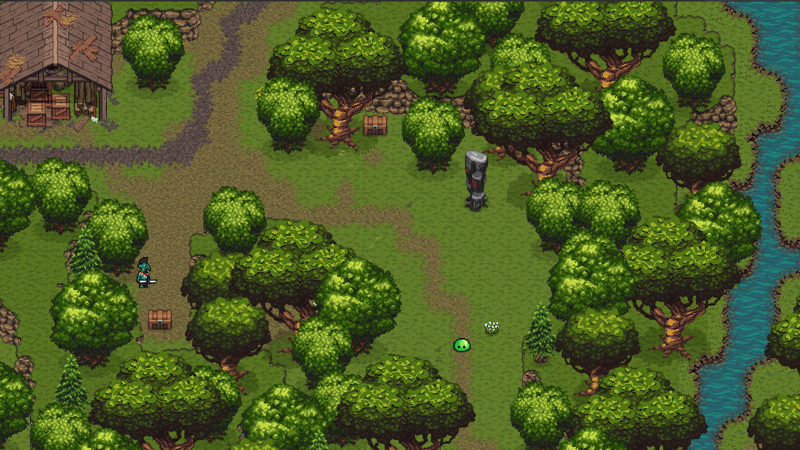
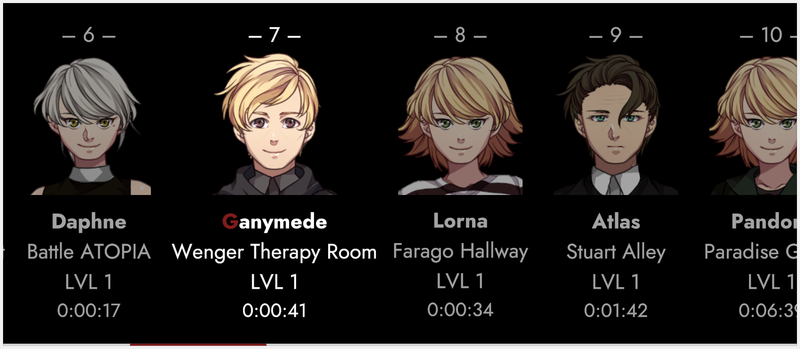
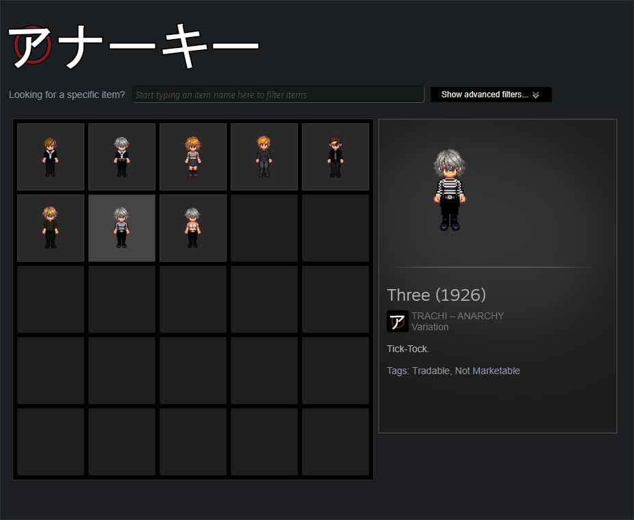
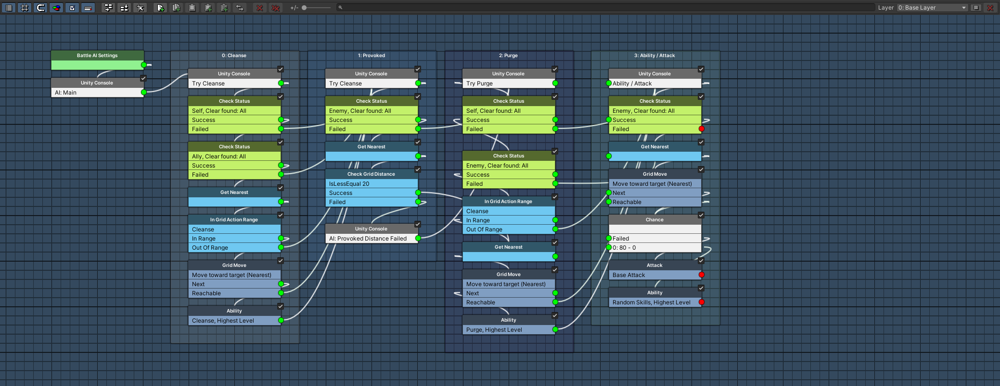

# Renaissance

### Greetings, friends of the sun! 👋

After two months of work, here's **ANARCHY 0.2.2** (*Renaissance*)! I'd normally give you an abstract about the highlights of this patch. This time, there's simply too many of them. 

We're facing – without a shadow of a doubt – the biggest update since the game came out. Almost every segment has received **new content**, wide-ranging **optimisation** and other equally important bits of **love**. 

Let's check it out! 👓

### **Narrative**

**ExtrapolAtion A** is the centrepiece of *Renaissance*. We covered the broad strokes in the [**preview**](https://steamcommunity.com/games/2169000/announcements/detail/4188989134099863985). In technical terms, Daphne is visiting Ganymede on **August 28th 1926**. On one hand, we're witnessing a love-letter to [AUTONOMY](https://store.steampowered.com/app/1811440/TRACHI__AUTONOMY/)'s first couple of scenes. 

There's a bunch of adjustments, both on the gameplay and narrative side. The dialogue is in many ways optimised and everything is far more **interactive**. Similar to ImmigrAtion, we're playing a lot with the thought of whether the scene in front of us is genuine history.

This exact dynamic comes to fruition during the **conversation** between Ganymede and Daph. We kick it off with familiar words – including a bit of extra AUTONOMY lore. When Daphne is about to leave, Ganymede casually drops a narrative nuke.

He's about to spill even more, then the encounter gets **physical**. I'll leave that and everything beyond to your own exploration, barring for one heartfelt promise: We're not only exposing story elements. 😏

### **Trilogy**

ExtrapolAtion neatly fits the gap between ExcommunicAtion and ParAdise. Future-us will have to decide whether we leave it like that – or sprinkle the former two across ParAdise and ANARCHY's other acts.

For now, I'm happy to give the players (that's you!! 😊) the freedom to engage with the content as a buffet. If you start with ExcommunicAtion, **ExtrapolAtion A** will trigger right after the epilogue. Come July 28th, we'll extend it with ExtrApolation B and finally work in ExtrApolation C on the day of days. 

After that's all done and settled, our narrative foundation is just about ready to support ParAdise. Which is the perfect segue to the next topic in this very post.

### **PreParAdise**

Let's be real for a second: ParAdise – for its many qualities – has 'prototype' written all over it. We're booted into a green landscape without any **context** at all. For the better part of a year, we've kept it that way to make debugging and testing less of a pain.

At the same time, we've diligently worked on ParAdise's own introduction. **ImmigrAtion** was engineered for that purpose specifically, although it humbly remained a Fragment ever since. The first course of action is thus to put ImmigrAtion at the forefront of ParAdise.

Even so, there's still a big leap from fake-Aion 1913 to waking up in front of a Monolith. Ergo we took the backdrop of Paradise (that is 'green', Monsters and LiberAtion) as ingredients for a new map and made it a tutorial zone.

### **Renovation**

The *Glade* is first and foremost a gameplay and narrative bridge. At the same time, it also serves two additional goals. I like to think of it as a field test for smaller, tighter outdoor maps. One aspect of that is performance – the other one is a more abstract 'vibe'.

Both factors have direct consequences for the existing parts of ParAdise. You'll probably notice that our main map – 'Paradise' – is now known as 'Paradise North'. It's an open-ended project, so I can't give out too many details yet. However, I'm leaning toward splitting the map.

I'll talk more about it when things are more concrete, but we can look at it in the following way: The new map is, for all intents and purposes, a good orientation of the aesthetic detail we're going for.

### **Chaperone**

<iframe allowfullscreen="" frameborder="0" src="https://www.youtube.com/embed/VP2huG05mY8"></iframe>

The other, much more immediate side-goal of the 'Glade' is to introduce **Companions**. Since we're placing ourselves in the tradition to exploration-based Tactical RPGs (i.e. Baldur's Gate, Pillars of Eternity and the like), combat and field-movement are deeply intertwined.

The new area tries to experiment with that. We've got a major character (Selene / Cleo) as our persistent side-kick on our way north. She follows, places herself on the grid and is even **interactable** for a chat or two. 

If all goes well, we'll extend this system to Paradise proper. Lime would be an obvious candidate for a persistent companion down the ~~Lime~~ line.

### **Persistency**

A wise man once said: People die when they're killed. In ANARCHY, deaders stay dead until the player triggers a Monolith. This means we have to be deliberate about what's **respawned** whenever we reenter a scene.

One likely scenario is **saving** and loading a game. The core challenge is to reinstate the scene as close as possible to the way we left it in. This is the primary reason why ANARCHY only supported AUTO-Saves. That restriction – in turn – was a major motivation for me to take a deeper look.

Starting today, we're supporting **Manual Saves**. It's currently limited to Field-Mode (i.e. no Battles and Conversations) but I'm committed to make it work everywhere. The second addition is that we've reworked the save and load **menus** to show the location and the portrait of the Field Leader.

### **Identity**

We've more or less covered Variations in the [preview](https://steamcommunity.com/games/2169000/announcements/detail/4188989134099863985) and [the technical overview](https://store.steampowered.com/news/app/2169000/view/4151835070979945097). Thanks to our diligence, we can focus on what's new for you. First of all, you can **equip** Variations at any point in the game. Since individual pieces are still tied to Steam Items, some Fragments allow you to unequip an item without being able to reequip it. 

Temporary Variations are thus marked as **'TEMP'** – although I'll eventually slap an extra confirmation dialogue on top of that. Except for these fringe cases, you'll only see the Variations you own. This is mostly to prevent someone buying the Variation under the assumption it can't be unlocked through playing the game.

All in all, I'm (almost) completely satisfied with our current infrastructure. Implementing a new Variation takes about 10-15 minutes, all in all. The only aggravating part is making the Variations itself, so I'll keep that to a minimum until the [**updated Character Generator**](https://visustella.itch.io/stella-character-generator/devlog/734300/may-2024-follow-up-progress) comes out. Here's hoping we'll get to see it released sometime this year.

### **Abilities**

Obviously there's a bunch of changes and additions to the battles as well. I went into the visualisation of Actions a bit deeper [here](https://store.steampowered.com/news/app/2169000/view/4151835070979945097?l=english). From the player's perspective, combat generally works the same, just a lot more stable and smooth. 

Our big new feature is a **Counter** mechanic. Given a certain Status Effect, a target of an Action retaliates with their own attack. It's not only borderline broken, but also breaks new ground. Chaining Actions without dropping the Side-View Overlay is something I've had my eyes on for a long time.

We'll get to see more of that in August at the latest. For now, I've also implemented a couple of extra abilities like Selene's *Decrescent*, a weakness inflicting AOE – and several weapon-based skills such as Terminology's *Legshot* [MOV DBUFF] and *Fast* [MOV BUFF].

### **Adversity**

To be blunt, I've procrastinated a long time around setting up proper **decision trees**. AI-controlled combatants operated on very bare-bone instructions. As of Renaissance, every Field enemy now has a multi-tiered set of nodes that checks both enemies and allies for specific conditions.

Say, for example, you apply an ATK boost to yourself. If there's a Slime nearby, it could spoil your plan by **purging** that immediately. Another scenario would be an enemy unable to reach a target running *Provoking*, so it goes after someone else. These, in conjunction with every enemy's unique set of abilities, should make the fights in ParAdise way more engaging.

### **Bottom Line**

Over the last two days, I've spent every waking minute testing ANARCHY. It's a bit like moving places, when everything you own becomes a burden. As annoying as it may be, I'm incredibly proud of what we've achieved. The 'we', in this case, is literal. I want to once again express a heartfelt thanks to [(-_-!)](https://steamcommunity.com/id/Teijen/) for posting so many helpful reports. 

All of these are issues I didn't have to find myself. They are – hopefully – issues you won't run into anymore. That, coupled with the **community support** and the (very encouraging) **player statistics** are the reasons why I keep coming back to ANARCHY.

On that note, let's talk again in just about two weeks. We'll take a look at ANARCHY 0.2.3 (*Souvenir*), where we'll formally introduce our fourth and final protagonist.

Hugs and kissies from your biggest fan

**much love**  
nory

-----
## Release Notes
### ANARCHY 0.2.2
#### **Chapters**
- Added 📈 "**ExtrapolAtion**".
  *Three years since Trachi.*
- Reworked "**PostExcommunicAtion**".
  *Leads to ExtrapolAtion.*
- Reworked "**Paradise**".
  *ImmigrAtion -> Glade -> Paradise North.*#### **Quests**
- Added 📅 "**ExplanAtion**".
  *ExcommunicAtion + ExtrapolAtion.*
- Added Task "**ExhalAtion**"
  *Is it me, or was I here before?*
- Added Task "**ExternalisAtion**"
  *Either way, August 28th.*
- Added Task "**ExpirAtion**"
  *Another world about to be rewritten.*
- Adjusted "**Argonautica**"
  *Major rewrites and restructuring.*#### **Areas**
- Added 🚞 "**Wenger Sanatorium**"
  *These people are inSANE.*
- Added 🌲 "**Paradise Glade**"
  *Was that here before?*
- Renamed "**Paradise** -> **Paradise North**"
  *RenovAtion.*#### **Combatants**
- Added 👨‍⚕️👩‍⚕️"**Wenger Staff**"
  *Do I look like a receptionist?*
- Added 💖 "**Field Companions**"
  *The more the merrier.*
- Adjusted "**Helios**"
  *New Portraits & Sprites.*#### **Abilities**
- Added 🤺 "**Counteract**"
  *Counter (if attacker(s) in range) [1 TURN]*
- Added 🌒 "**Decrescent**"
  *20% AOE DMG | adds WEAK [2 TURNs]*
- Added 🚿 "**Cleanse**"
  *REMOVE 1 DBUFF*
- Added 💦 "**Purge**"
  *REMOVE 1 BUFF*
- Added "**Ambrosia**"
  *100% DMG | PARALYZE [1 TURN]*
- Added Passive "**Broken Wings**"
  *My life for yours.*
- Fixed "**Rage**"
  *20% Lifesteal | No CNTRL*#### **Items**
- Added 🛂 "**Visitor's Pass**"
  *He's in the Western Wing.*#### **Enemies**
- Added "**Battle Ogre**"
  *Level 15???*
- Reworked "**Ogre**"
  *Come here! 🏃‍♂️*#### **AI**
- Reworked 🤖 "**Base Behaviour**"
  *Cleanse -> Provoked -> Purge -> Attack.*
- Reworked "**Icarus**"
  *Doesn't attack targets < 30% HP.*#### **Variation**
- Added 👕 "**Nostalgia**"
  *Tick-Tock.*
- Added "**Tartarus**"
  *Third time, isn't it?*
- Added "**Liberty**"
  *Ser yourself free.*
- Streamlined "**Item Slots**"
  *Character-specific 'Item Types'*
- Streamlined "**Fragments**"
  *TEMPorary Variations*#### **Achievements**
- Added "**Renaissance**"
  *We go again.*
- Adjusted "**Paratrooper**"
  *Rewarded after ImmigrAtion.*#### **User Interface**
- Adjusted "**Combatant**"
  *Available in Battles & Conversations.*
- Ergo "**Equipment**" & "**Inventory**"
  *Adjustable everywhere.*
- Reworked Slot "**Variation**"
  *Restricted to owned Variations.*
- Adjusted Battle Menu "**Deploy**"
  *Only shown if deployable combatants >= 1.*#### **Action Overlay**
- Adjusted "**Combatant Placement**"
  *Top-Down -> Side-View coherence.*
- Adjusted "**Timings**"
  *Faster, better, smoother.*#### **Savegames**
- Added "**NPCs**"
  *Stores positions & rotations.*
- Added "**Manual Saves**"
  *We'll always be here.*
- Added "**Save File Portraits**"
  *Putting a face to a name.*
- Added "**Save File Area Info**"
  *Places to be.*#### **Miscellaneous**
- Adjusted "**Camera Boundaries**"
  *Staying in our lanes.*
- Adjusted "**Scene Transitions**"
  *Now waiting on the Camera to be set up.*
