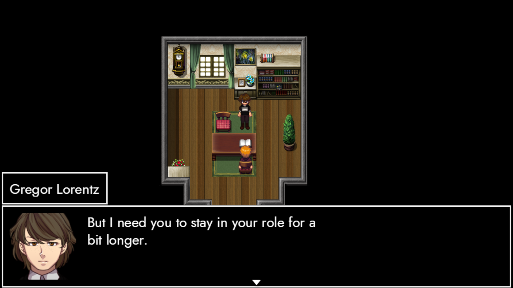
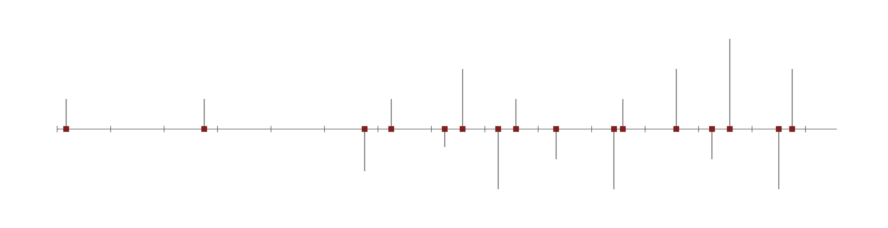

# ONE

## **Howdy-ho, friends!**

Remember when I [promised](https://store.steampowered.com/news/app/2169000/view/4185613970221498189) a major update two months ago? We followed it up by a progress [report](https://store.steampowered.com/news/app/2169000/view/4372516525995618833) on July 28th, where we covered what should've been ANARCHY 0.3 (*ExtrapolAtion*). 

The truth is: I've barely had time to spin the things I've worked on into a releasable build. We'll thus have to delay the update by a couple of weeks. Rest assured, though: there's a lot more months to the year!

The last couple of weeks have given me a good hold of the narrative pieces ANARCHY needs. Story remains our strongest point – so let's have a look at the arcs of the individual acts!

### – ParAdise –

The first act puts Pandora (aka Lorna) in the driving seat. Following the intro (*ImmigrAtion*), our protagonist wakes up in a strange new place. There's a bunch of familiar faces, but the world has radically changed. Either that – or Pandora's memory is terribly wrong. 

To answer that question, we revisit snapshots of Pandora's life between 1913 and 1919. Key factors are her relationship to Atlas (Aron), Selene (Cleo) and Eurydice (Viktoria). Pandora's aristocratic background, her new identity and life in the military make up her primary arcs.

All in all, the beginning and end of Pararadise proper is mostly sorted out. The current challenge is to pave the road in between. Some of the steps are already there: There's the Checkpoint, the Orchard and the Tree. We'll use the former two to kill the latter – revealing a way to the Castle and confront Eurydice.

### – Prometheus –

Once all is well in Paradise, we spot a post-game door. We could live happily ever after, but Pandora knows that there's answers out there. There's a familiar balcony, an old friend – and for the first time in almost year – it RAINs. 

That's the cue for ANARCHY's antagonist to reveal itself. A new kind of character – neither bound by history nor a script – has his own plans for the game. TRACHI's people are transformed into training subjects, forced to relive their memories over and over again.

### – ParAdox –

Daphne's (Dorothy) intro kicks off in 1915. She's kidnapped, orphaned and becomes Hyperion's (Teron) newest protegee. Her first stop is EnKAD academy – a boarding school to shape adolescents into servants of the state.

It's easier said than done if you're the daughter of a former public enemy, Daphne has a hard time making friends, her grades fall off and she's increasingly late. Hyperion intervenes and presents her with an opportunity. She becomes a Disciplinarian to bring other students in line.

ParAdox is a story about embracing and bending the rules. Daphne's evolution runs largely parallel to her historical development, which we'll follow from Kenovice through Aion until the big finale in Hermingrad 1922. 

### – ParAgon –

Our earliest snapshot of Atlas goes back to 1913. His interrogation by Crius (Danil) sees him being nonchalantly shot in the leg. Our protagonist holds firm, impressing his captor and landing him a job in the nation's secret police (EnKAD).

Two years later, Atlas is dispatched to Kenovice with orders to kill the man that recruited him. It's a turbulent time, given that he also meets the love of his life. For a couple of years, Atlas is content with life – until a tragic event makes him end up on his own again.

Fast forward to 1921. Eurydice disappears during a mission to Trachi. Atlas is sent to investigate. The current plan for ParAgon is to revisit his trip to the city we know and love. 

### – ParAsite –

Last but not least: Ganymede. Various characters pointed out that his past is a giant question mark. We saw a couple of flashbacks centering around a boy named Timothy – though we can't say for sure if these are 100% accurate.

Here's what we undoubtedly know: Ganymede delivered a letter for his brother Orpheus (Gregor) sometime before 1919. Two years later, he and Icarus (Nikolas) were in charge of the Forten Assassination. Ganymede met Orpheus again in 1923 and single-handedly dismantled Amryn's entire network in Dusa.

The last part will likely be the main stage of Ganymede's act. We'll get to see a younger brother who's been separated from the person he can't live without. If you've been wondering where the name 'Trojan Boy' comes from, you're in for a treat!

### TRACHI, THEM, US

Towards the end of Act 4, the experiment concludes. I can't tell you too much about the results, but here's the pieces that form the conclusion: A fictional story is a script detailing the struggle between characters and their world. In the scope of a video game, we add a player who acts unpredictably.

ANARCHY is the characters learning how to break the script. This could lead to several outcomes. Either order is restored (AUTHORITY), the characters reconstruct Paradise (AUTARKY) or the game breaks into reality (ATOPY). 

We don't need to make that call anytime soon. However, it's an important question for the future direction of TRACHI. Think of it as a balance between macro-history, individuality and meta ideology. If you have any thoughts on that – I'll gladly listen to them all.

### ANNIVERSARY

TRACHI's first iteration was released exactly five years ago. 2021 saw AUTONOMY, followed by InvAsion in 2022. Last year, we pushed ExcommunicAtion (aka ANARCHY 0.1).

This year is the first one without a major release. I'm super sorry that I have so little to show. For what it's worth: I won't let go until I'm gone. Updates will likely be far and inbetween, but I firmly expect to pick up the pace towards the end of the year.

I want to thank you – and everybody else who has interacted with the games. From the many friends that embraced a nory trying to create, to all the strangers out there. Here's to you and the hope that TRACHI fills you with joy!

Talk to you again soon, friendos!

**much love**  
nory
