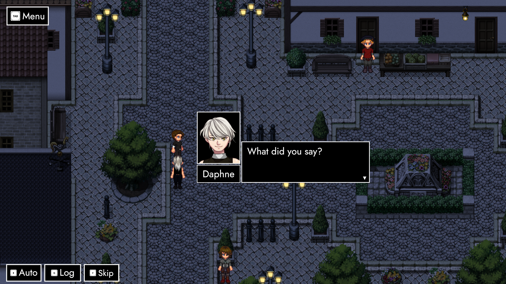
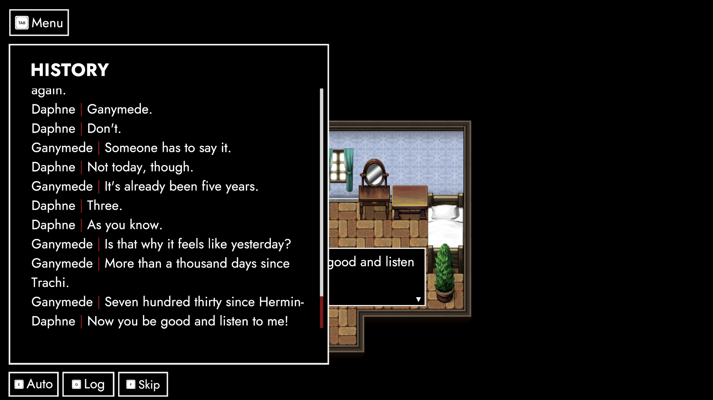
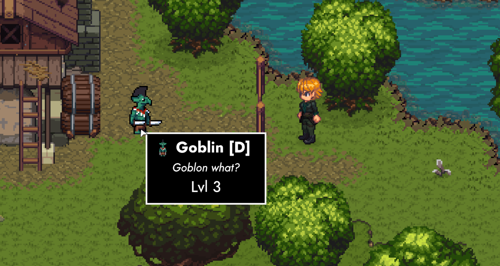
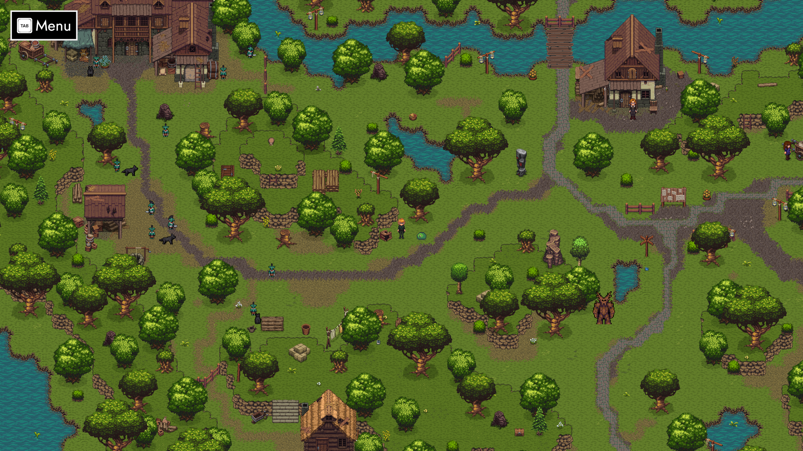
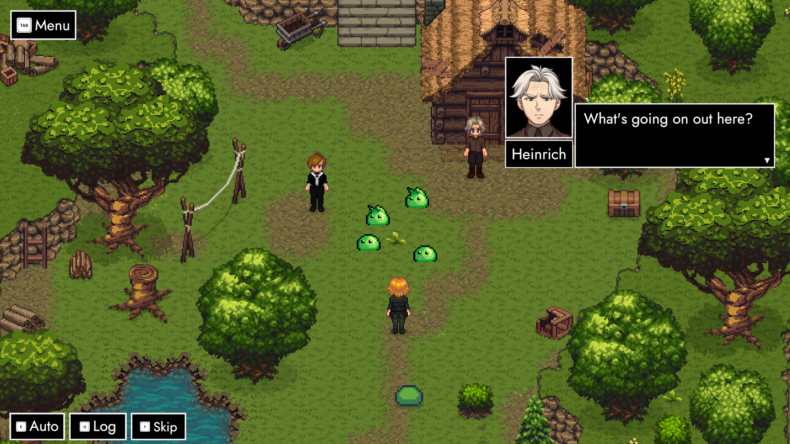

# ExtrapolAtion (Preview II)

## Salutations, 皆さん! 👋

I hope all of you arrived well into September 2024. Turns out this is our first post in ANARCHY's second year! Seeing as I just recently had to publicly [apologise](https://store.steampowered.com/news/app/2169000/view/4284698870322496743?l=english) – it's high-time we sat down for a little one o' one.

### Nostalgia

Let's start with ExtrapolAtion. Our return to Trachi is roundabout 90% done. The maps are finished and the dialogue is coded in. I'm currently testing the battle back and forth. On the whole, this segment took super long – partially since it's a crossroads for many things.

First off: the story. TRACHI has always been about who knows what at which point. ExtrapolAtion B's situation proved to be incredibly tough in that regard. Contrary to AUTONOMY, Atlas and Daphne are greeted by Ariadne when they step inside.

You can imagine how much Daphne wants to call her out. There's a good reason not to, though! As far as everybody is concerned, Atlas may or may not know whether it's actually 1923. The only hint we get appears in the question he puts to Ariadne: *Should you be here?*

### Indulgence

Unsurprisingly, the conversation is full of references to AUTONOMY. From Trachi's sewers to arteria and Icarus – all roads converge on this point. After the back and forth, a battle ensues.

Ariadne by herself doesn't pose much of a threat. Although she's the core of a city fighting back, her main effort goes towards helping Atlas connect the dots. It's a blessing in disguise, given that Daphne and Ganymede have their own plans for him.

We'll talk more about it at the end of the post. For now, let's put the focus on the stage itself. ExtrapolAtion will take place in two additional locations. One of them is the place where ANARCHY began.

### ATOPIA

In 1925, Daphne came to. As ExcommunicAtion's protagonist, she took it upon herself to beat up Ganymede real good. The point of the segment is to expose players (both old and new) to the macro plot and combat elements of the game.

It's one of the reasons why we repeatedly went back to improve and rephrase parts of the dialogue. ANARCHY 0.3 proudly continues that tradition. Daphne's initial banter with Ganymede admittedly felt a bit out of place, given that she's been out of it for a year.

Come 0.3, Daphne will be far more inquisitive. It's a smoother buildup to her reaction at seeing Icarus – and also aligns her closer to the player. ANARCHY's motifs are introduced more confidently, since we can now rely on ExtrapolAtion to follow them up.

### Conversation

If words aren't your cup of tea, we got you covered, too! A toggle in the title screen's main menu used to trigger a shortcut in ExcommunicAtion's dialogue tree. Going forth, we don't need that crutch anymore.

Instead, we have a skip-button that runs through any conversation instantly. All cutscene-specific commands (e.g. pathfinding, spawning and despawning characters) are executed and we'll land exactly where we should.

On the backend, skipping works similarly to Auto-mode. This (reintroduced) feature advances the dialogue automatically at a readable – and customizable – pace. If you still happen to miss a line or two, you can read it back in the (aesthetically improved) conversation history.

### Information

ANARCHY 0.1.1 (Encore) [introduced](https://store.steampowered.com/news/app/2169000/view/3726224612498922851?l=english) tooltips for Status Effects. I had to unfortunately roll it back due to them unpredictably crashing the game. It took me the better part of a year – but I've finally gotten around to sort it out.

Come ANARCHY 0.3, you'll be able to hover over all kinds of things. Status effects and other UI elements are just the tip of the iceberg. Entities in the world – such as interactable objects and combatants work as well. This means you'll finally be able to check the Level of enemies in ParAdise before you engage.

Speaking of that – let's take a look at what our Little Pear is up to!

### Macrodise

August 28th's story preview taught me one thing above everything else: Lorna's adventure still has a couple of question marks. Counting what we currently have (Paradise North), the Glade and the Checkpoint, we need at least one more major hub.

However, there's a major conceptual problem with our setup. If you recall ImmigrAtion's balcony scene, it's evidently facing north. Both the bridge next to the checkpoint and the road crossing the Glade are pointing – you guessed it – north.

This led me to (finally) sketch out a macro-map. If you're interested, heres a (very impressive) draft [here](https://raw.githubusercontent.com/norygami/norygami.github.io/main/assets/img/ParAdise%20Sketch.png). I'll revisit the topic in the next couple of months, but let's keep the milestones *farm*, *windmill* and *castle* in the back of our heads. 

### Eremite

We can apply our newfound knowledge immediately. The first point of improvement is the south-western section of the map. There's these hills that feel super uncanny – not to speak of the fact that the section is more or less a dead-end.

Both problems are solved by carving a new path to the Manor northwest. We've also added a little cottage housing an old friend. Luckily us! Someone who 'can't just stand idly by' comes in handy when there's a Daphne in distress.

Our new-found ally increases the number of friendly combatants. We're ramping up the enemies to compensate, making this our first big fight. As a reward, Daphne joins the team, we clean up a bit of Paradise and – if Lorna puts on the friendly eyes – we might see what the cottage looks like inside.

### Companionship

<iframe allowfullscreen="" frameborder="0" src="https://www.youtube.com/embed/PiVrIL-B8Oc"></iframe>

On the topic of making friends: Remember the big feature we added in June? *Renaissance* introduced companions that follow you around the map. Selene does so after Pandora lands in the Glade. ExtrapolAtion B's Daphne extends that behaviour across maps. 

There's ways to go, but our goal is clear: Build a system that supports party members at preset positions on the map, persistent companions that follow you around – and last but not least – deployable battle combatants.

Let's be frank: This challenge is one of the tallest mountains we have to climb. On the other hand, we've already gotten super far. And besides – I do look my best when I'm dying on a hill.

### X Marks the spot

The last six months were a lesson in patience and restraint. We'll slowly but surely wrap up ExtrapolAtion C as the final (non-flashback) piece of **pre-Paradise**.

In broad strokes: the road continues in Trachi, then the world succumbs to RAIN. There's a multi-phase threesome with a couple of surprise appearances, followed by credits leading straight to ImmigrAtion.

More on that in the third and final preview – hopefully this month. Until then, here's a good-luck hug to manifest you a couple of stellar weeks! 🤗

**much love**  
nory
