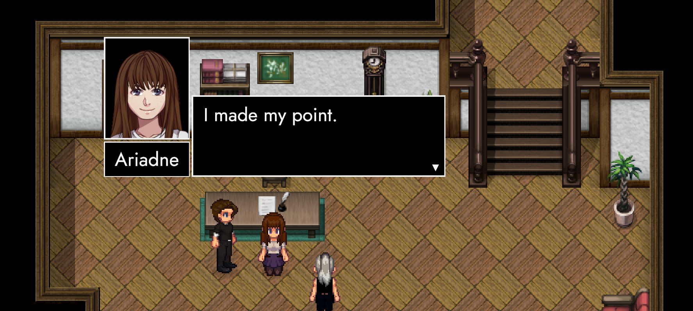
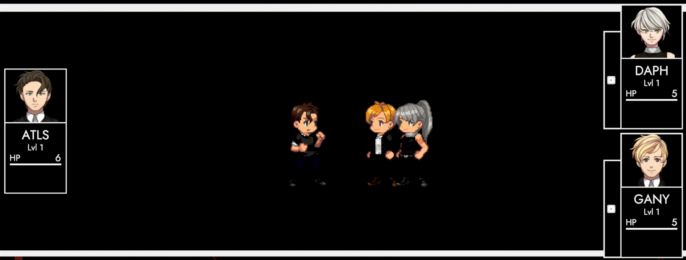

# ExtrapolAtion (Preview III)

## Hey friends! 👋

We're approaching the end of September, so I'll have to make due on my promise! Our third (and hopefully final) preview of ANARCHY 0.3 ties it all together through a mix of ExcommunicAtion, ParAdise – and last but not least: ExtrapolAtion C!

## Goose Shed

We covered ExtrapolAtion B in plenty [here](https://store.steampowered.com/news/app/2169000/view/4372516525995618833) and [here](https://store.steampowered.com/news/app/2169000/view/4586440679320222872). Today's good news is: Trachi 1923's segments are 100% set up. We've got the intro conversation, NPC (and companion) interactions, the dialogue and subsequent battle with Ariadne all under wraps. 

The encounter itself is far more difficult than anything we've faced so far. A deathless run is absolutely possible, but requires pitch-perfect execution. One way or the other, Ariadne takes a fall. 

I'll let you discover (and untangle) her message in your own time. After all, we've got a date with the room where AUTONOMY peaked. The place where Atlas and Daphne settled things with Orpheus and Eurydice.

## Reunion

In a not-so-shocking turn of events, a different situation unfolds: Neither Orpheus nor Eurydice are anywhere to be found. We'll get an explanation for that later in ExtrapolAtion. For now, we have to make due with Orpheus' little brother.

Like Ariadne – Ganymede has gone off-script. Daphne is justifiable pissed. Atlas easily picks up on the discrepancies. For one, Ganymede should have a cut on his left cheek. Secondly: his hands are fine. It's an irregularity with explosive implications. Daphne drops the mask and gets a hint of revenge for a wound inflicted in 1923. There's a crack, a bang, the world turns black. It's August 28th 1926.

## ExtrapolAtion

Ten months after the first teaser, it's high-time we follow-up ExcommunicAtion. We're back in ATOPIA, right before the RAIN. Plenty of time to drop a couple of answers! Topics on the agenda include: time, the people and the space we're in. 

Something big must've happened in 1924. The world endlessly regurgitates AUTONOMY. Daphne and Ganymede are evidently eager to abuse the situation. Atlas is reluctant until proof presents itself. Something inherently absurd – like random letters falling from the sky.

## ManipulAtion

RAIN giveth and it taketh away. Every year on August 28th, the world is recompiled. Characters are restored to their base-forms and retain nothing but the memories they made.

Gameplay-wise, we're back to Level 1. Our opener (Phase 1) is a melee throw-back to ExcommunicAtion. There's just one key difference: It's not a freebee anymore. We're doubling down on positioning, showing how strong *Knockback* can be in the right hands.

Phase 2 and onward is weapons hot. *Last Resort* and *First Response* make a glorious comeback. Which leads us to the most important question of them all: What's Atlas' signature?

## KOSMOS

Big sword spells big responsibility. The blade itself is so large, it occupies its own cell and acts as a (temporary) combatant. Althought we can't control it directly, Atlas has a whole set of tools or the job.

For example: You can pull KOSMOS towards you to deal damage in a straight line. The reverse obviously also works. By far the most devastating ability is *InterpolAtion*. Two turns after activation, everything in the immediate vicinity of KOSMOS gets vaporised.

You'd almost feel bad for Ganymede and Daph. Then again, they wouldn't press the issue if they didn't have a plan!

## Quid pro quo

Put yourself into Atlas shoes. He's been driven by hunger, dedication, love, despair and finally: revenge. Now that he's seen what the RAIN can do, there's a possibility. If objects can be constructed – does it work for people, too?

Veterans of ExcommunicAtion know that it does. So do Daphne and Ganymede. When Atlas is about to reach the same conclusion, they offer a helping hand. From a marriage of red and white emerges a dream come true.

For the sake of avoiding spoilers, we'll leave it at that. Rest assured, though: The dialogue – from its darkest valleys to its brightest sparks – is already there. Our destination is also crystal clear. No matter where the road takes us inbetween, we'll eventually land in Aion 1913.

## Face the BGM

<iframe allowfullscreen="" frameborder="0" src="https://www.youtube.com/embed/FYdRuXD9yUs"></iframe>

We're about to have a continuous sequence from ExcommunicAtion to about 30% into ParAdise. So it's high time we spared a thought on the overall ANARCHY experience! Part of that is ExcommunicAtion's dialogue revision (covered [here](https://store.steampowered.com/news/app/2169000/view/4586440679320222872)).

On that note: A little eureka appeared while I sorting out ExtrapolAtion's battle score. RAIN apparently goes super hard with dance / edm. If you haven done so already, feel free to check out the demo above. 

Arguably the biggest change is the addition of vocal tracks. There's a connection between voice and the RAIN – although that doesn't mean we're neglecting other musical bits of ANARCHY!

## Countryside

<iframe allowfullscreen="" frameborder="0" src="https://www.youtube.com/embed/WtOhnSBEoaA"></iframe>

ParAdise started out as a dreamy and ethereal place. We've recently shifted it closer and closer towards a semi-grounded frontier atmosphere. It's closer in line with Pandora's childhood memories: a somewhat spoiled younger sister behaving not-so aristocratically.

Now put these things into an arc about self-actualisation: we arrive at a sheltered protagonist stepping into a world without too many laws. Pandora has a habit of breaking things, but she's also keen to repair and rebuild.

The second preview offered a first hint of that. We (re)introduced Heinrich and his hut. What started out as a small side-quest has now evolved into one of ParAdise's bigger threads. 

## Almost

AUTONOMY-people might rightfully ask the question: What does this guy have to do with Pandora? It's simple, really: Heinrich was a Sergeant of the Trachian prefecture. He was ordered to investigate rumours of a false-flag attack on Fredrick Dam.

On the other side of that encounter was the Ionian Military. We know that Pandora would've been part of that attack – if not for Hyperion's intervention. In concrete terms: There's a scenario where the two of them would've pointed a gun at each other.

Obviously, neither of them are aware of that. We just happen to meet a grumpy eremite crippled by guilt. Pandora being Pandora, she can't help but dig. As we advance through the quests, we'll help Heinrich to rebuild his house and his relationship with the past at the same time.

## Soldiering

One major element of ANARCHY's first act is shaping up to centered around a life in and after military service. Pandora's own development is firmly tied to her ambiguous relationship with an organisation she technically shouldn't fit into.

However, it's also the place where she learned to (somewhat) stand on her own feet. There's a feeling of comradery between her, Helios and Selene. This sentiment is extended towards everybody that served. The Fragmentarian (Miroslav) and Heinrich being two such examples.

ParAdise is free of geopolitics, which means there's no need for a military. The Checkpoint is full of bored veterans, drowning their varying amounts of PTSD. It's the perfect climate for Pandora to stir things up.

## October – November – December

So far the plan. I'm still heavily invested in my PhD, so it's hard for me to give a proper ETA. However! Tomorrow I'll be off to my final conference this year.

After that, its just research and writing. If all goes well, we might get ANARCHY 0.3's beta out around mid-October. The post for that should be pretty succinct, but I'll try to cover a couple of technical changes that didn't fit into the previews.

## Most importantly

Guys, Girls and Everybody else! I know the last nine months were a shitshow. If the Steam Awards had a category for 'Early-Access Hell', I'd have to make room on my shelf.

Despite all of that, people are downloading and playing the game. Not to speak of the people who read these posts. I'm blessed in two ways: There's a crowd that cares – and it's small enough for me to appreciate everyone.

Tl;Dr: Thank you for sticking it out with me! Talk to you in October, you absolute champs!

Huggies and kissies and all that!

**much love**  
nory
