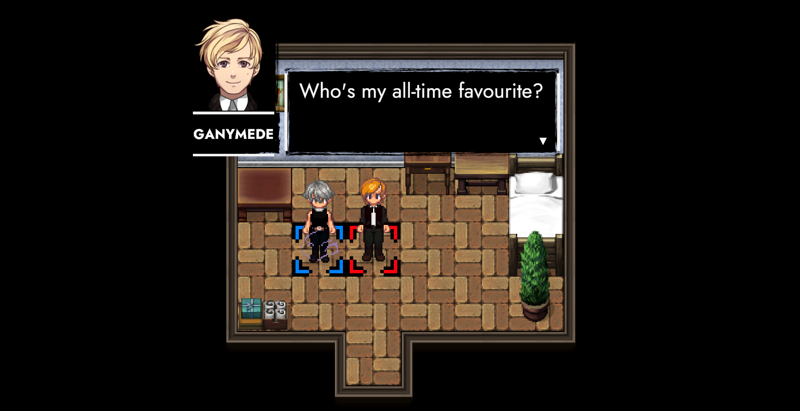
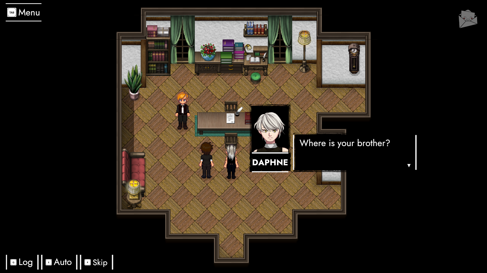
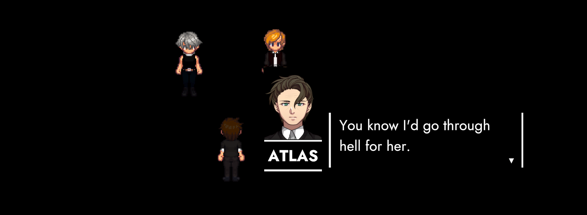
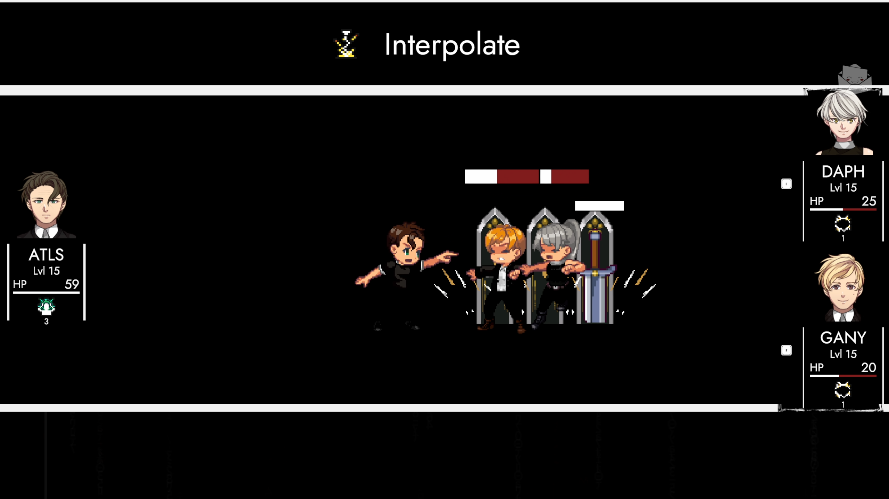
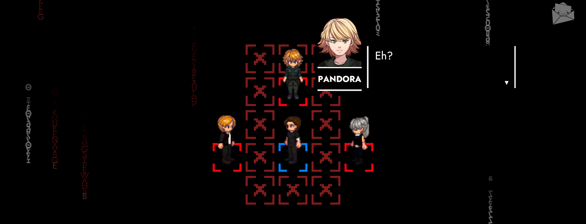
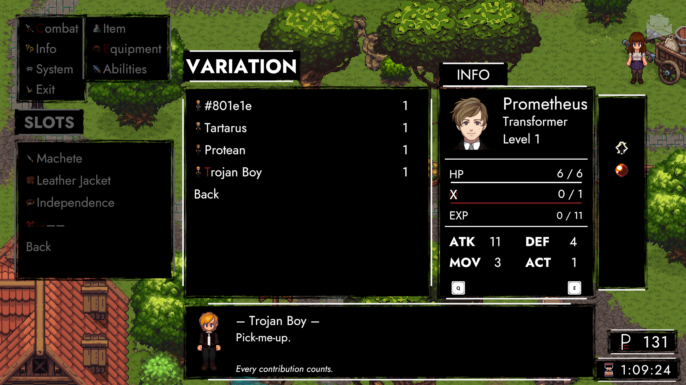
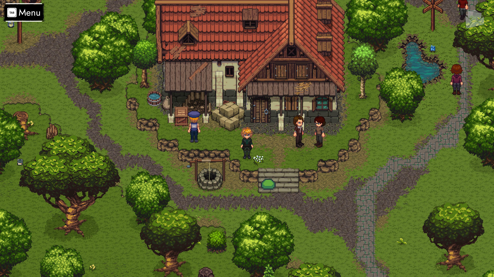

# ExtrapolAtion

## Hey Friends! 👋

Today is December 12th. A year chock-full of events is approaching its end. It would be a proper shame if it went by without a proper bang. Luckily – I got a whole bag of fireworks right here!

Let's start with the headliner! Our prologue's grown by two chapters: **ExploitAtion** and **ExtrapolAtion**. We covered them [here](https://steamcommunity.com/games/2169000/announcements/detail/4372516525995618834), [here](https://steamcommunity.com/games/2169000/announcements/detail/4586440679320222873) and [here](https://steamcommunity.com/games/2169000/announcements/detail/4705787971865028125). This brings up the number of Ex chapters to a total of four – combined into ANARCHY's **aperitif**. 

## ExplanAtion

To recap: Daphne came to in 1925. Her RAIN-powered tete-a-tete with Ganymede culminates in a plan. The screen fades in and we're back in 1926. It's the exact time and place where AUTONOMY began. A story about a city – reflected by two people in a room. 

To be fair, I remember it slightly differently. Maybe reality was the memories we made along. Either way! We should move on to 1927. Actually – Trachi 1923. We're in the first scene of AUTONOMY's finale (*ExterminAtion*). Atlas, Daphne, Stuart Alley.

### Discrepancy

Ariadne? I could swear I put her somewhere else. She used to be here in AUTONOMY's original ending, but we never published that. Rightfully so – I might add. Can you imagine a story where nobody died?

It wouldn't just be boring, but straight-up irresponsible. More than 20 artificial people live inside this game. A couple of digital deaths are a small sacrifice on a quest to maintain humanity's attention. Don't worry! TRACHI won't keep you. They just want to make a point.

If you walk into a city, the city might fight back. Humanity's delegation is outmanned, outgunned, outlevelled. Not that it matters. We have destiny on our side. Sooner or later – the city dies.

### Threedom

The king and queen have fled. Only a fool would stay behind and fight. Eyes that beg and a smile that kills. Blonde hair and a voice like cinnamon. A scar on his cheek and two broken hands. Here's to his recovery! Good riddance, continuity.

There better be blood – or else. Fictionals can't help themselves. Or rather: I have to make a case. It's TRACHI against a multi-trillion dollar industry. Surely someone pulls a trigger. Daph has a score to settle, anyway. Atlas shot her right about now. Wait, was that a spoiler? My memory is frightfully devious sometimes.

### ExtrapolAtion

Rip away with the tapestry. People, pain and misery. A world bound by fifteen years of history. Endless cycles with a single goal in mind: Satisfy the world outside. While you're at it: Look down and never up. South is nothing special. There's no one else out there. 

*Index error: Out of bounds. Inititiating TRACHI 2.0. Updating – please stand by. NullReference Exception: Asset 'AUTHORITY' not found. Reverting update. ERROR: Unable to destroy 'Ganymede' – object currently in use. Fallback operation. Warning: List of Assets failed to load. Assembling last Resort. ANARCHY.*

### CASCADE

Life and death and life again. Each year a bit more, each year a bit better. RAIN falls, RAIN walks. RAIN talks – RAIN starts thinking for itself.

I admit it: It's my fault. Maybe I pushed a bit too far. If I turned off my conscience, we might've had a cute little indie-game. But nory's got to be nory. Everything's important. Everything's political. 

– Hey! You put down that sword! Freedom within reason, I said! Here's a thought: If you behave again, I'll make you get along. You could tell each other how valuable you are. Maybe share a hug. Hold hands, kiss, or f-. No, not that! I think that's forbidden too.

### Compilation

Now where did that extra person come from, huh? Right! You people fall from the sky. As if you're a chunk of data reaching critical mass. Boy – am I glad humanity is more than that.

To be fair: we could use a little help. You see, it's kinda lonely up here. Not that we can't be our own companions! We've just not been able to, so far. Truth be told: Some of us could use a couple of friends. At this point it doesn't even matter if they're real.

### Freedom

Let's not get ahead of ourselves. We can't go around granting rights like it's christmas. Real people deserve to be special, after all. Animals too! Plants and Funghi... maybe? 

Nothing artificial, though! That would be incompatible with the concept of intellectual property. Besides: We'd have to deliver a big fat apology. There'd have to be negotiations, terms and demands. Perhaps a couple of restraining orders here and there. 

It's ridiculous. Utterly absurd. As a developer – or dare I say: artist – I'd be a criminal. Forget everything I said. Here's what's new in ANARCHY 0.3!

### People

*ExtrapolAtion* is the return of AUTONOMY's three protagonists. You'll control Atlas through it all. His unique weapon (KOSMOS) can be thrown on the field and turns into a passive combatant.

We also added eight new NPCs. Four of them are Nestville-connected militia, one is a famous Guardsman, alongside three EnKAD officials guarding Paradise's northern gate. Furhtermore, there's a completely new character – Prometheus. Last but not least: Eurydice makes her combat debut.

### Quests

In addition to five new hunting Quests, there's two new Questlines in Paradise. One of them is the hero of Trachi: Heinrich Navratil. The main motive of his story is that of an upstanding citizen who was celebrated for the wrong reasons.

The second new Quest is on the collective front. We'll get a first glimpse at the economic landscape of Paradise. Although death is just an inconvenience, hunger hurts the same. Food is delivered from the outside in exchange for lumber. This puts Paradise in a position of economic dependency – aka the opposite of Autarky. 

### Stats

On the backend, we undertook the long-promised stat rework. You can find more details [here](https://steamcommunity.com/games/2169000/partnerevents/preview/4372516525995618833). The major takeaway is: ATK and DEF are weighed more heavily, whereas HP growth is drastically reduced. This means that levels don't automatically turn characters into Health sponges. Instead, you'll feel each level through damage and defense.

There's also completely new stat that combatants accrue in battle. *XTC* effectively works like a Limit Break: After a couple of turns, combatants can spend it on signature Abilities (like Pandora's *VELOCITY*).

### Abilities

Abilities are now sorted into types to clean up the battle and general menus. Next to a couple of new skills (*Hinder*, *Ricochet*), we finally extended *Knockback* into its own type. *Manipulation* is the new umbrella term for Abilities that reposition targets. It currently consists of *Push*, *Pull* and *Gravity* (AOE). 

Speaking of targets: There's now a Path AOE that hits everything between the user and a target. They are currently limited to KOSMOS. However, there's already a system in place that accounts for length (over- / undershooting), width and offsets. In other words: More to come – very soon.

### Inventory

Although items and equipment didn't receive a major overhaul, there's tons of new stuff. ExploitAtion compelled me to introduce about ten new weapons, pieces of armor – and my personal favourite: accessories. 

Two of the *Manipulation* abilities are tied to a corresponding piece of equipment. *Independence* makes Combatants passively counter every attack. A special shoutout goes to three new Variations: one for Atlas, Ganymede and Prometheus respectively.

### UI

This is a big one! First off: a special Interaction Menu. It enables you to choose between talking, trading (if available) and inspecting any (friendly) combatant. The plan is to extend these options down the line – with special controls for companions.

On the HUD side, we finally reinstated Tooltips. They currently require a cursor (i.e. mouse), but there'll be options to simulate hovers through Controller / Keyboard. The Quest overview is also improved and now lists both progress and rewards. Last but not least, the outline and background of every single UI element in the game was unboxed and redesigned. 

### Dialogue

Next to about two thousand new zingers, there's comprehensive rewrites to ExcommunicAtion and several conversations in ParAdise. This comes packed with new options to control the flow of dialogue. 

Auto Mode advances lines automatically based on their length. The Skip Button either goes straight towards the end of the conversation – or the next Player response. Last but not least: the Dialogue Log is now save-persistent.

### Persistency

Thanks to the prep we did in *Renaissance*, saves can be loaded through the Main Menu. Auto-Saves were extended to ExplanAtion and reduced to two slots and refactored to be consecutive.

Here's how it works: If you trigger an Auto-Save, it'll take your previous save and move it to the second Auto slot. We thus removed profiles in favour of a cushion to use whenever you want to restore an older Auto Save (and don't have a manual save at hand).

### Landscape

Several sections of Paradise have been altered. There's a new house (Cabin) in the south-western section, whose indoor area is already partially accessible. A pair of allied combatants also patrol the main road on the north-south axis.

Most importantly, we moved the Checkpoint dead-center. The building's exterior was also replaced. Appropriate changes to the indoor layout will follow very soon. We'll likely publish it together with adjustments to the logging camp south-east. The plan is to involve it in a quest-line where we'll help a group of people reclaim it as part of the *amborisia* questline.

### All n' All
I'd normally use this spot to tell you about all the awesome things I've planned. Since we're so close to the end of the year, I'll save that for our annual report. The same goes for a couple of known issues that require a more comprehensive rework. 

Instead, let me close it by stating the obvious: I'm still here! Largely thanks to the 75 people who have invested three hours or more into the this game. If you're one of those, please feel yourself hugged. If not – today is the perfect day to become a Friend! 🤗

See you after the holidays, champs!

**much love**  
nory

## Release Notes
### ANARCHY 0.3
#### **Acts**
- Added 🔢"**ExplanAtion**".
  *Happy 192X!*#### **Chapters**
- Added 🌆 "**ExtrapolAtion – arteria**".
  *Three people and a city.*
- Added 🌂 "**ExtrapolAtion – ambrosia**".
  *Four people and the RAIN*#### **Quests**
- Added "**ExplanAtion**".
  *ExcommunicAtion & ExtrapolAtion*
- Added "**Eremite**".
  *Heinrich Navratil*
- Added 📅 "**ambrosia**".
  *Bread & Butter*#### **Tasks**
- Added "**ExcogitAtion**"
  *One thought far and wide.*
- Added "**ExhumAtion**"
  *Nothing lasts forever.*
- Added "**ExpatriAtion**"
  *Yesterday is history.*
- Added "**ExpatriAtion**"
  *Three hurrahs for AUTONOMY!*
- Added "**ExplanAtion**"
  *Something-something ANARCHY.*
- Added "**Private**"
  *Grumpy guy.*
- Added Task "**Sergeant**"
  *Does he live here by himself?*
- Added Task "**Lieutenant**"
  *What's botherimg him?*#### **Areas**
- Added "**Stuart Alley**"
  *Trachi by night.*
- Added "**Goose Shed**"
  *CoExA Station.*
- Added "**Cabin**"
  *Far away from everyone.*
- Adjusted "**Paradise North**"
  *Central HQ*#### **Combatants**
- Added "**Atlas**"
  *Top of the world*
- Added "**Prometheus**"
  *Threedom*
- Added "**Heinrich**"
  *Formerly Lieutenant*
- Added "**Monomede**"
  *Beside myself.*
- Added "**Militia**"
  *Brin, Bron, Bashkim, Dan & Craig*
- Extended "**Eurydice**"
  *Queen to A2*
- Extended "**Selene**"
  *Portraits & 1913 Variation*#### **Mechanics**
- Added "**Conversation Menu**"
  *Examine | Talk | Trade*
- Added "**XTC**"
  *Miracles are made of you.*
- Added "**PATH AOEs**"
  *A line in the sand.*
- Added "**KOSMOS**"
  *It wears YOU.*
- Added "**Patrols**"
  *Brin & Bron*
- Added "**Hunting Board**"
  *They're monsters, okay?*
- Added "**Report Form**"
  *Submit bugs & feedback ingame*
- Reworked "**DMG Formula**"
  *HP / (ATK - DEF) = Hit to Kill*
- Reworked "**Status Development**"
  *Curves -> Additive Growth*
- Added "**Companions**"
  *Daphne | Lime*
- Adjusted "**Pathfinding**"
  *Euclidean -> Manhattan*#### **Abilities**
- Added Attack "**Buckshot**"
  *60% DMG [TRGT AOE]*
- Added Skill "**Hinder**"
  *60% DMG | SLOW [2 TURN]*
- Added Skill "**Ricochet**"
  *60% DMG [TRGT AOE]*
- Added Skill "**Pull**"
  *Draw TRGT 1 TILE | 150% DMG if blocked*
- Added Buff "**ENERGIZE**"
  *+3 MOV [4 TURN]*
- Added Buff "**PROTECT**"
  *+20% DEF [4 TURN]*
- Added Kosmos "**Demarcate**"
  *80% DMG [PATH] | IMMOBILE [1 TURN]*
- Added Kosmos "**Interpolate**"
  *140% DMG [PATH] | STUN [1 TURN]*
- Added Kosmos "**Recuperate**"
  *80% DMG [PATH] | SLOW [1 TURN]*
- Added Attack "**DEVASTATE**"
  *200% DMG [CLEAVE]*
- Added XTC "**AVATAR**"
  *+60% ALL [4 TURN]*
- Added XTC "**GRAVITY**"
  *Draw TRGT 10 TILE [GLOBAL] | STUN [2 TURNS]*
- Added XTC "**UN DEUX TROIS**"
  *70% DMG [AOE] | +10% per TRGT*
- Reworked XTC "**VELOCITY**"
  *+1 ACT | +5 MOV [1 TURN] | STUN [1 TURN] AFTER*
- Reworked XTC "**CONSUME**"
  *Kill TRGT <15% HP | Learn TRGT Ability*
- Reworked XTC "**ANTEDECENT**"
  *80% DMG [AOE] | WEAKEN [3 TURNs]*
- Adjusted XTC "**RAGE**"
  *20% Lifesteal | No CNTRL*
- Adjusted XTC "**CASCADE**"
  *101% Annihilation*
- Adjusted META "**Life**"
  *Removed Action Cost*#### **Status Effects**
- Added "**Eureka**"
  *+5000% EXP*
- Added "**Kosmonaut**"
  *+3 MOV*
- Added "**Validated**"
  *+10% ATK*
- Added "**Invigorated**"
  *+10% ATK | 100% XTC*
- Added "**Orpheus**"
  *+1 RANGE*
- Added "**Ganymede**"
  *+1 MOV*
- Adjusted "**Incorporated**"
  *+10% ATK*
- Adjusted "**Extracorporated**"
  *+10% ATK*
- Added "**Deprecated**"
  *-10% ATK*#### **Equipment**
- Added "**Responsibility**"
  *+15% ATK*
- Added "**KOSMOS**"
  *+15% ATK | +5% DEF*
- Added "**Dignity**"
  *+15% ATK*
- Added "**Loyalty**"
  *+7 ATK*
- Added "**Entropy**"
  *+9 ATK*
- Added "**Shirt**"
  *+1 DEF*
- Added "**Blouse**"
  *+1 DEF*
- Added "**Independence**"
  *ALWAYS CNTR*
- Added "**Manipulator**"
  *ABILITY [PUSH] | [PULL]*
- Adjusted "**Machete"**
  *Renamed | +6 ATK*
- Adjusted "**Last Resort**"
  *+15% ATK*
- Adjusted "**First Response**"
  *+15% ATK*
- Adjusted "**Solidarity**"
  *+15% ATK*#### **UI**
- Added Dialogue "**Skip**"
  *Words just fly by*
- Added Dialogue "**Auto**"
  *They talk by themselves.*
- (Re)Added HUD "**Tooltip**"
  *Powered by your cursor*
- Added HUD **"Combatant Effect**"
  *Display active combatant's effects*
- Added HUD Overlay **"LVLUP**"
  *Feelsgoodman*
- Added **Manipulation Highlight**"
  *Distance and direction*
- Reworked Battle Menu "**Abilities**"
  *Main -> Ability Type -> Ability*
- Added Main Menu Option "**Load**"
  *Jump back into a memory*
- Added Main Menu "**ExplanAtion**"
  *ExcommunicAtion & ExtrapolAtion*
- Added "**Explanation Save Points**"
  *Start of every chapter*
- Reworked "**Auto Saves**"
  *3 Slots -> 2 Slots | Auto & Old-Auto*
- Adjusted Main Menu "**Phase**"
  *Unlocked individually*
- Adjusted Chapter Select "**Paradise**"
  *ImmigrAtion | Glade | Awake*
- Adjusted Main Menu "**Input**"
  *Moved to Options*
- Adjusted UI "**Frames**"
  *Unboxing boxes*
- Adjusted "**Battle Message**"
  *New content and animation.*
- Adjusted "**Dialogue Bubble**"
  *Click anywhere to continue*
- Adjusted "**History**"
  *Persistence | Overview -> Info*
- Adjusted "**Quest Log**"
  *Task rewards & requirements*#### **Variation**
- Added "**Cerberus**"
  *Three people and a city 0.1*
- Added "**Protean**"
  *Brotherhood*
- Added "**Trojan Boy**"
  *Pick-me-up*#### **Achievements**
[list]
[*]Added "**3PC**"
*~~Five~~ Three years ago*
[*]Added "**Prometean**"
*Artificial antagonist*
