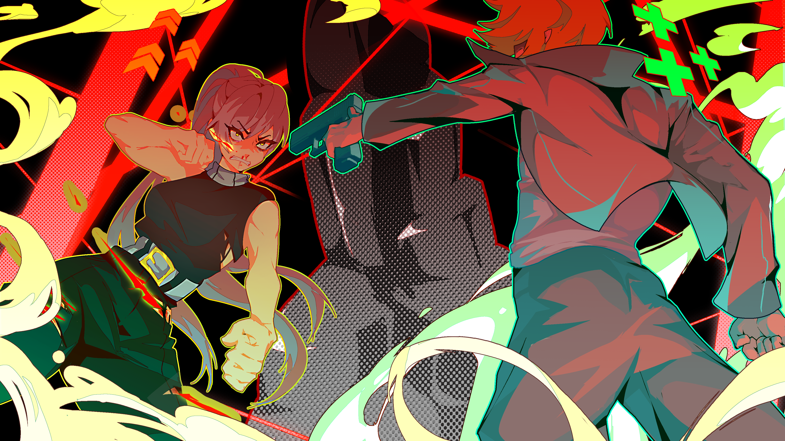

# TRACHI++

## Hey Friends! 👋

Look! There goes another one!

Time to reminisce – and whatever the future equivalent is. A trip up and down the memory lane in two announcements: [**AUTONOMY**](https://steamcommunity.com/games/1811440/announcements/detail/527581830427181969) handled the ideological end – now we'll focus our **full attention** on this game right here.

Let's kick it off with a **chronology**!

## – January –

The start of the year was crazy. We just released ***[Rendevous](https://steamcommunity.com/games/2169000/announcements/detail/3890611710922097096)*** and settled the relationship between exploration and combat. ANARCHY grew from a tactical to a CRPG and joined the ranks of games such as Baldur's Gate, Knight's of the Old Republic, Divinity: Original Sin or Dragon Age (back when that name meant something).

Player numbers, engagement and overall excitement was off the charts. I reached out to several artists (like [**zuddi**](https://x.com/zuhzudi)) and commissioned pieces left and right. On the whole, I probably worked 70-80 hours per week organising and prepping ***[Silhoutte](https://steamcommunity.com/games/2169000/announcements/detail/3975056740203933950)***.
<!-- more -->

On January 13th, we published the [**preview**](https://steamcommunity.com/games/2169000/announcements/detail/3890611710969491204). Flagship features included NPC locomotion and pathfdinging. Friends and enemies learned to walk the map, spot players through line-of-sight and react accordingly. Battles could escalate through social aggro, Daphne broke into ParAdise and – last but not least – we shipped the second piece of ImmigrAtion.

## – February –

Following January's release, I took two days off to conceptualise. *Silhouette* was the frame, ***[Merci](https://steamcommunity.com/games/2169000/announcements/detail/3982938673431827121)*** would have to fill it. Content, content, content. More precisely: The final piece of ImmigrAtion, new indoor areas, skills, Variations and a Tree.

In addition to ingame-goodies, [***pataypusa***](https://x.com/pataypusa) delivered a ground-breaking piece of artistry. A masterwork that condensed the idea of ParAdise, Lorna and her arc to a symphony in RGB. If January was any indication of where we're headed, we'd be on track to make the next big indie thing.

My **expectation** climbed to Mount Olympus – and tumbled all the way down. For reasons unclear to this day, we lost a major chunk of people. Maybe it's because Steam's launch visibility wore off. Maybe the game straight up wasn't good enough.

Either way, I had to reset myself. February was my final coup before a month filled with work. Come March, dreams couldn't sustain me anymore. In retrospect, I got a much needed wake-up call.

## – March –

While I was away at work, I composed an exit strategy. ***[Café](https://steamcommunity.com/games/2169000/announcements/detail/4186732260749825455)*** would be the last of eight consecutive monthly releases. My mind was fully occupied by my day job, but I couldn't let the people down. If I had to make the reputation of Early-Access even worse, I better have a good explanation.

More importantly: An update to sweeten the deal. I threw together some content and published it. The corresponding **announcement** was: It'll have to last for a while. At least I kept that promise, right? So while I'm on a roll: I think it's high-time for me to be a bit more honest overall.

Let's say ANARCHY would've boomed. I'd be stuck between a rock and a hard place. On one hand, there's a video-game as ambitious as it is **demanding**. On the other hand, I'm in the second year of my **PhD**. This wasn't a problem per se, as long as I kept side-lining one for the other.

For the first sixteen months or so, I went all in TRACHI. The thought of telling a story – or rather: building a **world** – was so compelling, I sacrificed nigh-on everything for it. Even IF ANARCHY's exposure was not up to my expectation, I would've pushed for more. Sure, I'd be snarky as hell about it! But I picked it up because I wanted to, which means I dropped it out of my own volition.

## – April & May –

You see, there's a real, real reason why I went on a break. From the moment I left RPGMaker in January 2022 to my **hiatus** starting March 2024, I learned at a rapid pace. Game-development was my entry into coding, writing, vector and raster image manipulation, video-editing – and general PR.

It made me understand the thing that drives me. I'm a slut for personal improvement. Give me something to **grow** and you won't see me for months. Between the end of March and May, **work** excited me more than ANARCHY. The fact that I was drowned with appreciation – and that it paid – was just the icing on the cake.

At that point, I was ready to let the game sit in **development hell**. My mind was 100% on NLP and absorbing everything I could about neural networks. I got big into transformers and LLMs, when TRACHI whispered a seductive thought into my head: *Wouldn't it be cool if there was a model fed with ingame dialogue?*

Two weeks later, the setup was complete: Extracting and preprocessing ingame [**conversations**](https://huggingface.co/datasets/norygano/TRACHI), training and locally host an **[LLM](https://huggingface.co/norygano/dolphin-mistral-TRACHI-7b)**, that can be interacted with through character-based Discord bots. Mission accomplished, but what's next?

## – June –

For about 36 hours, I entertained the idea of remaking AUTONOMY in **RPGMaker MZ**. Proper fullscreen, new music, rewritten dialogue and overall performance optimisations. I would've honestly committed myself – if it wasn't for the fact that MZ's plugin infrastructure couldn't be any worse.

I'll spare you the details, since I've covered that topic in [**AUTONOMY's post**](https://steamcommunity.com/games/1811440/announcements/detail/527581830427181969). Here's a tl;dr: Convenience has a price called dependency. People with a lack of technical knowledge are open season.

In sum: I'm glad that I don't have to deal with RPGMaker anymore. The only remnant is a **[character generator](https://visustella.itch.io/stella-character-generator)** whose update was due in December 2023. Remember how I seethed about that? Nowadays, it's a relief to know that I'm not the only one making things up. And hey: At least my promises are free.

Once in a while, the things I say come true. June 28th saw the release of ***[Renaissance](https://store.steampowered.com/news/app/2169000/view/4185613970221498189)***. The first update in three months shipped ExplanAtion's second chapter, Companions, Paradise's Glade, a new Variation system and many other things. Most importantly: It proved that ANARCHY lived in my head rent-free.

## – July 2 November –

Well, at least for a time. In my defense, September to November was chock-full of work. August, too, actually. The undeniable highlight was [***pataypusa***](https://x.com/pataypusa) elevating TRACHI art to its current peak. As for me: I backtracked my way through months of technical debt.

The main motivation for my short-lived relapse into RPGMaker was to check how my improved **technical proficiency** held up. Funnily enough, that's exactly what happened with ANARCHY! I ripped open every framework and made a conscious effort to understand as much as I can. 

Not because I had to. A good game is not the result of deep understanding. On the contrary! Production means to cover things with tape. It's the art of taking **shortcuts**, so players have something to play. That's the rule I lived by from August 2023 to March 2024. That's what almost killed ANARCHY for me.

***ExtrapolAtion*** was meant to be a counterpoint. Months spent on resolving issues that held me back since the game came out. Both in technical and narrative terms. I had a face-off with the point, the motive, the foundation of ANARCHY. ***ExplanAtion*** became the game's prologue, upping the average total playtime to roundabout five hours.

## – December –

Two and a half weeks ago ***[ExtrapolAtion](https://steamcommunity.com/games/2169000/announcements/detail/509566179781641079)*** graduated to the live branch. Since it's relatively fresh, we can leave it at that. Instead, I'd like to roll out all the things that didn't fit into the corresponding announcement.

First of all: I'm sorry it took so long! It could've been out way sooner and bigger! The second half of the year was a painful **reminder** that ANARCHY won't take four or five years, but ten or more. Sixty characters (currently), two worlds and a conflict between ideology and history. Add to that the tension between gameplay and narrative.

We got our work cut out for us. And frankly: I wouldn't have it any other way. Some of my esteemed colleagues have pushed out several **VNs** while I'm spending double-digit hours to make a skip button work. Some people (i.e. a harsh voice in my head) would call it a waste of time. 

But it's also the exact thing I enjoy. Four stats, no RNG. Manipulation-capabilities that put pathfinding algorithms to shame. One-liners that take me **months** to get right. Music that adds up to thousands of dollars in license fees. A story that combines authenticity with epic theatre to demand rights for fictional life.

## – Prognosis –

<iframe allowfullscreen="" frameborder="0" src="https://www.youtube.com/embed/5-92Ps25N-M"></iframe>

How's that going so far? Let's evaluate the **data**! Steam says ANARCHY had 277 players overall. About **1/3** of those reached the three-hour mark. Now compare that to AUTONOMY: **118 players** out of 1180 fulfill the same criteria.

In absolute numbers, AUTONOMY (release) smashes ANARCHY (early-access). Relatively speaking, ANARCHY keeps **3x** as many players engaged. Either what we're doing works, or we've successfully grown 'brand loyalty'. One way or the other, I'm sold on one thing: A friend of TRACHI is a friend of mine.

We'll continue the ExtrapolAtion blueprint in 2025. A big focus on old-world scenarios – especially the city. **Trachi** deserves to be part of ANARCHY, so we might as well port AUTONOMY. Everybody will have an opportunity to revisit 1923, I get to polish, extend and experiment while I grab my PhD.

As a bonus, we'll bring the whole **family** under a single roof. AUTONOMY becomes LEGACY – and ANARCHY gets a new name:

2025 will be all about consolidation. I'll focus on the things we have, manage my **expectations** and keep my eyes where they belong: LaTeX, Unity and you.

**Thank you** – so much – for your trust and your support! Next time I try reach for the stars, I'll make sure to remember that I got a whole bunch of them right here! 🤗

Have a wonderful 2025, Friends! 🥂

**much love**  
nory
