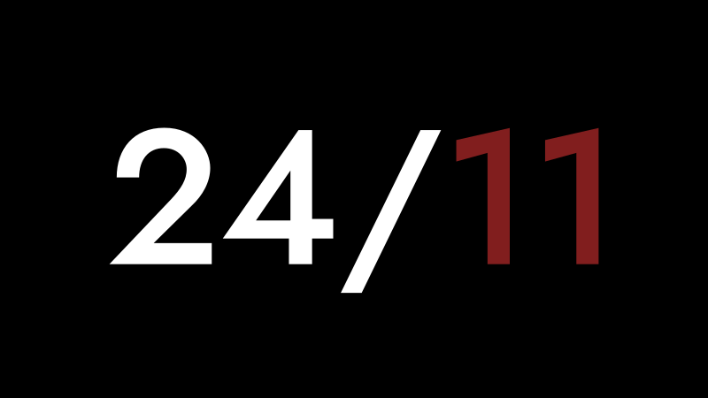

# Beta

## **Hey friends!**
**TRACHI** is due to be released on Steam on the **24th November**.

As of today, **the game is finished**, content-wise. And has been tested both by myself and a group of testers. However, a game can never be polished enough. 

So if you'd like to play through it and test its functionalities, please don't hesitate to **contact me** either through **[Steam](https://steamcommunity.com/id/norygami/) or [Discord](https://discord.gg/DyYx8zN6qq)**.

I appreciate **any kind of feedback**, of course. So please do make your own impression of TRACHI and tell me what you think. 

**Examples**:
[list]
[*] General performance
[*] Audio elements (volume, transitions etc.)
[*] Controller/Gamepad functionalities
[*] Accessibility features (colours, readability etc.)
[*] Steam Overlay / Big Picture [/list]
**Mac** and **Linux** versions will hopefully be added in the coming weeks. If you happen to run either of these OSs, please contact me and I'll prioritize pushing a corresponding build.

In any case, I want to thank you very much for your interest. And I hope that you'll come to enjoy the world of **TRACHI** as much as I do.

**Much love**  
nory
