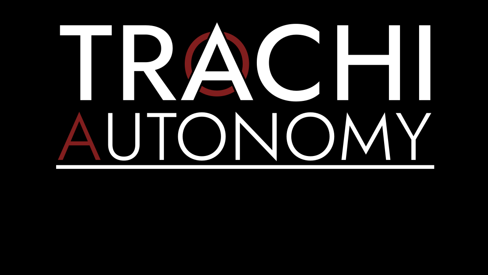

# arteria

Hey friends.

## A hundred days
On the 20th June 2021 - TRACHI: AUTONOMY 1.0 was released.
One year later, operation arteria will conclude. And with that, the first game in the TRACHI series is laid to a peaceful rest. To sleep, and to never wake up again.

In non-cryptic words: The final build of **AUTONOMY, 1.5 (arteria)** will be released on **June 20th**.

It's not a huge update. More of a last sweep, before the lights go out. The biggest change comes in the shape of a few **new BGM** pieces. Or to be more precise, some tracks had to be replaced due to licensing uncertainties, especially in terms of sustainability. For that matter, there is now also a full license document included.

The **title screen** has also been updated to be more in line with the new branding:

*Smooth, isn't it?*

Lastly, a couple of **character names** have been adjusted:
- Terence Prawnfield -> Teron Pravoskos
- Johan Fairclough -> Ioanis Fero
- Laurits Farnswood -> Laurits Faber
- Rupert Starling -> Rupert Sternlein
This is mostly for authenticity reasons and to ensure continuity. A few lines of **dialogue** have also been slightly polished, and **one area** more or less revamped.

Regardless of all these things, I want to make one thing abundantly clear:
If you've played through TRACHI 1.4, there's no need for you to go back and replay it for story reasons. 

However, and here we get to the second point: It's a great opportunity to replay it, if you haven't. 

## Beta
Because I just pushed the beta build. So whenever you feel eager to dance again, you can **opt in** through the usual Steam procedure. **Savegames** should also be compatible.

So with all that being said - I have a proposal. If you play the beta and find a bug or something, let me know. And **I'll put you in the credits**. Yeah, just like that. And since I won't touch AUTONOMY anymore after June, it'll stay there forever.

In any case, the offer stands. And I'd be delighted to hear from you. If not, I'll see you on the **20th June**, at the latest.
Where we'll also talk a bit about AUTARKY and what else is coming when.

Until then, have a great time, everyone of you.

**Much love**  
nory
