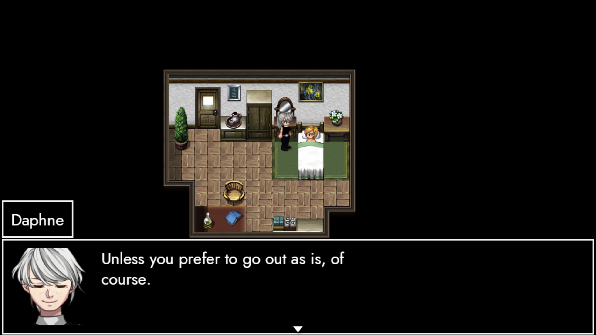
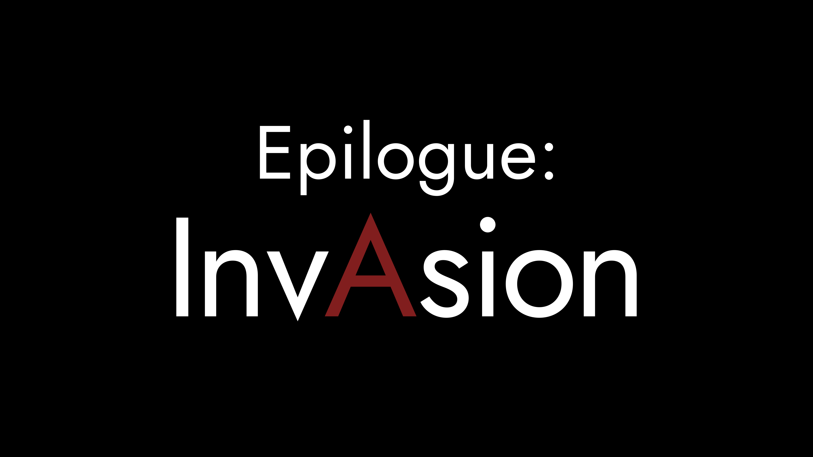

# Nostalgia

**Hey party peeps, friends - and potential future roommates!**

As you've probably noticed, the beta branch has been updated.
So let's take a quick look at some of the things that changed.

## Black & White

The build includes a whole bunch of bugfixes, qol improvements and - most importantly - revised credits scenes for Act 1-3.

I'm slowly crawling my way through all the scenes from start and finish, so expect most of the current changes in the **earlier half of the game**. Which is kinda fitting, since we're a bit more than halfway there. 

In other words, we've got about 48 days until **June 20th**.
Until then, I'll primarily focus on Act 2 & 3, while trying to hunt the last few bugs remaining.
So if there's anything you noticed, both in terms of **gameplay** and **performance**, please do feel free to let me know.

As for everything else: I kinda forget what I've already announced, lol. So please don't be too hard on me if I repeat myself.

In any case, I think I might as well just drop it here.

## Loose Ends

That's right, ladies and gentlemen
**We're in for some DLC.**

Releasing on August 28th 2022, **InvAsion** will serve as wrap-up for AUTONOMY, with a dedicated focus on clearing up a lot of questions in regards to **what the fuck happened before, during and after operation arteria**. For that matter, it'll fully forego the exploration parts and instead present you the story as is. Think of it more like a play than interactive fiction.

And of course, you'll get to see some of your favourite characters again.

The idea is to fill in a bunch of the blanks and touch upon the deeper intricacies that dominate both the narrative of AUTONOMY and TRACHI as a whole. In that sense, it's both the **conclusion** to AUTONOMY, but also the **bridge** to what comes afterwards.

I'll give you more details - especially in terms of **technical features** - shortly after the release of AUTONOMY's last build on June 20th. From that point onwards, I'll fully focus on InvAsion and its aftermath.

**Although some things never change...
Nothing will ever be the same again**.

So before I rant on, let me thank you once again for giving this game a chance. I appreciate it tremendously and regard it as one of the biggest reasons to keep pushing TRACHI beyond what it already is.

If there is ever anything you'd like to share with me or want to become involved in the project, please feel free to drop me a DM either here or through Discord.

Anyways, I hope you have a great time.
See you on June 20th, at the latest.

Much love
nory
