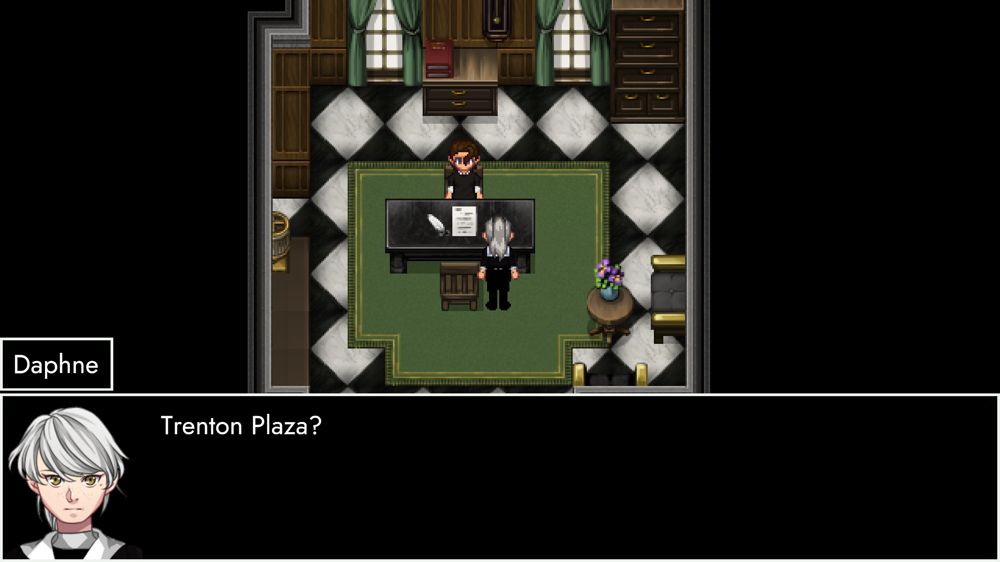
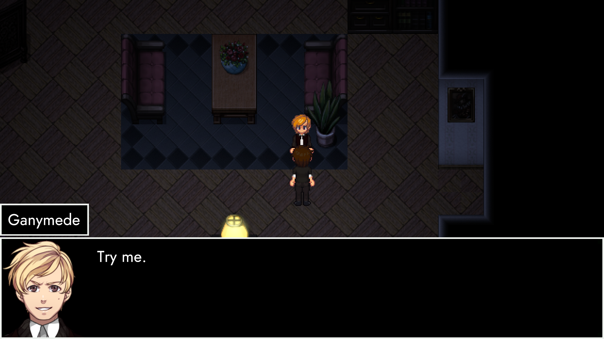
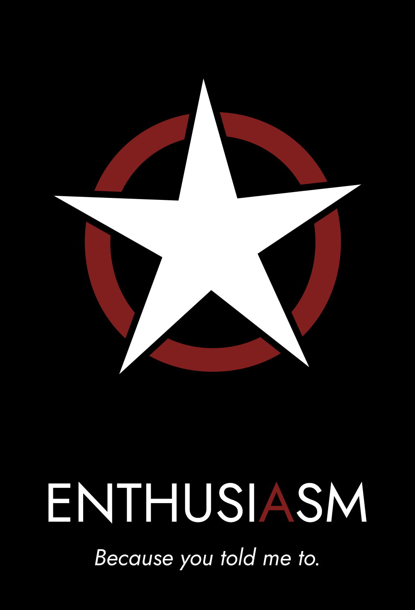

# InvAsion

## August 26th 2022
**[TRACHI – InvAsion](https://store.steampowered.com/app/2015930/TRACHI__InvAsion/)** has a date.

And so do we.

The DLC will be an addendum for AUTONOMY, though technically fully stand-alone. A bridge between the old and new. Made in Unity.

Take a look at this:

*Same people, different times.*

## A technical prototype
InvAsion tries to recreate AUTONOMY's look and atmosphere as closely as possible, while utilizing Unity's strengths at scalability.

As you can see, the RPGMaker-esque blurriness on higher resolutions is gone. This means that everything looks a lot sharper and clean. In most cases for the better, for worse in a few. But that's where polishing comes in.

*Same people, same times.*

## A narrative appendix
Of course, it's not just about showing off new tricks. Because the technical side is just a vessel to tell a story.

For that matter, the chief goal of this DLC is to answer some of the questions left over from the main game. This includes a lot of things. Whether it's narrative gaps or emotional send-offs – InvAsion's got it all.

And obviously – this means that a good bunch of established characters will take the stage again.

*Same people, same place.*

## An interactive play
As of today, InvAsion is fully playable, barring two scenes. A first build has also been released as an internal Alpha.

It's still kinda hard to gauge how long it's going to be runtime-wise, but I'm aiming for around 45 minutes to an hour, give or take. And yeah! It's going to be chock-full of dialogue, essentially scrapping the exploration bits to fully focus on the narrative.

In other words, this is me trying to play into the strengths of AUTONOMY, without the filler in-between. For that reason, I'm taking great care for every single line to be meaningful in some shape or form.

But of course, that's not all.

*Same people, different place.*

## A one-way trip
There's a storm coming. And we want to have all our bases covered when it hits.
Which brings us to the final – and probably most important – reason for InvAsion to exist. It's role as a bridging element.

Simultaneously to putting the finishing touches on AUTONOMY and creating InvAsion, I've spent a lot of time trying to conceptualise the future of TRACHI. I won't go to deep into this, as we don't want to get ahead with ourselves, right?

So let me just say the following:
Take a good look at these faces.
And think about a world without them.

With that, I'll come to a close.

There's around 2 1/2 weeks left on AUTONOMY's clock before it stops. After that, I'll put my full attention on InvAsion until August 26th.

Accompanied by regular updates along the way.
So if you'd like to keep track of where we're at, feel free to have a look at the [DLC's store page](https://store.steampowered.com/app/2015930/TRACHI__InvAsion/).

And if you'd like to actively participate in development yourself, you are more than welcome to join the [official discord](https://discord.gg/SvaYDEUasg) and/or shoot me a message either there, here or through any of the other channels.

In the meantime, I wish you the best of days and weeks to come.
And remain – as always – a deep admirer of yours.

Much love
nory
