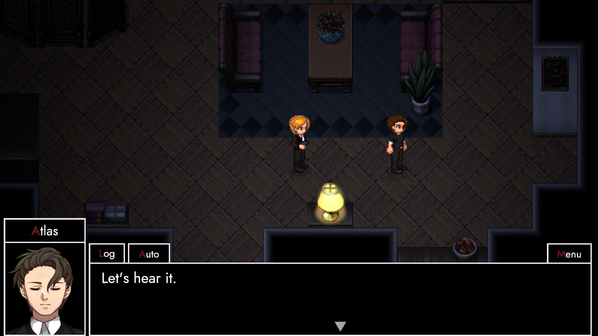
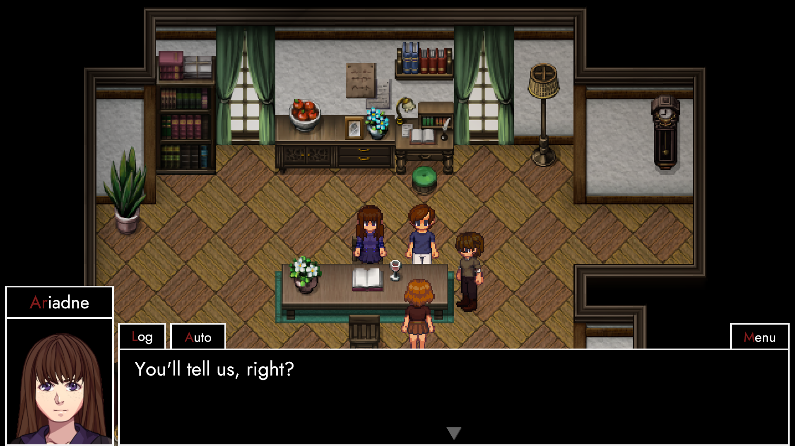
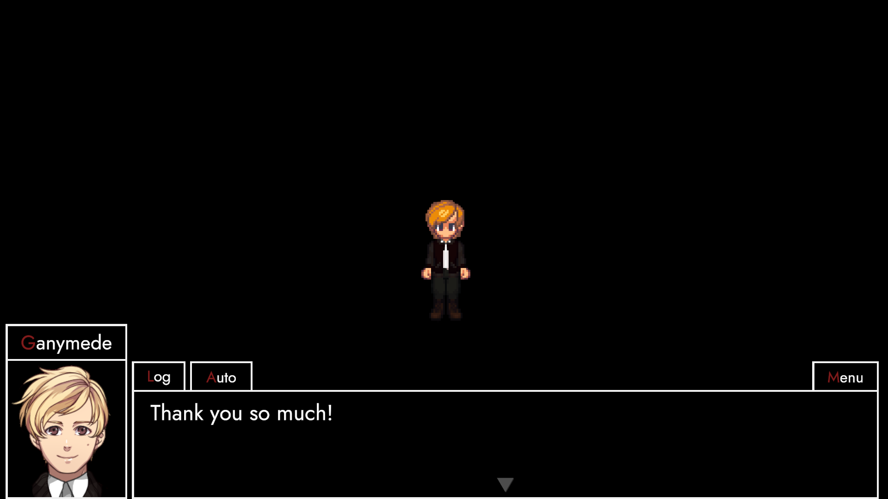

# Verbatim

**## Hey friends,**

**today's the day!**

**[TRACHI - InvAsion 1.0 (Verbatim)](https://store.steampowered.com/app/2015930/TRACHI__InvAsion/)**

I've said most of the important stuff in the [preview](https://store.steampowered.com/news/app/1811440/view/3399674324115296278) already. So I'll spare you that, if you don't mind.

Instead, let's try something else. 
If you've played either AUTONOMY or InvAsion, you know how much I love writing dialogue. And even though I've written more than ten-thousand individual lines at this point, I still can't get enough of it.

So let's pretend for a second someone asked a couple of questions. Furthermore, let's pretend that person is you.

## FAQ
***What's InvAsion?***
It's the counterpoint to AUTONOMY. In that sense, it's an expansion, an epilogue and a deconstruction.
The first segment aims to wrap up events of AUTONOMY, the second part is a slow descent towards phase 2 of the TRACHI project as a whole.

***How much content is there?***
Depending on your reading speed, playtime ranges from 45 to 60 minutes, roundabout.

***How linear is it?***
Extremely so. To be honest, I treat it more as a movie or a play than anything else.

***Do I need to play AUTONOMY beforehand?***
Yes. And no. There's a lot of things that'll fly past your head if you haven't experienced AUTONOMY. However, InvAsion was deliberately made to be its own thing, too. So feel free to hop into InvAsion, right away.

***What's next?***
I'm glad you asked! I've been pondering the perfect setting to announce it. But seeing as both of us are here, we might as well get it over with.

***That's it?***
For now. Partly because a lot of the stuff is WIP. But mostly because I don't want to spoil the surprise, too much.

I'd like to give you a couple of days, in case you want to experience InvAsion in the way it was meant to be.

## PostApocalypse

Starting next week, we'll have a first look into phase 2 and what it's all about. From that point onward, development will (hopefully) be much more transparent. The way it used to be, even though we're all a bit older and hopefully a bit wiser, too.

At any rate, by the time you're reading this, AUTONOMY and InvAsion have become a thing of the past. We're moving on to greener pastures. One that values actions much more than words.

Nonetheless, I want to express my deepest gratitude to everyone who's reading this. Whether you've been here from the days of rmn back in 2019, or just recently hopped on the train. 

## PostAtopia

This is your space, too. It's a space for you to plant your roots. A space you can call home. So if life ever gets rough, feel free to seek shelter here. Because that's what we do, right?

Until then, I wish you all the best. And hope that both AUTONOMY and InvAsion managed to nudge your desire for more. If not, please feel free to stick around, anyway. Because I can guarantee you one thing, already.

### **Nothing's ever going to be the same again.**
