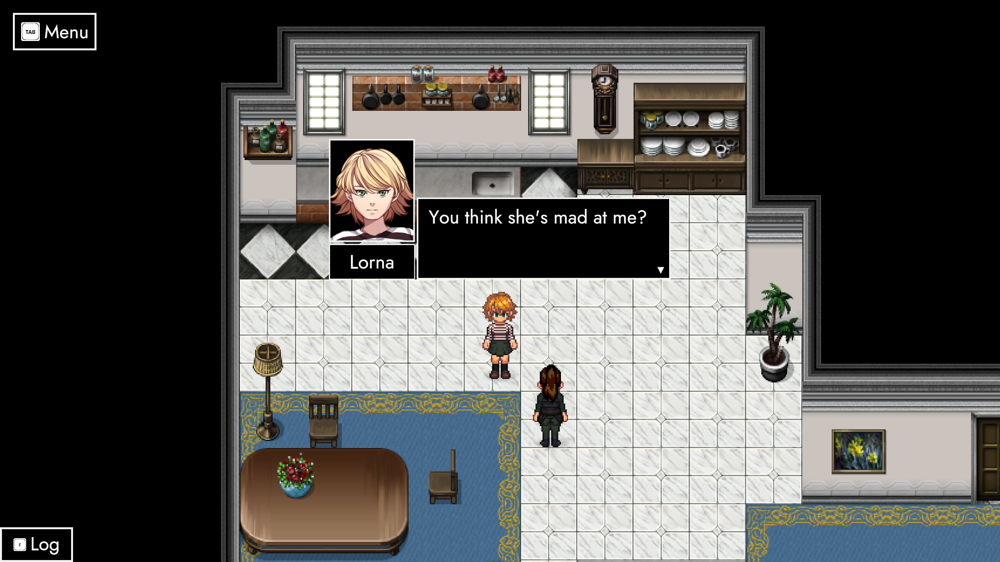
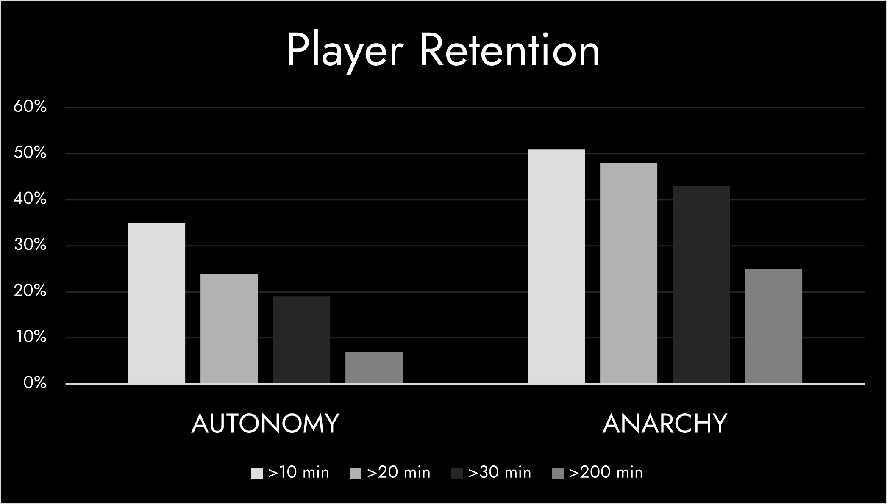
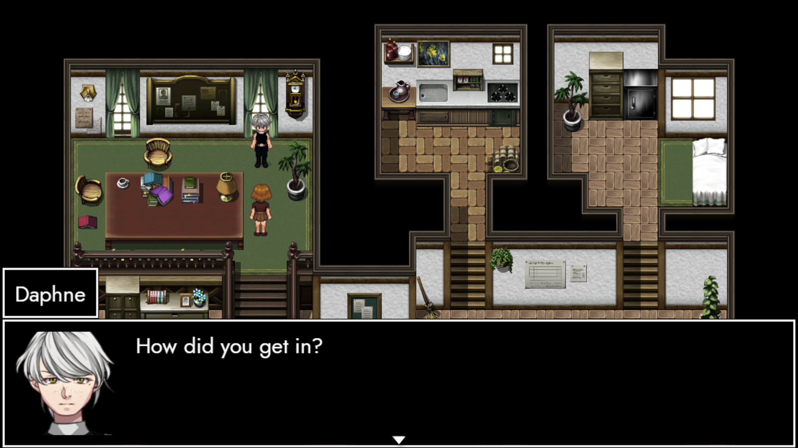
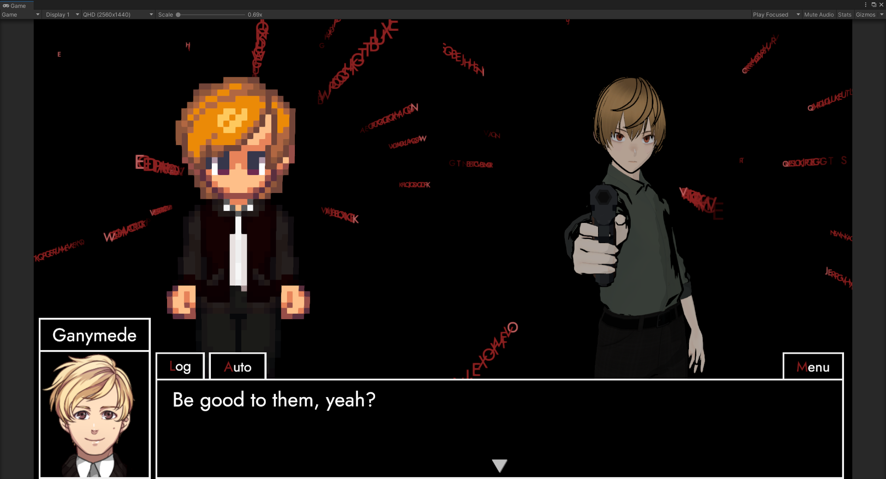
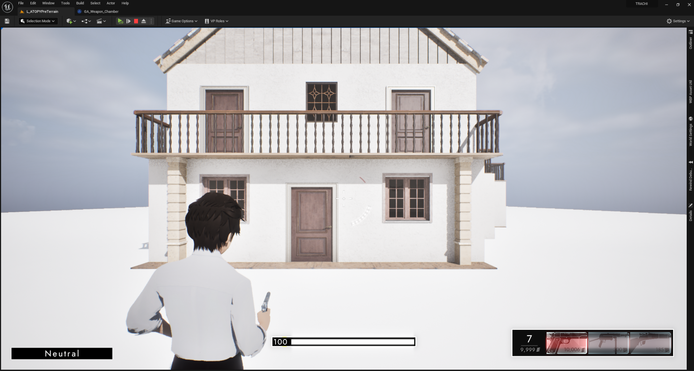
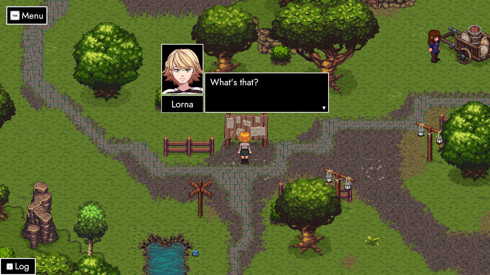
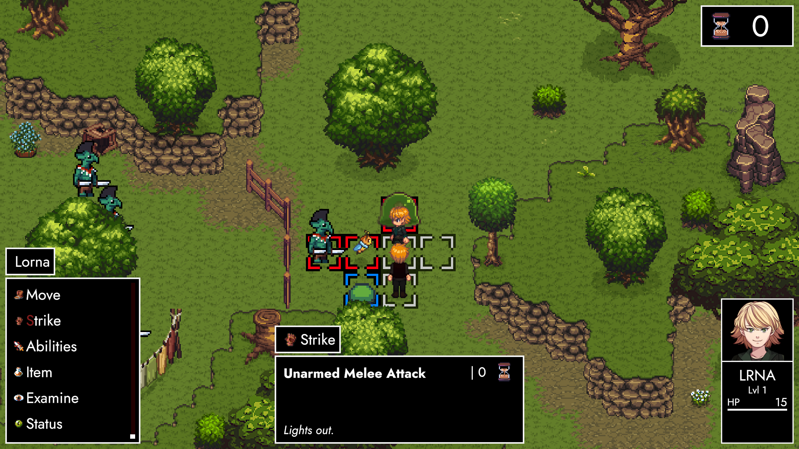
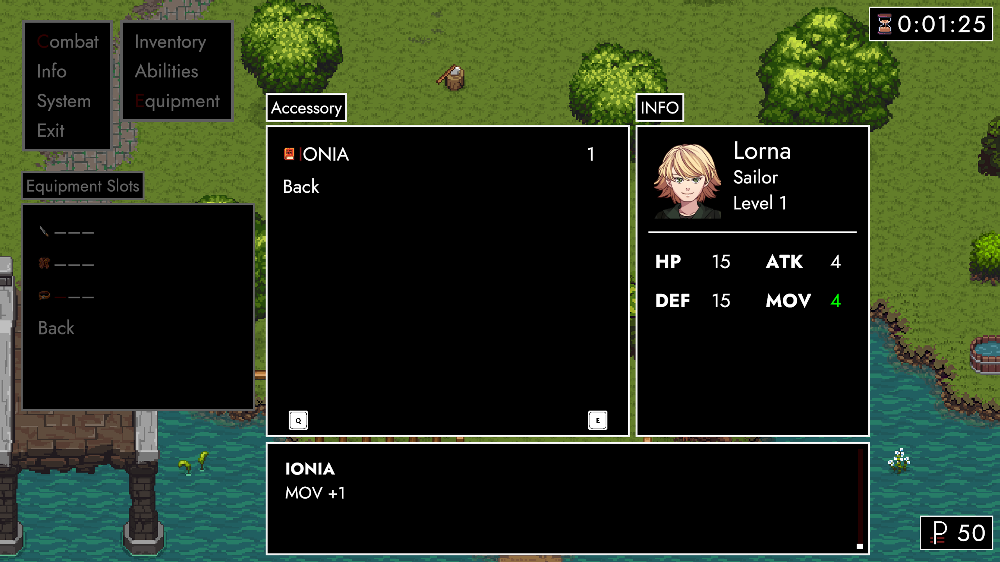
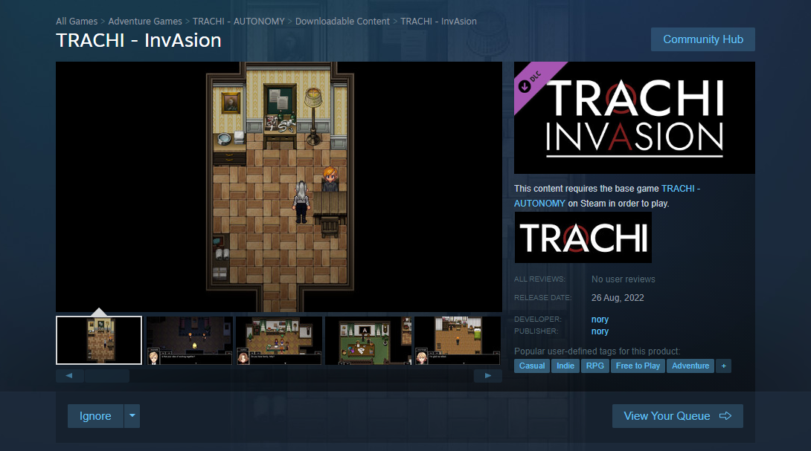
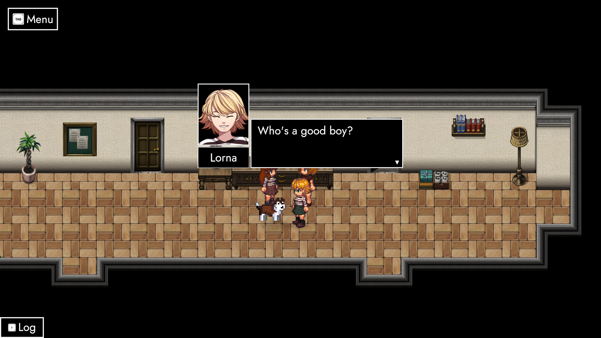

# All good things.

**## Hey friends! 👓**

It's been a damn long while! More than four months, to be precise!

I know! Sometimes it feels as if the world accelerates. Today, for example, we're about to kiss goodbye another year. **2023** is on the verge of becoming history – turning moments into memories.

### **Nostalgia**

Truth be told, it's making me tear up a little bit. TRACHI was in a weird spot, back in **January**. The first post-AUTONOMY year passed – and I frankly wasn't too content with the things I had to show.

Being neck deep into Unreal Engine, the mountain kept growing no matter how hard I tried. It took me not one, but three steps back until I learned to check my expectations. Five months later, **[ANARCHY](https://store.steampowered.com/app/2169000)** was born.

### **Return to Form**

For the first time in a year, I was making things again. What started out as a run-of-the-mill JRPG quickly transformed into a **Tactical RPG**. As you can imagine, these things don't just simply fall out of the sky. Especially considering that little nory here never made a game like this before.

I took it one step at a time, which is the reason why **ExcommunicAtion** exists. Above all, I wanted to present a combat prototype in the shape of multi-stage battle infused with story elements.

### **PresentAtion**

For the first time in history, I put the game above its **people**. That's not to say TRACHI is no longer a franchise about curious idiots and their tendency for unprovoked violence. In fact, it's exactly that formula that led to ANARCHY in the first place.

However, I wouldn't be myself if I wasn't trying to be 100% honest with you. The last two years saw me spend thousands of hours into **learning** a lot of different things. Whether it's engines, frameworks, RPG systems and/or combat elements – everything has a price.

### **Sacrifice**

Undoubtedly, something got lost on the way. For the sake of clarity, let's call that something ***AUTONOMY 2***. It's a little novel made in RPG Maker, continuing the story after August 28th, 1923. Given the amount of hours funnelled into TRACHI over the past 24 months, we'd already be back in the city again.

At this point, you're probably asking: Why aren't we, then? It's a perfectly justified question – one that I ask myself every single day. With the year coming to a close, I think both of us deserve an answer. Which is – coincidentally – exactly what I'll be trying to provide.

### **Truth**

About a month after releasing AUTONOMY, I was already gone. Partially because I'm a person who always chases the next shiny thing. However, I also had the **numbers** backing me up. Playtime statistics on Steam clearly indicated something went wrong. 

In total, 1200 people launched the game through Steam. However, only **seventy-two** got to see the end. A story that took more than two-thousand hours to create fell flat in the face of more than 90% of its playerbase.

### **Cause and Effect**

You can imagine how curious I was to find out why. AUTONOMY undoubtedly had flaws – but that never stopped a game from being good. Add to that the fact that tons of people reached out just to tell me how much they enjoyed the **story**.

All of that isn't worth much if people drop it fifteen minutes in. Like many other passion-driven works published throughout humanity's history, the problem wasn't **quality**, but a combination of discoverability and presentation.

### **TRAdition**

You know I love writing dialogue. There's nothing I enjoy more than unravelling decades of history by rubbing two people against each other. This particular aspect – henceforth called **TRAdition** – is the engine that drives most narrative movements in TRACHI. 

If you'd remove this particular aspect, the entire structure would collapse in on itself. There is – in other words – no version of TRACHI in which there isn't some sort of **dialogue**. On the other hand, AUTONOMY undeniably proved that TRAdition by itself wasn't enough.

### **Battle**

In August 2021, someone brought up a lack of **interactivity**. That particular line of feedback hit me in a very special way, since I grew up with video games prioritizing gameplay over cinematic experiences. Speaking as someone who – mildly put – wants to be the best at everything, I didn't think twice about whether I could.

Instead, I immediately went to work trying to refactor pieces of dialogue into dynamic, choice-based **conversations**. That went on for a about a week, before I admitted that these kind of interactions aren't compatible with the way I write.

### **Composition**

The problem with conversations driven by dialogue options is that individual lines turn into an item on a **laundry list**. The overwhelming majority of sequences don't change the world, whereas TRAdition dictates to never waste a single word.

As a result of that unsolvable conflict, I set my eyes on other playing fields. Thankfully, there's another (often overlooked) core element to AUTONOMY.

### **TRAvel**

One of the lovely reviewers pointed out that moving between places didn't add too much to the game. I'm not one to judge whether that's true or not, but I do understand the **message**. Most of the time, travelling in AUTONOMY is relatively uneventful.

That's not to say that **exploration** segments aren't incredibly important to me. TRACHI's world was there before its people – and building maps you can explore is one of the things I love most about development. Regardless, I wanted to see how big of a factor it really was.

### **Purity in Unity**

As you know, [**InvAsion**](https://store.steampowered.com/app/2015930) only contains a single exploration segment confined to a single map. Beyond that, **InvAsion** is unadulterated TRAdition. In other words: If AUTONOMY was a burger, InvAsion was twice the meat without the bun. 

Looking back at it almost one and a half years later, I'm still proud. Although it's not for everyone, TRACHI has to this day never been more **perfect**. However, it's also never been more **wrong**.

### **Fusion**

The first half of still holds up, I think. Conversations flow better than ever, lines are short and the **pacing** is just the way I want it to be. Most of the scenes would fit into AUTONOMY without a problem. In fact, there were times when I wished I would've made them in RPGMaker instead. 

The same goes for the second half. It's home to the most emotional scene I've ever written by far. You can practically feel the enthusiasm and excitement of someone who's finished their first work being eager for more.

### **Ambition**

Towards the end of InvAsion, there is a behemoth of a scene that goes on for fifteen minutes. In a place called **ATOPIA**, we're left to witness nothing but two people and bits of the UI. If there's one scene screaming TRAdition, it's this one.

For good reason, too! Because all good things must come to an end. Especially if they're about to be replaced by better things. Maybe that's what I thought when the **2D people** and their **homes** were indiscriminately erased.

### **Evolution**

If I was a politician, I'd say: "I stand behind the principle". TRACHI's people and its world had to go because words and maps weren't enough. Whatever followed AUTONOMY would be more interactive by throwing **combat** in to the mix.

At that point, the 2Ds were missing animations – barring the odd redraw here and there. Ganymede as a 3D model offered a lot more in that regard. He proved that point and completed TRACHI's second **transformation**.

### **Reality**

Turns out working a new engine whilst adding combat and RPG systems is a tall order in itself – let alone adding an entire dimension. Although I'd gotten hold of most intermediate stuff, there would be no **game** coming out anytime soon.

Being stuck between a rock and a hard place, I took a step back. In the meantime, I embarrassed myself on **Twitch** learning to talk about TRACHI. At some point, we got to restore a bunch of AUTONOMY scenes – and it wasn't long until I started writing again.

### **Missing Link**

All the while, the 2D's character builder had been updated with animated side-view sprites. The moment I saw that, I thought of InvAsion and how it ran on an **RPG framework** at some point. 

Maybe I could introduce combat and elevate InvAsion from an **experiment** to an actual game. Both TRAdition and rudimentary TRAvel were already there – I just had to round out the formula with the final core element.

### **TRACHI 2.0**

Three months later, we released a little game in **early access**. On August 28th 2023, InvAsion reemerged as ANARCHY. AUTONOMY's successor appeared in the shape of a full blown tactical top-down RPG.

It's work in progress powered by **monthly updates**, accompanied by weekly devlogs and biweekly announcements. I've gotten used to talk about things I've been working on. Most importantly, fleshing out combat and the RPG framework. 

### **TRAnce**

There's stats and status effects, consumables, equipment, challenges and quests, monster catalogues and – of course – roaming enemies, neutrals and friends. All of that running on a **map** that makes AUTONOMY's Anderson Park blush with gentle embarrassment.

**Everything** you know (and hopefully love) is right there. You'll get to walk places and listen to people talking smack. In addition, you'll also see your personal private army – gathered around Lorna in Act 1 – **grow** and evolve as you cut your way through an increasingly ruthless world.

### **Again and Again**

I know it's a lot to take in. AUTONOMY put a big emphasis on **authenticity** – and yet we're running around killing slimes. One might point out that there's a bit of a discontinuity there. Others might roll their eyes and straight-up accuse me of going isekai.

I'd be in one of those camps too, if I didn't know any better! Bringing 2Ds back might maybe raise even more eyebrows than originally killing them did. But I swear to whatever you think is holy – I can **explain** everything! 🙊

### **Full Circle**

ANARCHY will cover that explanation in **four acts**. Everything from 1924 to Daphne paying a visit to Ganymede in 1926. Unrolling it all means showing the full picture, including InvAsion. 

In concrete terms: InvAsion has to become part of ANARCHY. In fact, the process has already started. At the time of this writing, several scenes are already implemented into what experts on YouTube call a "gameplay-loop".

### **Souvenir**

Scenes such as Lorna losing her service card (1918 Edition) are triggered through **interactable objects** placed all over the world. Some of these, but all of them are tied to their own ingame rewards.

Long story short, TRACHI's people get to revisit their past – and you get to know a little more about the way things used to be. It's a perfect opportunity to write **TRAditional** scenes, with an extra potential to gently nudge people towards AUTONOMY.

### **Consequence**

Remember when I said everything has a price? The thing is, InvAsion becoming part of ANARCHY makes it a bit awkward for AUTONOMY's **DLC**. Not that it's harming anyone as is, but there's also very little reason to keep it around. 

In other words: **InvAsion gets the chop on February 28th 2024**. If it's already it in your library, you'll get to keep it – of course! For everyone else, it'll be as if it never was. Kinda ironic, given the theme of it all.

### **Symbiosis**

Going forth, there'll be two core products: **AUTONOMY** and **ANARCHY**. The former is a kinetic novel that also acts as a narrative background to ANARCHY. Over the last four months, AUTONOMY already received a couple of big boosts, both in terms of downloads and playtime. 

Not so coincidentally, these always occur shortly after the release of an ANARCHY update. In other words: We're already making a lot of new friends!

### **Bottom Line**

ANARCHY caters to a bigger **audience** than AUTONOMY did. I'll try to make the best version of a sequel that I possibly can. A game that satisfies a lot of people, including those that don't want to wait 45 minutes for it to get good.

However, I'd be a fool if I didn't make use of the things we already have. It should be clear by now that I take **feedback** very, very seriously. And if there's one thing I'd like you to know – it's that I'm listening twice as eagerly to you!

### **Seventy-two**

You're the reason I'm still going. Whenever I'm neck deep into systems, I'm thinking of **you**. It reminds me that I'm not only doing this because I get off on learning things, but also because I have to hold up my end of the deal. 

In return for your attention, you deserve a **game**. Above everything else, I have a lifelong responsibility to fuel a flame that has been burning since 2019. 

**Thank you** for that, for playing AUTONOMY – and for reading it all. I wish you the best for 2024 and hope that you'll be surrounded by people as lovable and awesome as you.

Big love n' hugs from an even bigger fan! 😊

**much love**  
nory
