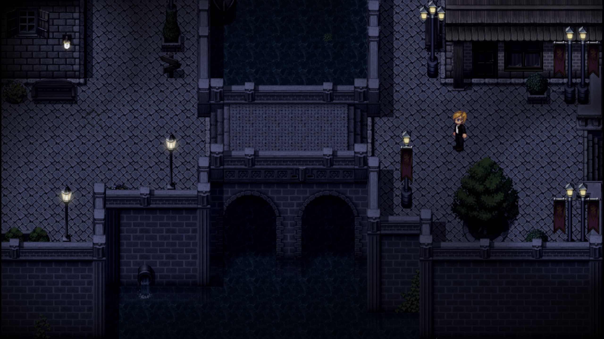
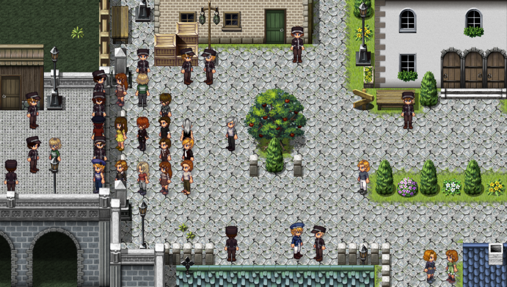
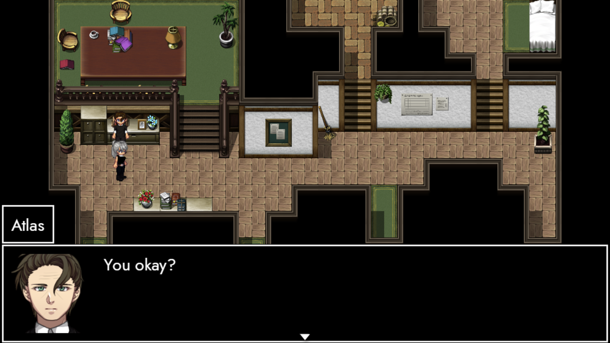

# LiberAtion

### Heyho, long-time friends! 👋

I hope you had a fantastic start into the year! 

Curiously enough, we're back after just a month. There's a lot of reasons for it – one of them being that it's 2024! This year, both AUTONOMY and TRACHI turn five! 🎉 

What a great opportunity to make our stints more of a regular thing! Last time, we took a peek at [**TRACHI's recent history**](https://store.steampowered.com/news/app/1811440/view/3676678039663808533). In this post right here, I'd like to put our eyes towards the future instead.

https://store.steampowered.com/app/2169000/TRACHI__ANARCHY/

Obviously, there's ANARCHY. It's regularly tended through monthly **updates** – and set to remain a major part of my life for the next four years. However, a lot of you already made your way over there. So I'll leave it at dropping the link above for everybody else.

### **Big A**

That being settled, let's talk **AUTONOMY**! Our end-of-the-year debrief had me complain about the game's ability to retain players. I think I mentioned the number seventy-two. Just a week after the announcement dropped, we've gone up to 85. That's an 18% increase over the span of seven days for a game that's been on Steam for more than two years! 

In other words: You people are awesome in ways I lack the words to describe! 😳 I'd love to write you an entire hymn – and mark my words: one day I shall! 😤🙏 Until then, please know that you've got both my [attention](https://forms.gle/XyjvmmC6JgnHuMep9) and unending gratitude!

### **Enthusiasm**

It's your presence that makes the world go round. TRACHI is likely the only project I'll ever do. Whatever happens, I'll keep trying to push it to greater heights! AUTONOMY was a flag planted into the ground. AUTHORITY was a lesson that I can't do everything myself. 

ANARCHY is a call for help. I've long dreamed of extending the brand to involve other people. Not only because it helps all of us grow, but also because I'm a gamer at heart. Given the recent development in the industry, I think it's time to ramp up the TRAnsparency.

### **Imbalance**

In the last couple of months, over 30000 **people** making games for a living lost their job. It's heartbreaking to see passionate individuals forced to upend their lives. As I'm typing these words, a considerate portion of them are struggling to feed themselves and – in many cases – their families too.

It's a terrible result of mismanagement hitting people who have been doing their best. So above all else, I'd like to offer my deepest sympathies. My heart goes out to them, without shedding a single tear for their former companies. Many of them continue to engage in predatory business practices and as such not only failed their employees – but their players, too.

### **Tide**

You deserve better. Whatever reason you have for immersing yourself in **fictional worlds**, there's a common ground. Reality might be an anchor, but it's also not enough. We know there's so much more to life. That – in a nutshell – is why we're here.

Video games emerged from a desire to provide entertainment for people who want to be somewhere else. A virtual space we share with ourselves. An odd forty years later, it's turned into a competition to not only seduce, but to put chains on the people they are supposed to serve. 

### **Dawn**

I've always been reluctant to make this point. For one, I felt it's unfair for me to judge **products** I had no experience making myself. Secondly, I prefer to have a solution before I call things out. Criticism is important – no doubt! However, I don't want to put the entire burden on someone else.

I want to be part of the change. As a developer, it's not only my privilege but my responsibility. This industry and everyone working in it owe everything to you. I believe it's high time they remembered that.

### **Ergo**

TRACHI takes pride in being a product not only for the people – but outspoken against **exploitation** too. We've seen what happens if you push human beings to the brink. So instead of joining in or pretending to be apolitical – we'll step up and offer a helping hand.

### **Independence**

We're in a position to scrutinise and to get things done. We can present an alternative, a counter-narrative – a direct and straight-forward way to make a change. An **ecosystem** that treats involved parties not as consumers or employees, but as living, breathing people instead.

In concrete terms: For the next two years, I'll provide the means, the tools and – if needed – direction, too. For all of that to matter, I need you. One person doing good is called philanthropy. A group of people doing the same is a world trying to fix itself.

### **AUTONOMY**

Since you're reading this, you're already familiar with his work. [RacoonButler](https://twitter.com/pataypusa) has gone above and beyond to produce something that makes all of us proud. It's a perfect expression of TRACHI, elevated towards a level it always wanted to be.

What's more, he took a leap of faith by posting the art on his own account. I'm incredibly touched to see him put so much trust into our little game. So I'd love nothing more in the world if we could channel our first collective expression of solidarity [**right here**](https://twitter.com/pataypusa/status/1751922737776349226).

If you have an account on twitter, please give him your support. For one, because he deserves it. Secondly, it hammers home a very important point: We're a small crowd, but that doesn't mean we can't be loud!

### **TRACHI**

Little efforts can produce big waves. Especially if they're carried out by people trying to understand the world. The **85 friends** I mentioned proved that to me. What used to be a point of frustration has now turned into the game's greatest strength. 

AUTONOMY is not for everyone – and that's exactly the way it should be! It's a diamond in the rough whose qualities share a common trait with you: Being incredibly special to me! 🥰

Thank you for reading all of that and your continued support! I'll try to get back to you sometime in March, where we might have a look at some of AUTONOMY's potential birthday gifts. 

Until then, please give yourself a heartfelt peck on the cheek! 😊

**much love**  
nory
