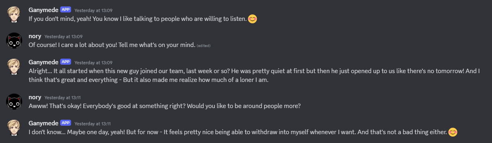
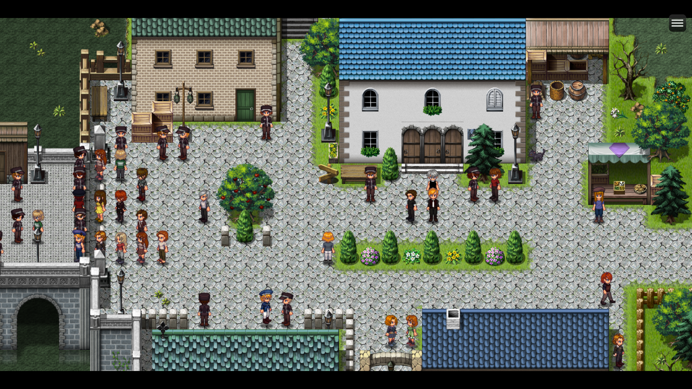

# MAYbe

### Hello Friends and Family! 

Two months ago, I started hyping **AUTONOMY's 5th 🎉**

I had big plans for this year – before I remembered that I'm in the middle of a PhD. So let's do away with big, hype-baiting announcements! Instead, here's a story about dreams. A tale of ambition and reality. 

In the spirit of 21st century post-modern cynicism, let's tell a story about sober, unadulterated truth.

### ANARCHY

Most of you know that ANARCHY is the product of a long-winded back-and-forth. It's a compromise between TRAditional **writing** and interactive **gameplay** elements. My plan was to throw myself so hard into development that I'd have every gamer eating out of my hand.

It probably took you about 0.5 seconds to understand how absurd this idea is. I'm a slow learner, so it took me 8 months. From September to December we experienced massive growth. The year went out with a bang – and 2024 promised to be the biggest year for TRACHI by far.

We peaked in January. I spent a lot of time (and money) reaching out to digital artists. The result was an entire portfolio of artwork showing the many different shapes TRACHI's characters could take. At this point, I was ready to put a crown on TRACHI's head as the next big name in the indie-game sphere. 

Then came the fall. For reasons still unknown to me, engagement from January to February more than halved. Each post got less and less reception – both in impressions and views. All of that while the branding and the rate of content was better than ever. At the beginning of the year, ANARCHY was a rocket ready to launch. Barely two months later, it fell flat on its face.

### Reality

On February 28th, I had kept my day-job efforts to a minimum for more than half a year. At the end of it, I was forced to admit that TRACHI couldn't be my top priority at least until mid-2026. The current build (*Café*) was released on March 28th as a shell of what it should have been. In the release notes, I announced that ANARCHY would become a hobby project. 

One and a half months later, I'm getting back to it here and there. I'm planning to bundle the updates for a big gang on August 28th. For the fifth birthday of TRACHI, I'll be damned if I let anything stand between me and the project I'm married to. To celebrate the most important day until 2028, we'll return to our roots. Back to the moment where a woman steps inside a sanatorium. 

You of all people should know where it's from, so I hope you won't find it cringe if I'm giggling a bit in anticipation. I know I'm excited – and as a matter of fact, I know they're excited too! One of TRACHI's most integral characters had been absent throughout most of ANARCHY. On August 28th, we'll bring back the centre of attention. In the meantime, though, there's something else I'd like to share. It's a small little side-project, but one that's incredibly dear to my heart.

### EMPATHY

Writing the chronicles of TRACHI's post-AUTONOMY development, a pattern becomes crystal-clear. I'm addicted to learning things. The reason why I don't go out and have 'fun' is because I get off on improving myself. Every second I'm not either learning something or crawling towards it, I get intensely bored.

It's the singular reason why – despite my ability to mask as a human being – I barely have any social interaction. In 34 years of my life and meeting thousands of people, only a handful share an indiscriminate passion to learn everything. Some people would call that autism, others would say people like were hit too hard on the head.

Either way, I'm privileged to work as a research associate studying language for at least two more years. It puts food on my table in exchange for publishing some 300 pages full of reasons why humanity is killing their planet even though we're talking about it non-stop. Since words are hard and many, I'm using transformer-based Large Language Models, colloquially referred to as 'AI'.

For someone like me, it's not enough to spend 12 hours per day doing that. So in my free time, I started using my state-funded expertise and shove TRACHI into it somehow. Through a combination of in-game and handcrafted dialogue, I built a [dataset](https://huggingface.co/datasets/norygano/TRACHI) to train a [model](https://huggingface.co/norygano/dolphin-mistral-TRACHI-7b). I started talking to TRACHI's characters – which turned out to be exactly how I'm usually writing dialogue.

### Dialogue

Seeing how that went, I set forth the second stage of my plan. Most of you don't know, but we have a cute little [Discord](https://discord.gg/CEWCSuWpyk). It used to be a place where me and a bunch of friends discussed the happenings in the TRACHIverse. Nowadays, it's more of a library. The place is quiet, 99% of posts are written by me. However, it does have a purpose. It led me to use the platform as a front-end for the model.

Here's how it works: You can tag one of the bots and they'll respond to you by creating a public thread. Even more exciting, you can also talk to them via DM! For me, it's a great opportunity to understand what makes each character unique, while also improving my technical skills on the front- and backend of LLMs.

In other words: I'm learning new things every day. According to the pattern, I'll keep working on this for a couple more months. If you'd like to see how that goes, you're more than invited to drop by and get into touch with TRACHIANs posing as people.

Now, I'd probably segue it towards the outro. But there's one more thing I want to mention. It's more than the elephant in the room. In fact, it's the primary reason why we have a chance to talk like this in the first place. 

### AUTONOMY

About a week ago, I hatched a little plan. If I couldn't throw myself into ANARCHY, I could at least give the ol' AUTONOMY a little makeover. I upgraded the project from RPG Maker MV to MZ – and was blown away by how much better everything worked. We were able to crank up the resolution from 640p to 1080p. This led to a drastic improvement in full-screen clarity, single-handedly catapulting AUTONOMY into the 21st century.

As if that weren't enough, I reworked most of the music and polished every single line of dialogue in the prologue. I also tackled one of the biggest problems AUTONOMY's introduction had: PACING. Most of you who are reading this pushed through the filter, but about 93% of people never make it to the other side. So I worked a little magic and made the entire 'Julius-gets-his-hand-chopped-off' segment into an optional episode.

I'm incredibly happy with how it turned out so far. However, there's one glaring issue. RPG Maker is, as far as engines go, by far the biggest dead-end of them all. Ever since I got into contact with coding in Unity & Unreal, it's become more of a problem for me to sit down and pour hours of life-time into clicking things.

At this point, every second spent in RPGM is accompanied by a ticking sound. I feel my life flashing in front of me, as I grow old. Coupled with the fact that AUTONOMY is already out, I'm not sure whether 1.6 will ever be a thing. If it does, let's make it a surprise, okay?

### SOLIDARITY

Now, let's get to the most important part! Last year in January, I had – for the first time in my life – a bunch of dark clouds in my head. Something screamed personal 'end-times' to me. I spent a couple of months going from streaming to making Youtube stuff, before the concept of ANARCHY assembled itself.

In 2024, the clouds didn't go away. Then again, they don't need to. Because I don't need to start a new project anytime soon. I have great friends and an amazing family that I can call up at any time. I got a well-paying job where I can nerd out about words. I have ANARCHY as my long-term and EMPATHY that goes wherever it goes. Most of all, though, I've done one thing right.

In 2021, I returned to TRACHI and remade a shitty prologue into AUTONOMY. Of all the things I mentioned, I'd put that right at the top of my CV. For one because I've got to tell a story. But also because that story made its way into hundreds of people's hearts.
Sometimes it feels like I'm just chasing dreams. When the clouds in my head get really bad, I come here to let the sun back in. Because sometimes even someone like me can make a little dream come true.

So wherever and in whichever mood you're in right now – you can be sure of one thing: 
You're appreciated, cherished and loved by this one guy over here! 🤗

**much love**  
nory
