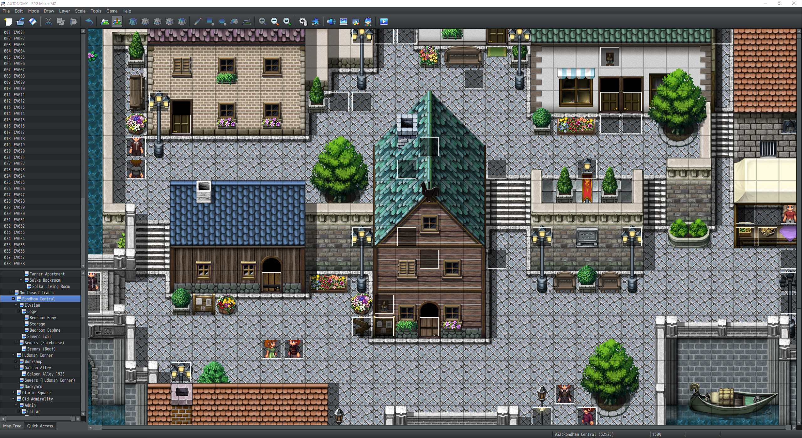
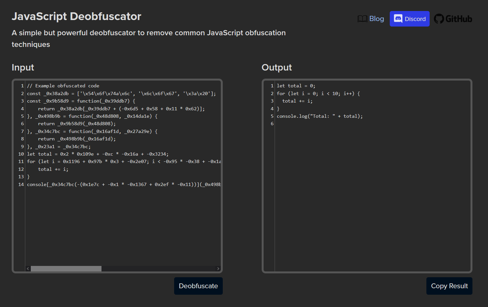
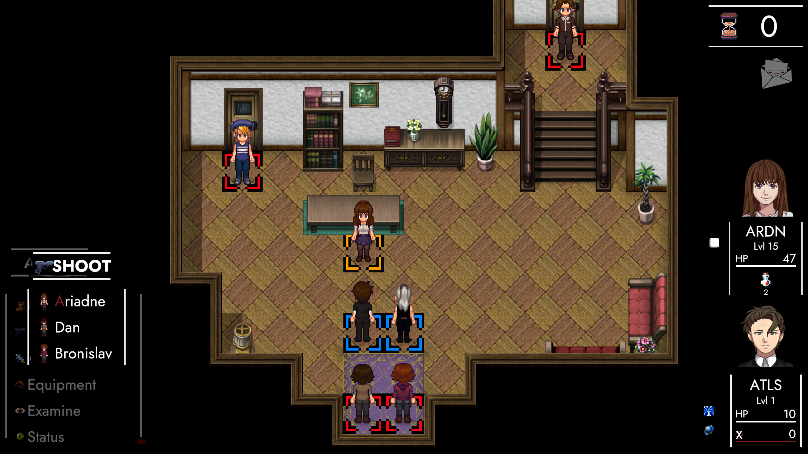

# LEGACY

## Hey Friends! 👋

Welcome to the **end of the year** – again.

This time, there are two announcements: **ANARCHY's** post will tackle active development. **AUTONOMY** handles big-picture stuff. I composed eight sections filled with **meta** rants. The trials and tribulations of an indie brand. 

Turns out we can do better than that! As a matter of fact: AUTONOMY is **relevant** again!
Yes! That's right! We're 100% **on-topic** for once! 😳

## Plot

Let's **recap** the year real-quick! The first three months had me neck-deep in ANARCHY. Somewhere around mid-march, I remembered that my **PhD-thesis** was due in early 2026. Days spent in Unity slowly gave way to messing around with Transformers (or what the normies call 'AI').

Fast forward to mid-May. TRACHI creeped back into my head. Three weeks later, I set up a bunch of character-based, locally-hosted **Discord bots**. These bots – Atlas, Daphne, Ganymede & Pandora – feed their interactions to a Large Language Model fine-tuned on handcrafted interactions. For added authenticity, I extracted AUTONOMY's and ANARCHY's dialogue and threw that into the mix as well. 

This was followed by a 36-hour stint where I started porting AUTONOMY from **RPG Maker MV** to MZ. In addition to a lot of QoL, MZ adds tons of performance improvements and properly scaled fullscreen. In other words: The game wouldn't look as if it was made in 1995. 

As the phrasing might suggest, that port never happened. There's three major reasons why. First of all: ANARCHY. Secondly: RPGMaker. Last but not least: A somewhat absurd situation in the Plugin community. 

Today, I'd like to cover these three aspects. We'll start with the darkest depths of the game-development ecosystem, work our way through shoddy engines and – finally – cast a little light on the horizon.

## MZ

If you're an RPGMaker developer, chances are you've caught on. Yes! I admit it! AUTONOMY is chock-full of **plugins**. From 'pathfinding' to dialogue boxes, from save and load menus. Many features of the game are handled by small scripts layered on top of RPGMaker actual.

Most of the plugins were developed (and some released for free) by a person named [YanFly](http://yanfly.moe/). nory being a good-boy, I bought the full-pack. Largely to make AUTONOMY a better game, but also to support a fellow creator. So far so good. 

Now for porting the entire thing. It's known that plugins pose a major headache. And so they did! Although there's ways to force MZ into using MV-plugins, many essential features (like 'pathfinding') refused to work. That's no biggie, though!

After all, most of the old plugins had MZ-equivalents. Even the YanFly collection! At worst, I'd have to rebuy the pack and support the group that took up YanFly's torch.

## Stella

If the name sounds familiar, you're on to something! [VisuStella](https://visustella.itch.io/) is the crowd that not only develops and hosts the majority of RPGMaker MZ plugins – they're also the people behind the **Character Generator** we've been using since 2021. ANARCHY-andies know that I've dropped a snarky comment here and there. My main gripe was an update supposedly scheduled for Mid-2023.

If you're asking if it's been released – ask me again in 2025. To be fair: I know the troubles of **development**, so I can 100% emphasize. Besides, I've gotten used to squeeze out as much as I can from the 2022 iteration. Although I wish they'd have included the source code. Not having a revert and redo is funny for a day, but I stopped laughing afterwards.

You see, I like tinkering with things. Working with UE, Unity – and Data Science stuff I do at work –exposed me to the beauty of code. In fact: Part of the reason why I wanted to give **RPGMaker** another spin was to test my newfound expertise. And since I had JavaScript somewhere on my bucket list, I was eager to dive head-first into the plugins' code.

Spoiler alert: My excitement didn't last very long. Although I learned a new word for my vocabulary.

## Obfuscation

Let's try and formulate a definition: *the act of making something less clear [...] to understand, especially intentionally*. Well, that wasn't so hard! Maybe it's because I ripped it straight from the [Cambridge dictionary](https://dictionary.cambridge.org/dictionary/english/obfuscation). Not that I'm obligated to tell you. I just think it's common decency.

In terms of code, obfuscation refers to scrambling variable and function names so they're human-intelligable. Note the term ***intentional***. Believe me, I've come across tons of bad code in my time – most of it made by myself. To add another layer of hypocrisy: I'm also regularly tucking away source code when I build an application.

So, what's the difference? Well, I'm obligated to encrypt source code due to **license agreements** with 3rd Parties. I am legally instructed to remind you not to decompile. Otherwise I'm forced to spend the millions I'm making off TRACHI to sue you relentlessly.

If you make a **copy**, for personal or commercial purposes – or distribute the product elsewhere – I might have to send you a cease n' desist. Realistically, I couldn't care less. TRACHI is like a ~~parasite~~ symbiont. Success is measured in how many people it affects. 

Either way, the **ToS** states that I can't tell you about the several thousand deobfuscation websites out there. In fact, word on the street is that the developers literally used the first website that pops up when you google that term.

How do I know? I guess my hand must've slipped. Or maybe I don't like buying a cat in a bag with a black bar on its face. Putting obfuscated code on top of a framework with **exposed** code is like me asking you to forget what you just read.

## Exodus

After I got over my little tantrum, reasonable nory intervened. Deobfuscation (which I totally didn't do) would have left me with semi-readable code. Now I just had to introduce myself to **application-development** in JavaScript – while my mind was parsing Python for work and C# for ANARCHY.

Why was I doing that again? To funnel more work into a dead-end engine/framework. Every minute spent in RPGMaker would mean about twenty seconds of porting it into Unity. Since I had most of the QoL stuff already implemented in **ANARCHY**, RPGMaker had nothing to offer beyond ~5 hours of content.

At the same time, August 28th was coming up. I had promised an AUTONOMY-themed prologue for ANARCHY. On December 13th (!), ***[ExtrapolAtion](https://store.steampowered.com/news/app/2169000/view/509566179781641078?l=english)*** hit the shelves. It includes two locations from AUTONOMY: *Wenger* 1926 and ExterminAtion's *Trachi* 1923 (*Stuart Alley* by night and all that).

Seeing the characters in those places – coupled with ANARCHY's features – put a big smile on my face. It made me think of how far the game has come in **fourteen months**. The movement, the pathfinding, the menus, the quests, the dialogue boxes, conversation skips and auto modes. As if AUTONOMY came to life again!

## Refulgence

<iframe allowfullscreen="" frameborder="0" src="https://www.youtube.com/embed/5-92Ps25N-M"></iframe>

Remember when I said my thesis is due in 2026? In effect, I'm taking the year off TRACHI. More precisely: I'll drop the development hat – and dust off my **artist's beret**. 2025 will be freestyle whatever, whenever I feel like it.

Maybe I'll dig into the backend and optimise. Or I try to solve a couple of infrastructural question marks. Sometimes, though, I might need a little ego-boost. The ones you get from cleaning, sorting things – or porting content into a new game. As you can see, the process is already underway. 

**Trachi's checkpoint** is ported and even has its main-quest logic and conversations dialled in. I try to keep both of these verbatim, applying just a little **detail** here and there. The same goes for the environments, NPCs and overall progression. Sound-effects (as long as they're not RPGMaker-inherent) stay, but the music will get a big upgrade. 

For the sake of my own sanity – and your trust in me – we're talking **remaster** and not a remake. The story will happen exactly as it did in AUTONOMY. Characters are operating on 1923 knowledge, without a hint of what'll happen in a year. As for what's new: We'll include AUTONOMY's **deleted scenes**, **a quest-system**, **biographies**, **items**, **equipment** (#variations) and more. 

Once we're done, there'll be two AUTONOM(Y)(ies): RPGMaker's **AUTONOMY(R)** and Unity's **AUTONOMY(U)**.

## Legacy
It's a mouthful, I know! Then again: we're getting two games for the price of one. If Valve doesn't mind, AUTONOMY(R) gets a new name: TRACHI – LEGACY. As for ANARCHY, we'll trim the name a bit: 

Three years of separation are about to end. Our meta-dripping, post-ironic anarchistic adventure is in for a big bag of history. Three days, three people and a city. Most importantly: **YOU**. 

If you don't mind me asking (with a batted eyelash or two): Please grab your pitchfork and make me walk the line! 🙏 Not like I need or want you, okay!? You're just one of those special **10%** that dug their way through AUTONOMY - I mean LEGACY.

That's two homes for two-thousand people! 👏 One place for the future – and one for our memories!
Here's to my **favourite roommates** from 2021 to 2024! 🤗

Have a stellar New Year, Friends! 

**much love**  
nory
