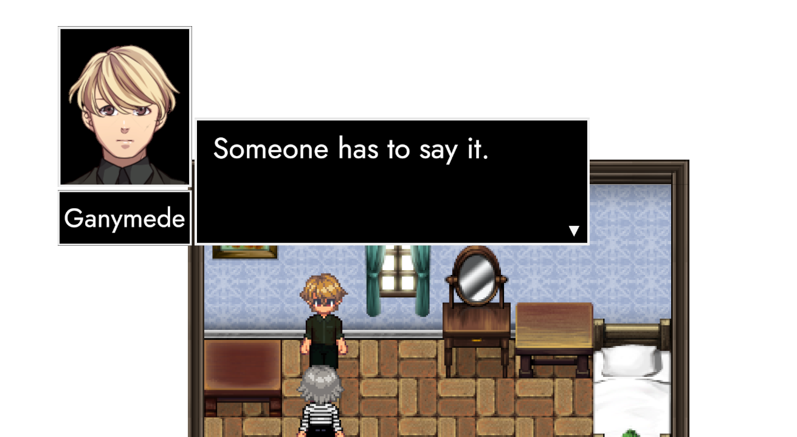

# Home
{ width=200, align=right }
**Hey Friend! 👋**

Welcome to TRACHI's knowledge base! 

## TRA– what?
{ width=200, align=right }
**TRACHI** is a series of [video-games](https://store.steampowered.com/franchise/TRACHI) set in a fictional 20th-century. It's a story about continental politics, espionage and subversion. A lot of people saying things – some of it – the truth.

**TRAKI** tries to separate fact from fiction. We want to gather, assess and evaluate what the TRACHIANS have been up to.

And whether they pose a threat.

## Contribution
<figure class="float-right">
  
  <figcaption>by <a href="https://vgen.co/pataypusa">Pataypusa</a></figcaption>
</figure>

If you'd like to be part of our effort, here's a chance to shine! Feel free to edit pages or fork the [repository](https://github.com/norygami/traki/).   

You can also raise an [Issue](https://github.com/norygami/traki/issues), start a [Discussion](https://github.com/norygami/traki/discussions) or join the [Discord](https://discord.gg/SvaYDEUasg).

Thank you very much for your attention –  
Have a hug on the house! 🤗  

**much love**  
nory